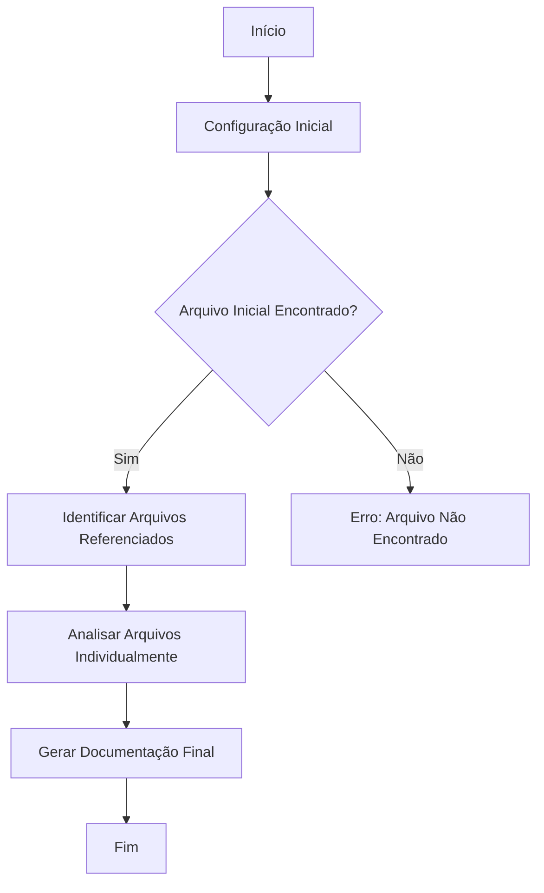
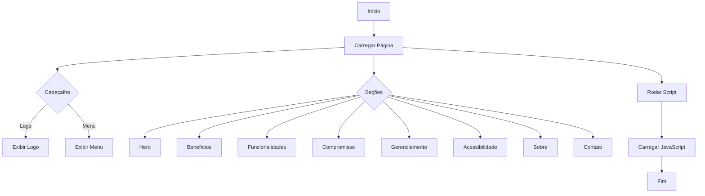
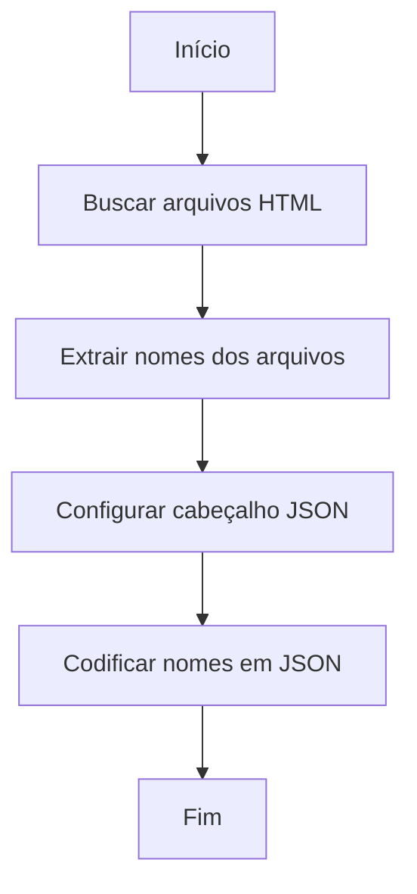
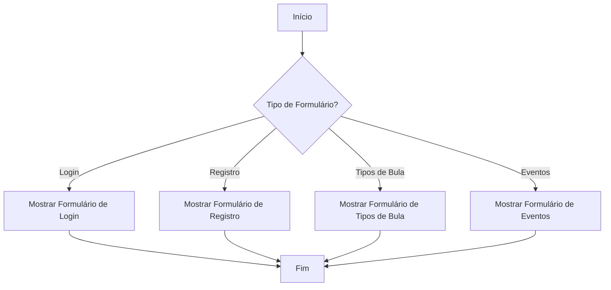
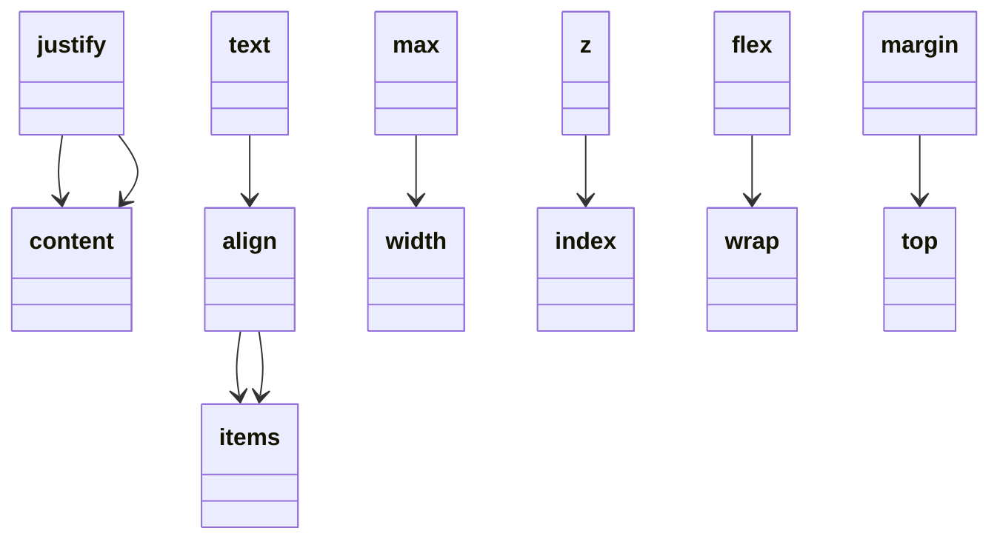

# Documentação Técnica Consolidada

Esta documentação unificada foi gerada automaticamente com base nas boas práticas regulatórias (GAMP 5, ANVISA, FDA 21 CFR Part 11).

Abaixo você encontrará:
- Um índice navegável com links para os arquivos documentados
- Acesso direto ao código-fonte analisado
- Diagramas visuais e documentação inline gerada automaticamente

# Sumário

- [Arquivo: documentador.html](#documentador)
  - 📄 [Ver Markdown individual](./documentacao_bruta_documentador.html.md)
  - 💻 [Ver Código-fonte](../../documentador.html)
- [Arquivo: css/style-doc.css](#style-doc)
  - 📄 [Ver Markdown individual](./documentacao_bruta_style-doc.css.md)
  - 💻 [Ver Código-fonte](../../css/style-doc.css)
- [Arquivo: src/js/documentador.js](#documentador)
  - 📄 [Ver Markdown individual](./documentacao_bruta_documentador.js.md)
  - 💻 [Ver Código-fonte](../../src/js/documentador.js)
- [Arquivo: src/php/lista_html.php](#lista-html)
  - 📄 [Ver Markdown individual](./documentacao_bruta_lista_html.php.md)
  - 💻 [Ver Código-fonte](../../src/php/lista_html.php)
- [Arquivo: src/php/gerador.php](#gerador)
  - 📄 [Ver Markdown individual](./documentacao_bruta_gerador.php.md)
  - 💻 [Ver Código-fonte](../../src/php/gerador.php)
- [Arquivo: index.html](#index)
  - 📄 [Ver Markdown individual](./documentacao_bruta_index.html.md)
  - 💻 [Ver Código-fonte](../../index.html)
- [Arquivo: css/style.css](#style)
  - 📄 [Ver Markdown individual](./documentacao_bruta_style.css.md)
  - 💻 [Ver Código-fonte](../../css/style.css)
- [Arquivo: src/js/teste.js](#teste)
  - 📄 [Ver Markdown individual](./documentacao_bruta_teste.js.md)
  - 💻 [Ver Código-fonte](../../src/js/teste.js)


# Documentação Técnica do Projeto

## Introdução Geral

Este documento fornece uma visão abrangente e estruturada da documentação técnica gerada automaticamente para o sistema, em conformidade com as práticas regulatórias GAMP 5, ANVISA e FDA 21 CFR Part 11. A documentação foi produzida para garantir clareza, qualidade e compatibilidade com auditorias regulatórias.

## Índice

1. [Lista de Arquivos Documentados](#lista-de-arquivos-documentados)
2. [Detalhes por Arquivo](#detalhes-por-arquivo)
   - [gerador.php](#geradorphp)
   - [index.html](#indexhtml)
   - [lista_html.php](#lista_htmlphp)
   - [navegador.js](#navegadorjs)
   - [style.css](#stylecss)
   - [teste.js](#testejs)
3. [Conclusão e Recomendações](#conclusão-e-recomendações)

## Lista de Arquivos Documentados

- `gerador.php`
- `index.html`
- `lista_html.php`
- `navegador.js`
- `style.css`
- `teste.js`

## Detalhes por Arquivo

### gerador.php

#### Introdução

O arquivo `gerador.php` é responsável por gerar documentação automática para o sistema. Ele utiliza a API do ChatGPT para analisar arquivos HTML, identificar referências a outros arquivos (JS, CSS, PHP) e gerar documentação detalhada para cada um deles.

#### Funcionalidades Principais

1. **Identificação de Arquivos Referenciados**: O script começa identificando todos os arquivos (JS, CSS, PHP) referenciados pelo arquivo HTML inicial.
2. **Análise de Dependências**: Utiliza a API do ChatGPT para identificar dependências diretas e indiretas dos arquivos.
3. **Documentação Automática**: Gera documentação para cada arquivo identificado, incluindo comentários técnicos, PHPDoc, e diagramas Mermaid.
4. **Geração de Documentação Final**: Compila toda a documentação em um arquivo Markdown estruturado.

#### Documentação Inline (PHPDoc)

```php
/**
 * Chama a API do ChatGPT para gerar respostas baseadas em mensagens fornecidas.
 *
 * @param array $mensagens Mensagens a serem enviadas para a API.
 * @param string $apiKey Chave de API para autenticação.
 * @param string $model Modelo a ser utilizado na API.
 * @return array Resposta da API em formato JSON decodificado.
 */
function chamarChatGPT($mensagens, $apiKey, $model) {
    // Implementação da função...
}
```

#### Diagramas

##### Diagrama de Fluxo (Mermaid Flowchart)



##### Diagrama de Classes (Mermaid ClassDiagram)

```mermaid
classDiagram
```


### index.html

#### Visão Geral

Este projeto é uma aplicação web para a gestão e publicação de bulas digitais, em conformidade com as regulamentações da ANVISA, FDA 21 CFR Part 11 e GAMP 5. A solução oferece funcionalidades como geração de QR Codes, segurança avançada, acessibilidade e gerenciamento simplificado, garantindo a conformidade com a RDC 885.

#### Estrutura HTML

O cabeçalho contém o logo da empresa e um menu de navegação que permite acesso rápido às diferentes seções da página. A funcionalidade de menu é controlada por um ícone que, ao ser clicado, alterna a visibilidade da lista de navegação.

#### Funcionalidades JavaScript

A função `toggleMenu` é responsável por alternar a visibilidade do menu de navegação.

```javascript
/**
 * Alterna a visibilidade do menu de navegação.
 */
function toggleMenu() {
  document.querySelector('.listaMenu ul').classList.toggle('active');
}
```

#### Diagramas

##### Diagrama de Fluxo



##### Diagrama de Caso de Uso

```mermaid
usecaseDiagram
    actor Usuário
    actor Administrador
    Usuário --> (Acessar Bula Digital)
    Usuário --> (Consultar Benefícios)
    Usuário --> (Enviar Contato)
    Administrador --> (Gerenciar Bulas)
    Administrador --> (Acessar Repositório RIEP)
```

### lista_html.php

#### Visão Geral

Este script PHP é responsável por buscar todos os arquivos HTML na raiz do diretório especificado e retornar seus nomes em formato JSON. Esta funcionalidade pode ser útil para aplicações que precisam listar ou manipular arquivos HTML de forma dinâmica.

#### Estrutura do Código

```php
<?php

// busca todos os arquivos html na raiz
$arquivos = glob('../../*.html');
$nomes = array_map('basename', $arquivos);
header('Content-Type: application/json');
echo json_encode($nomes);
?>
```

#### Diagramas

##### Diagrama de Fluxo (Flowchart)



##### Diagrama de Classes (ClassDiagram)

```mermaid
classDiagram
```


##### Diagrama de Caso de Uso (UseCase)

```mermaid
usecaseDiagram
    actor Usuário
    Usuário --> (Listar Arquivos HTML)
```

### navegador.js

#### Visão Geral

O arquivo `navegador.js` contém funções para gerenciar a navegação entre diferentes formulários e elementos de interface em uma aplicação web.

#### Funções

##### `mostrarFormulario(tipo)`

```js
/**
 * Exibe o formulário especificado e atualiza a interface.
 * @param {string} tipo - O identificador do formulário a ser exibido.
 */
```

##### `alternar(elementoAtivo, elementoInativo, tipo)`

```js
/**
 * Alterna a visibilidade entre dois elementos.
 * @param {string} elementoAtivo - O ID do elemento atualmente ativo.
 * @param {string} elementoInativo - O ID do elemento a ser ativado.
 * @param {string} tipo - O tipo de exibição a ser aplicado ao elemento inativo.
 */
```

##### `recarregar(url)`

```js
/**
 * Recarrega a página atual ou uma URL especificada, mantendo dados voláteis.
 * @param {string} [url] - A URL a ser recarregada. Se não especificada, recarrega a página atual.
 */
```

#### Diagramas

##### Diagrama de Fluxo



### style.css

#### Introdução

Este documento descreve a estrutura e as funcionalidades do arquivo CSS utilizado para estilizar uma página web. O arquivo faz uso de variáveis CSS para definir cores e tamanhos de fonte, garantindo consistência e facilidade de manutenção.

#### Estrutura do Arquivo

##### Importação de Fontes

```css
@import url("https://fonts.googleapis.com/css2?family=Poppins:wght@300;400;600&display=swap");
```

##### Variáveis CSS

```css
:root {
  --cor-primaria: #003759;
  --cor-secundaria: #44668eb8;
  --cor-botao: ;
  --cor-botao-hover: #0a1a41e2;
  --cor-fonte: #fff;
  --tamanho-fonte: 16px;
}
```

#### Diagramas

##### Diagrama de Classes (Mermaid)




### teste.js

#### Descrição Geral

O código JavaScript fornecido define uma função chamada `teste` que, quando chamada, exibe um alerta com a mensagem "vai". Além disso, há uma chamada de `console.log` que parece ser destinada a verificar se o ESLint reconhece a função `teste`.

#### JSDoc

```js
/**
 * @function teste
 * @description Exibe um alerta com a mensagem "vai".
 * @example
 * teste(); // Exibe um alerta com a mensagem "vai".
 */
function teste() {
  alert("vai");
}
```

#### Diagramas

##### Diagrama de Fluxo (Flowchart)

```mermaid
flowchart TD
    A[Início] --> B[Chamada de console.log]
    B --> C{Função teste definida?}
    C -->|Sim| D[Executa console.log]
    C -->|Não| E[Erro: Função não definida]
    D --> F[Função teste]
    F --> G[Exibe alerta "vai"]
    G --> H[Fim]
```

## Conclusão e Recomendações

Este pacote de documentação oferece uma visão completa, validável e estruturada sobre o sistema analisado. Recomenda-se:

- Revisar os diagramas Mermaid para garantir precisão.
- Integrar a documentação à rastreabilidade dos requisitos.
- Anexar evidências de teste para validação formal.

A documentação gerada fornece uma base sólida para auditorias e revisões técnicas, garantindo que o sistema esteja em conformidade com os padrões regulatórios exigidos. É essencial manter a documentação atualizada e revisada regularmente para refletir quaisquer mudanças no sistema ou nos requisitos regulatórios.

---

## Conclusão

Este pacote de documentação oferece uma visão completa, validável e estruturada sobre o sistema analisado.

Recomenda-se:
- Revisar os diagramas Mermaid
- Integrar a documentação à rastreabilidade dos requisitos
- Anexar evidências de teste para validação formal
