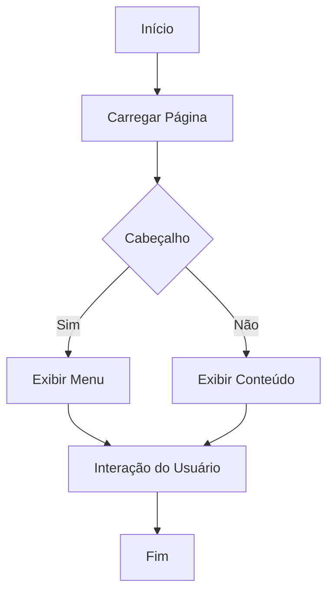
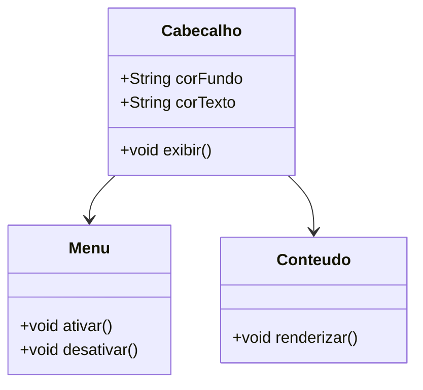

# Documentação de Estilo CSS

Este documento fornece uma visão geral do arquivo CSS `bd.css`, que é utilizado para estilizar uma aplicação web. A documentação está estruturada para facilitar a compreensão das funcionalidades e do design implementado, seguindo as diretrizes de GAMP5, FDA 21 CFR Part 11 e ANVISA.

## Estrutura do Documento

O arquivo CSS está organizado em seções que definem estilos para elementos HTML comuns, componentes de layout e interações do usuário. A seguir, cada seção é descrita com detalhes sobre suas funcionalidades e propósitos.

### Estilos Globais

```css
html,
body {
  height: 100%;
  font-family: Arial, sans-serif;
  text-decoration: none;
  background-attachment: fixed;
}
```

- **Descrição**: Define estilos básicos para os elementos `html` e `body`, garantindo que ocupem 100% da altura da janela e utilizem a fonte Arial.
- **Funcionalidade**: Estabelece uma base consistente para o restante do documento, fixando o fundo para evitar o deslocamento ao rolar a página.

### Cabeçalho (`.cabecalho`)

```css
.cabecalho {
  position: relative;
  background-color: #023e7d;
  color: white;
  text-align: center;
  padding: 2%;
  font-size: 16px;
  top: 0px;
}
```

- **Descrição**: Estiliza o cabeçalho da página, definindo sua cor de fundo, cor do texto e alinhamento.
- **Funcionalidade**: Cria um cabeçalho fixo e visualmente distinto, que permanece no topo da página.

### Menu e Itens de Menu

```css
.menu {
  position: absolute;
  display: none;
  cursor: pointer;
  top: 5%;
  right: 5%;
  z-index: 999;
}

.menu-itens {
  position: absolute;
  display: none;
  top: 5%;
  right: 5%;
  z-index: 998;
}
```

- **Descrição**: Define a aparência e o posicionamento do menu e seus itens, que são inicialmente ocultos.
- **Funcionalidade**: Permite a exibição de um menu interativo que pode ser ativado pelo usuário.

### Rodapé (`.rodape`)

```css
.rodape {
  background-color: #023e7d;
  height: 10%;
  bottom: 0px;
}
```

- **Descrição**: Estiliza o rodapé da página, garantindo que ele tenha uma cor de fundo consistente com o cabeçalho.
- **Funcionalidade**: Proporciona um fechamento visual para a página, permanecendo fixo na parte inferior.

### Conteúdo Principal (`.conteudo`)

```css
.conteudo {
  height: 80%;
  margin: 5%;
}
```

- **Descrição**: Define a área principal de conteúdo, com altura e margens especificadas.
- **Funcionalidade**: Cria um espaço centralizado para o conteúdo da página, garantindo legibilidade e organização.

### Seletor (`.seletor`)

```css
.seletor {
  display: flex;
  align-items: center;
  justify-content: left;
}
```

- **Descrição**: Estiliza um contêiner flexível para alinhamento de itens.
- **Funcionalidade**: Facilita o alinhamento horizontal de elementos, como botões e rótulos.

### Botões e Rótulos

```css
button,
label {
  background-color: #023e7d;
  border: none;
  color: white;
  border-radius: 15px;
  padding: 15px 32px;
  margin: 1%;
  text-align: center;
  font-size: 16px;
}
```

- **Descrição**: Define estilos para botões e rótulos, incluindo cores, bordas e espaçamento.
- **Funcionalidade**: Garante que os elementos interativos sejam visualmente consistentes e fáceis de usar.

### Campos de Entrada

```css
input {
  color: #fff;
  font-size: 28px;
  width: 80%;
  padding: 20px 5px 5px;
  background-color: lightgray;
  border: none;
  border-radius: 4px;
}
```

- **Descrição**: Estiliza campos de entrada de texto, garantindo legibilidade e usabilidade.
- **Funcionalidade**: Proporciona uma interface de usuário limpa e acessível para entrada de dados.

### Área de Texto

```css
textarea {
  width: 100%;
  height: 200px;
  margin-bottom: 5px;
}
```

- **Descrição**: Define o tamanho e o espaçamento para áreas de texto.
- **Funcionalidade**: Permite a entrada de texto em blocos maiores, com um layout consistente.

## Diagramas

### Diagrama de Fluxo (Flowchart)



### Diagrama de Classes (ClassDiagram)



### Diagrama de Caso de Uso (UseCase)

```mermaid
usecaseDiagram
    actor Usuario
    Usuario --> (Visualizar Cabeçalho)
    Usuario --> (Interagir com Menu)
    Usuario --> (Ler Conteúdo)
```

## Conclusão

Este documento fornece uma visão abrangente do arquivo CSS `bd.css`, detalhando suas funcionalidades e design. A estrutura modular e os estilos consistentes garantem uma experiência de usuário coesa e acessível.