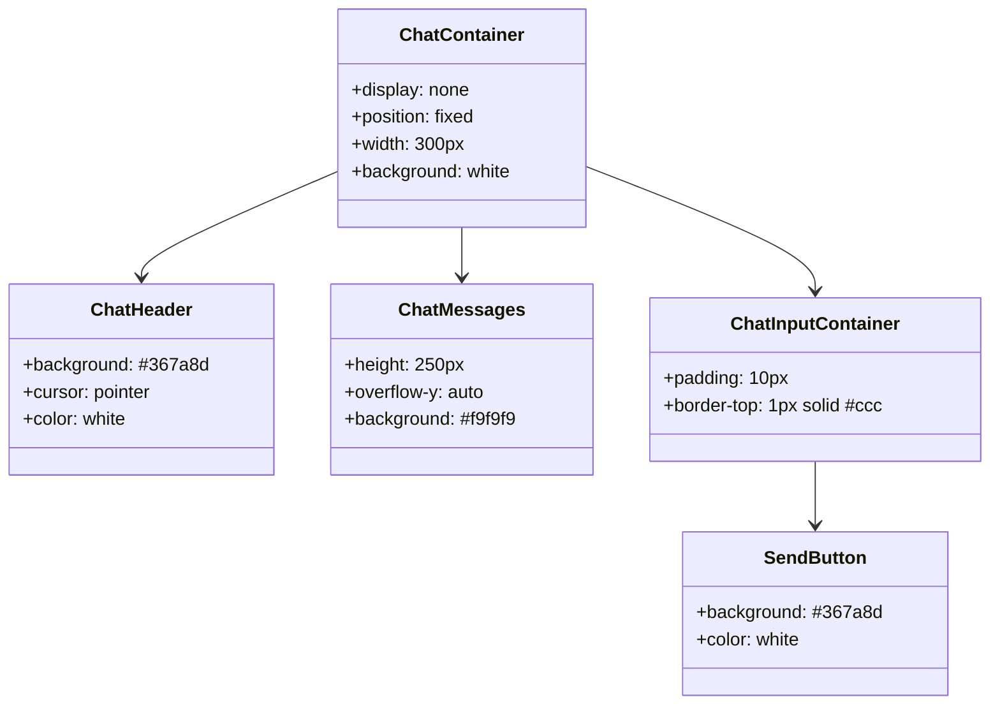
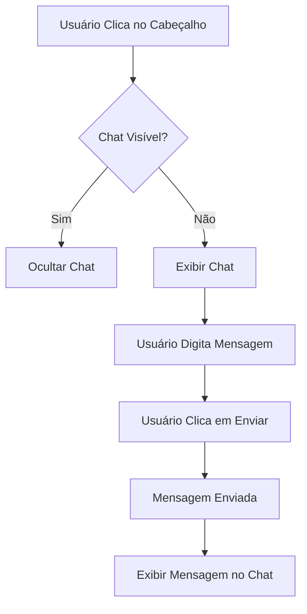

# Documentação do CSS do Chat

## Descrição Geral

Este documento descreve o arquivo CSS responsável pelo estilo de um componente de chat. O chat é projetado para ser fixado na parte inferior da tela, com um cabeçalho clicável que permite expandir ou recolher a janela de mensagens. O design é responsivo e inclui animações para feedback visual.

## Estrutura do CSS

### Contêiner Principal

```css
#chat-container {
    position: fixed;
    display: none;
    bottom: 20px;
    right: 50%;
    translate: 50%;
    width: 300px;
    background: white;
    border: 1px solid #ccc;
    border-radius: 10px;
    box-shadow: 0px 4px 6px rgba(0, 0, 0, 0.1);
    font-family: Arial, sans-serif;
}
```

- **Posicionamento e Aparência**: O contêiner do chat é fixado na parte inferior da tela, centralizado horizontalmente. Ele é inicialmente invisível (`display: none;`) e possui um design limpo com bordas arredondadas e sombra para destacar-se do fundo.

### Cabeçalho do Chat

```css
#chat-header {
    background: #367a8d;
    cursor: pointer;
    color: white;
    padding: 10px;
    text-align: center;
    font-weight: bold;
    border-top-left-radius: 10px;
    border-top-right-radius: 10px;
    display: flex;
    justify-content: space-between;
}
```

- **Interatividade e Estilo**: O cabeçalho é estilizado para ser clicável, com uma cor de fundo azul e texto branco. Ele utiliza flexbox para alinhar elementos internos.

### Área de Mensagens

```css
#chat-messages {
    height: 250px;
    overflow-y: auto;
    padding: 10px;
    background: #f9f9f9;
}
```

- **Rolagem e Estilo**: A área de mensagens permite rolagem vertical para visualizar mensagens antigas e possui um fundo claro para contraste com as mensagens.

### Entrada de Texto

```css
#chat-input-container {
    display: block;
    padding: 10px;
    border-top: 1px solid #ccc;
}
```

- **Layout e Separação**: A área de entrada de texto está separada das mensagens por uma borda superior e inclui um campo de entrada e um botão de envio estilizados.

### Botão de Envio

```css
#send-button {
    background: #367a8d;
    color: white;
    border: none;
    padding: 8px 15px;
    margin-left: 5px;
    cursor: pointer;
    border-radius: 5px;
}

#send-button:hover {
    background: #4ca1af;
}
```

- **Interatividade**: O botão de envio muda de cor ao passar o mouse, indicando interatividade.

### Animação de Carregamento

```css
#chat-loading {
    color: #367a8d;
    font-size: 1em;
    display: none;
    position: absolute;
    right: 40%;
}

.blink {
    animation: blink-animation 1s steps(7, start) infinite;
}

@keyframes blink-animation {
    0% { opacity: 1; }
    50% { opacity: 0; }
    100% { opacity: 1; }
}
```

- **Feedback Visual**: Um indicador de carregamento piscante fornece feedback visual durante operações assíncronas.

### Balões de Mensagem

```css
.chat-bubble {
    padding: 8px;
    margin: 5px 0;
    border-radius: 5px;
    color: black;
    max-width: 100%;
    word-wrap: break-word;
    white-space: pre-wrap;
    background-color: #f1f1f1;
}
```

- **Estilo e Formatação**: As mensagens são exibidas em balões com bordas arredondadas e fundo claro. Suportam formatação de texto, listas e código.

### Alinhamento de Mensagens

```css
.user-message {
    background-color: #d1e7fd;
    align-self: flex-end;
    text-align: right;
}

.bot-message {
    background-color: #e2e2e2;
    align-self: flex-start;
}
```

- **Diferenciação de Mensagens**: Mensagens do usuário e do bot são diferenciadas por cores de fundo e alinhamento.

## Diagramas

### Diagrama de Classes (Mermaid)



### Diagrama de Fluxo (Mermaid)



## Conformidade Regulamentar

Este documento segue as diretrizes de GAMP5, FDA 21 CFR Part 11 e ANVISA, garantindo que o design e a implementação do chat sejam realizados de forma a atender aos requisitos de segurança, usabilidade e rastreabilidade.