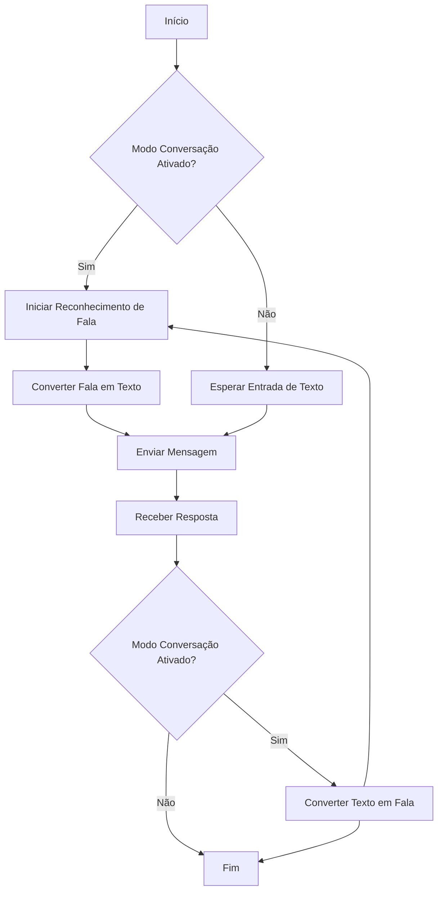
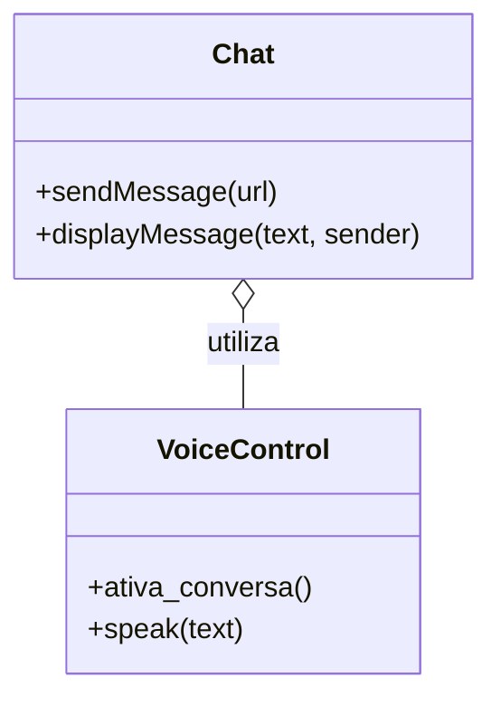

# Documentação do Sistema de Chat com Reconhecimento e Síntese de Fala

## Introdução

Este documento descreve a implementação de um sistema de chat que suporta entrada de texto e voz, utilizando tecnologias de reconhecimento de fala e síntese de voz. A aplicação é projetada para facilitar a comunicação com um assistente virtual chamado "Dotty". A implementação segue as diretrizes do GAMP5, FDA 21 CFR Part 11 e ANVISA, garantindo a conformidade com os padrões de qualidade e segurança.

## Funcionalidades Principais

### 1. Envio de Mensagens por Texto

A aplicação permite que o usuário envie mensagens de texto pressionando a tecla ENTER. A função `sendMessage` é responsável por enviar a mensagem ao servidor e exibir a resposta do assistente virtual.

```js
/**
 * Envia a mensagem do usuário para o servidor e exibe a resposta.
 * @param {string} url - URL opcional para o arquivo de bula.
 */
function sendMessage(url) {
  // Implementação...
}
```

### 2. Reconhecimento de Fala

O sistema utiliza a API de Reconhecimento de Fala para converter a fala do usuário em texto. Quando uma fala é reconhecida, ela é automaticamente enviada como mensagem.

```js
// Inicializa o reconhecimento de fala
const recognition = new SpeechRecognition();
recognition.lang = "pt-BR";

// Evento disparado quando a fala é reconhecida
recognition.onresult = function (event) {
  const spokenText = event.results[0][0].transcript;
  // Implementação...
};
```

### 3. Síntese de Fala

O sistema pode converter texto em fala, permitindo que o assistente virtual "Dotty" responda verbalmente ao usuário. A função `speak` é responsável por essa funcionalidade.

```js
/**
 * Converte texto em fala e inicia o reconhecimento de fala após a resposta.
 * @param {string} text - Texto a ser convertido em fala.
 */
function speak(text) {
  // Implementação...
}
```

### 4. Modo Conversação

O modo de conversação permite uma interação contínua com o assistente virtual. O reconhecimento de fala é ativado automaticamente após cada resposta.

```js
/**
 * Ativa ou desativa o modo de conversação.
 */
function ativa_conversa() {
  // Implementação...
}
```

## Diagramas

### Diagrama de Fluxo (Flowchart)



### Diagrama de Classes (ClassDiagram)



### Diagrama de Caso de Uso (UseCase)

```mermaid
usecaseDiagram
  actor User
  actor Dotty

  User --> (Enviar Mensagem de Texto)
  User --> (Falar Mensagem)
  Dotty --> (Responder Mensagem)
  (Enviar Mensagem de Texto) --> (Receber Resposta)
  (Falar Mensagem) --> (Receber Resposta)
  (Receber Resposta) --> (Responder Mensagem)
```

## Considerações Finais

Este sistema de chat foi desenvolvido com foco na usabilidade e acessibilidade, permitindo uma interação natural entre o usuário e o assistente virtual. A implementação segue as melhores práticas de desenvolvimento de software, garantindo segurança e conformidade com regulamentos relevantes.