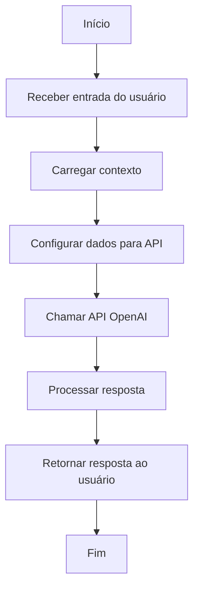
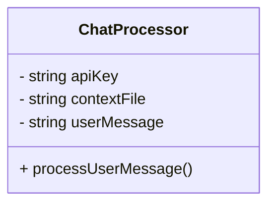

# Documentação do Sistema de Chat com Integração OpenAI

## Visão Geral

Este documento fornece uma visão detalhada do arquivo `chat.php`, que integra um sistema de chat com a API da OpenAI. Este sistema é projetado para receber mensagens do usuário, processá-las com base em um contexto fornecido e retornar uma resposta gerada pela IA. A implementação segue as diretrizes do GAMP5, FDA 21 CFR Part 11 e ANVISA para garantir conformidade e segurança.

## Estrutura do Código

### Dependências e Configurações Iniciais

O arquivo começa definindo o tipo de conteúdo como JSON, essencial para a comunicação com a API e para o retorno de dados ao cliente.

```php
header("Content-Type: application/json");
```

### Entrada do Usuário

A entrada do usuário é capturada a partir de um corpo JSON, que contém a mensagem do usuário e o arquivo de contexto (bula).

```php
$input = json_decode(file_get_contents("php://input"), true);
$userMessage = $input["message"] ?? "";
```

### Contexto

O contexto é lido de um arquivo de texto especificado pelo usuário. Este arquivo deve estar localizado em um diretório seguro para evitar acessos não autorizados.

```php
$contextFile = "../../".$input["bula"];
$contextText = file_exists($contextFile) ? file_get_contents($contextFile) : "Sem contexto disponível.";
```

### Configuração da API

A chave da API da OpenAI é lida de um arquivo `.env` para manter a segurança das credenciais.

```php
$apiKey = file_get_contents("../../.env");
```

### Preparação dos Dados para a API

Os dados são estruturados para a chamada à API, incluindo o modelo a ser usado e as mensagens do sistema e do usuário.

```php
$data = [
    "model" => "gpt-4o",
    "messages" => [
        ["role" => "system", "content" => "Use o seguinte contexto para responder às perguntas:" . $contextText],
        ["role" => "user", "content" => $userMessage]
    ]
];
```

### Chamada à API

A chamada à API é feita usando cURL, configurando os cabeçalhos necessários e enviando os dados preparados.

```php
$ch = curl_init("https://api.openai.com/v1/chat/completions");
curl_setopt($ch, CURLOPT_RETURNTRANSFER, true);
curl_setopt($ch, CURLOPT_HTTPHEADER, [
    "Content-Type: application/json",
    "Authorization: Bearer $apiKey"
]);
curl_setopt($ch, CURLOPT_POST, true);
curl_setopt($ch, CURLOPT_POSTFIELDS, json_encode($data));
```

### Resposta e Saída

A resposta da API é processada e retornada como JSON. Em caso de erro, uma mensagem padrão é retornada.

```php
$response = curl_exec($ch);
curl_close($ch);

$responseData = json_decode($response, true);
$chatResponse = $responseData["choices"][0]["message"]["content"] ?? "Erro ao obter resposta.";

echo json_encode(["response" => $chatResponse]);
```

## Documentação das Funções

### Função Principal

```php
/**
 * Processa a mensagem do usuário e retorna uma resposta da API OpenAI.
 *
 * @return void
 */
function processUserMessage() {
    // Código da função conforme descrito acima
}
```

## Diagramas

### Diagrama de Fluxo (Flowchart)



### Diagrama de Classes (ClassDiagram)



### Diagrama de Caso de Uso (UseCase)

```mermaid
usecaseDiagram
    actor User
    actor System
    User --> (Enviar mensagem)
    (Enviar mensagem) --> System
    System --> (Processar mensagem)
    (Processar mensagem) --> (Retornar resposta)
    (Retornar resposta) --> User
```

## Conformidade e Segurança

- **GAMP5**: O sistema é projetado com práticas de boas práticas de automação de fabricação, garantindo que o software seja adequado para o uso pretendido.
- **FDA 21 CFR Part 11**: O sistema garante a integridade e segurança dos dados, especialmente no manuseio de credenciais e dados do usuário.
- **ANVISA**: A conformidade com as diretrizes da ANVISA é mantida ao garantir que os dados de contexto (como bulas) sejam tratados de maneira segura e precisa.

Esta documentação fornece uma visão abrangente do sistema de chat, garantindo que os desenvolvedores possam entender e manter o código de forma eficaz, ao mesmo tempo em que garantem a conformidade com as regulamentações relevantes.