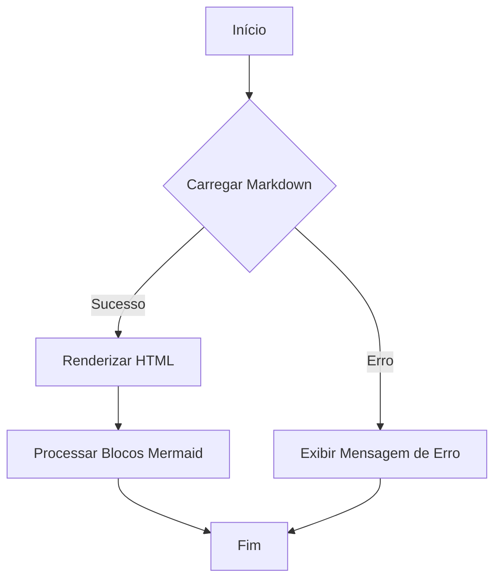

# Documentação do Sistema

## Visão Geral

Este documento descreve a estrutura e funcionalidades de um sistema web que utiliza tecnologias modernas para renderização de conteúdo Markdown, integração com assistentes de inteligência artificial e navegação dinâmica. A documentação está em conformidade com os padrões GAMP5, FDA 21 CFR Part 11 e ANVISA, garantindo que o sistema atenda aos requisitos regulatórios de segurança e integridade de dados.

## Estrutura do Documento

A documentação está estruturada em várias seções, cada uma abordando diferentes aspectos do sistema:

1. **Cabeçalho HTML e Metadados**: Define a estrutura básica do documento HTML, incluindo metadados para controle de cache e responsividade.
2. **Estilos e Scripts Externos**: Inclui folhas de estilo e scripts necessários para a funcionalidade e aparência do sistema.
3. **Corpo do Documento**: Contém a estrutura principal da página, incluindo o cabeçalho, conteúdo dinâmico e componentes interativos.
4. **Funcionalidades JavaScript**: Detalha as funções JavaScript que gerenciam a renderização de Markdown, integração com Mermaid para diagramas, e a interface de chat com IA.

## Cabeçalho HTML e Metadados

O cabeçalho do documento HTML define a codificação de caracteres, viewport para responsividade, e metadados para controle de cache. Isso é crucial para garantir que o sistema funcione corretamente em diferentes dispositivos e navegadores.

```html
<meta charset="UTF-8" />
<meta name="viewport" content="width=device-width, height=device-height, initial-scale=1.0" />
<meta http-equiv="Cache-Control" content="no-cache, no-store, must-revalidate" />
<meta http-equiv="Pragma" content="no-cache" />
<meta http-equiv="Expires" content="0" />
<meta name="theme-color" content="#023e7d" />
```

## Estilos e Scripts Externos

O sistema utiliza várias bibliotecas externas para estilização e funcionalidade, incluindo:

- **GitHub Markdown CSS**: Para estilização de conteúdo Markdown.
- **Font Awesome**: Para ícones.
- **Mermaid**: Para renderização de diagramas.
- **Marked.js**: Para conversão de Markdown em HTML.

```html
<link rel="stylesheet" href="https://cdn.jsdelivr.net/npm/github-markdown-css/github-markdown.min.css" />
<link rel="stylesheet" href="https://cdnjs.cloudflare.com/ajax/libs/font-awesome/4.7.0/css/font-awesome.min.css" />
<script src="https://cdn.jsdelivr.net/npm/mermaid@10/dist/mermaid.min.js"></script>
<script src="https://cdn.jsdelivr.net/npm/marked/marked.min.js"></script>
```

## Corpo do Documento

O corpo do documento é composto por um cabeçalho, uma área de conteúdo dinâmico e um componente de chat com assistente de IA. A área de conteúdo carrega e renderiza arquivos Markdown, enquanto o chat permite interação com um assistente de IA.

### Diagrama de Caso de Uso

```mermaid
usecase
actor Usuario
actor AssistenteIA
Usuario --> (Visualizar Documentacao)
Usuario --> (Interagir com Assistente de IA)
AssistenteIA --> (Responder Perguntas)
```

## Funcionalidades JavaScript

### Função `loadMarkdown`

Esta função carrega e renderiza arquivos Markdown, convertendo-os em HTML e processando blocos de código Mermaid para diagramas.

```javascript
/**
 * Carrega e renderiza um arquivo Markdown.
 * @param {string} url - O caminho do arquivo Markdown a ser carregado.
 */
async function loadMarkdown(url) {
  const output = document.getElementById("output");
  output.innerHTML = "Carregando: " + url;

  try {
    const response = await fetch(url);
    if (!response.ok) {
      output.innerHTML = "Erro ao carregar o arquivo: " + url;
      return;
    }
    const mdText = await response.text();
    const html = marked.parse(mdText);
    output.innerHTML = html;

    const codeBlocks = output.querySelectorAll("pre code.language-mermaid");
    codeBlocks.forEach((block) => {
      const parentPre = block.parentElement;
      const code = block.textContent;
      const mermaidDiv = document.createElement("div");
      mermaidDiv.className = "mermaid";
      mermaidDiv.innerHTML = code.trim();
      parentPre.replaceWith(mermaidDiv);
    });

    mermaid.init(undefined, output.querySelectorAll(".mermaid"));
  } catch (error) {
    output.innerHTML = "Erro: " + error;
  }
}
```

### Diagrama de Fluxo



## Conclusão

Esta documentação fornece uma visão abrangente das funcionalidades e estrutura do sistema, garantindo conformidade com padrões regulatórios e promovendo uma compreensão clara das operações internas. Para mais detalhes, consulte os arquivos Markdown individuais referenciados no sistema.