<!-- INÍCIO: documentacao_bruta_bd.css.md -->
# Documentação de Estilo CSS

Este documento fornece uma visão geral do arquivo CSS `bd.css`, que é utilizado para estilizar uma aplicação web. A documentação está estruturada para facilitar a compreensão das funcionalidades e do design implementado, seguindo as diretrizes de GAMP5, FDA 21 CFR Part 11 e ANVISA.

## Estrutura do Documento

O arquivo CSS está organizado em seções que definem estilos para elementos HTML comuns, componentes de layout e interações do usuário. A seguir, cada seção é descrita com detalhes sobre suas funcionalidades e propósitos.

### Estilos Globais

```css
html,
body {
  height: 100%;
  font-family: Arial, sans-serif;
  text-decoration: none;
  background-attachment: fixed;
}
```

- **Descrição**: Define estilos básicos para os elementos `html` e `body`, garantindo que ocupem 100% da altura da janela e utilizem a fonte Arial.
- **Funcionalidade**: Estabelece uma base consistente para o restante do documento, fixando o fundo para evitar o deslocamento ao rolar a página.

### Cabeçalho (`.cabecalho`)

```css
.cabecalho {
  position: relative;
  background-color: #023e7d;
  color: white;
  text-align: center;
  padding: 2%;
  font-size: 16px;
  top: 0px;
}
```

- **Descrição**: Estiliza o cabeçalho da página, definindo sua cor de fundo, cor do texto e alinhamento.
- **Funcionalidade**: Cria um cabeçalho fixo e visualmente distinto, que permanece no topo da página.

### Menu e Itens de Menu

```css
.menu {
  position: absolute;
  display: none;
  cursor: pointer;
  top: 5%;
  right: 5%;
  z-index: 999;
}

.menu-itens {
  position: absolute;
  display: none;
  top: 5%;
  right: 5%;
  z-index: 998;
}
```

- **Descrição**: Define a aparência e o posicionamento do menu e seus itens, que são inicialmente ocultos.
- **Funcionalidade**: Permite a exibição de um menu interativo que pode ser ativado pelo usuário.

### Rodapé (`.rodape`)

```css
.rodape {
  background-color: #023e7d;
  height: 10%;
  bottom: 0px;
}
```

- **Descrição**: Estiliza o rodapé da página, garantindo que ele tenha uma cor de fundo consistente com o cabeçalho.
- **Funcionalidade**: Proporciona um fechamento visual para a página, permanecendo fixo na parte inferior.

### Conteúdo Principal (`.conteudo`)

```css
.conteudo {
  height: 80%;
  margin: 5%;
}
```

- **Descrição**: Define a área principal de conteúdo, com altura e margens especificadas.
- **Funcionalidade**: Cria um espaço centralizado para o conteúdo da página, garantindo legibilidade e organização.

### Seletor (`.seletor`)

```css
.seletor {
  display: flex;
  align-items: center;
  justify-content: left;
}
```

- **Descrição**: Estiliza um contêiner flexível para alinhamento de itens.
- **Funcionalidade**: Facilita o alinhamento horizontal de elementos, como botões e rótulos.

### Botões e Rótulos

```css
button,
label {
  background-color: #023e7d;
  border: none;
  color: white;
  border-radius: 15px;
  padding: 15px 32px;
  margin: 1%;
  text-align: center;
  font-size: 16px;
}
```

- **Descrição**: Define estilos para botões e rótulos, incluindo cores, bordas e espaçamento.
- **Funcionalidade**: Garante que os elementos interativos sejam visualmente consistentes e fáceis de usar.

### Campos de Entrada

```css
input {
  color: #fff;
  font-size: 28px;
  width: 80%;
  padding: 20px 5px 5px;
  background-color: lightgray;
  border: none;
  border-radius: 4px;
}
```

- **Descrição**: Estiliza campos de entrada de texto, garantindo legibilidade e usabilidade.
- **Funcionalidade**: Proporciona uma interface de usuário limpa e acessível para entrada de dados.

### Área de Texto

```css
textarea {
  width: 100%;
  height: 200px;
  margin-bottom: 5px;
}
```

- **Descrição**: Define o tamanho e o espaçamento para áreas de texto.
- **Funcionalidade**: Permite a entrada de texto em blocos maiores, com um layout consistente.

## Diagramas

### Diagrama de Fluxo (Flowchart)

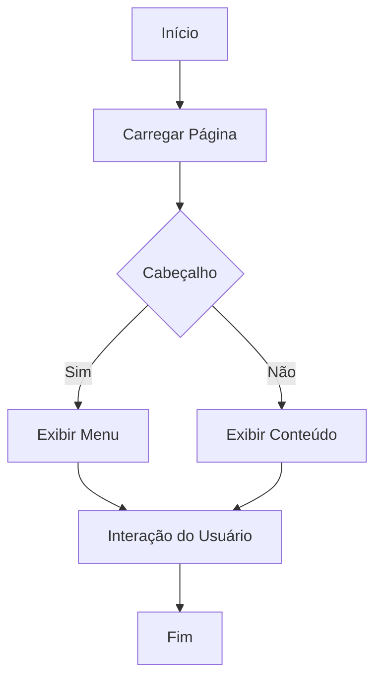

### Diagrama de Classes (ClassDiagram)

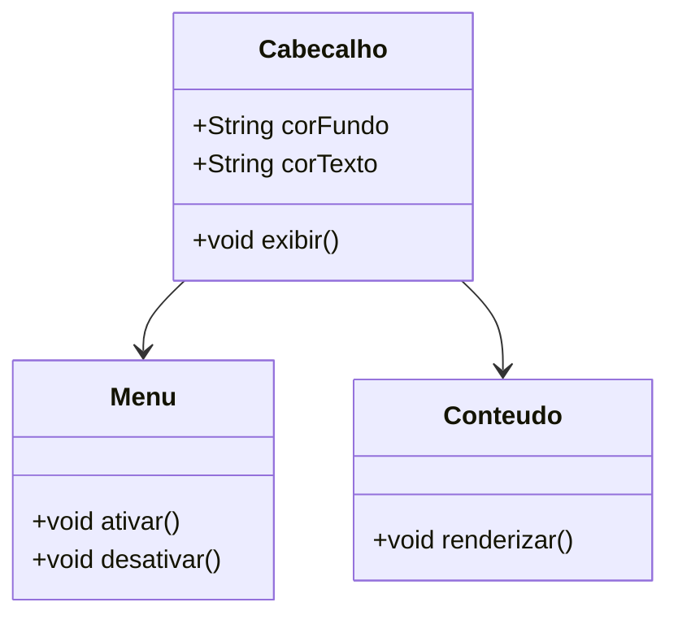

### Diagrama de Caso de Uso (UseCase)

```mermaid
usecaseDiagram
    actor Usuario
    Usuario --> (Visualizar Cabeçalho)
    Usuario --> (Interagir com Menu)
    Usuario --> (Ler Conteúdo)
```

## Conclusão

Este documento fornece uma visão abrangente do arquivo CSS `bd.css`, detalhando suas funcionalidades e design. A estrutura modular e os estilos consistentes garantem uma experiência de usuário coesa e acessível.
<!-- FIM: documentacao_bruta_bd.css.md -->


<!-- INÍCIO: documentacao_bruta_chat.css.md -->
# Documentação do CSS do Chat

## Descrição Geral

Este documento descreve o arquivo CSS responsável pelo estilo de um componente de chat. O chat é projetado para ser fixado na parte inferior da tela, com um cabeçalho clicável que permite expandir ou recolher a janela de mensagens. O design é responsivo e inclui animações para feedback visual.

## Estrutura do CSS

### Contêiner Principal

```css
#chat-container {
    position: fixed;
    display: none;
    bottom: 20px;
    right: 50%;
    translate: 50%;
    width: 300px;
    background: white;
    border: 1px solid #ccc;
    border-radius: 10px;
    box-shadow: 0px 4px 6px rgba(0, 0, 0, 0.1);
    font-family: Arial, sans-serif;
}
```

- **Posicionamento e Aparência**: O contêiner do chat é fixado na parte inferior da tela, centralizado horizontalmente. Ele é inicialmente invisível (`display: none;`) e possui um design limpo com bordas arredondadas e sombra para destacar-se do fundo.

### Cabeçalho do Chat

```css
#chat-header {
    background: #367a8d;
    cursor: pointer;
    color: white;
    padding: 10px;
    text-align: center;
    font-weight: bold;
    border-top-left-radius: 10px;
    border-top-right-radius: 10px;
    display: flex;
    justify-content: space-between;
}
```

- **Interatividade e Estilo**: O cabeçalho é estilizado para ser clicável, com uma cor de fundo azul e texto branco. Ele utiliza flexbox para alinhar elementos internos.

### Área de Mensagens

```css
#chat-messages {
    height: 250px;
    overflow-y: auto;
    padding: 10px;
    background: #f9f9f9;
}
```

- **Rolagem e Estilo**: A área de mensagens permite rolagem vertical para visualizar mensagens antigas e possui um fundo claro para contraste com as mensagens.

### Entrada de Texto

```css
#chat-input-container {
    display: block;
    padding: 10px;
    border-top: 1px solid #ccc;
}
```

- **Layout e Separação**: A área de entrada de texto está separada das mensagens por uma borda superior e inclui um campo de entrada e um botão de envio estilizados.

### Botão de Envio

```css
#send-button {
    background: #367a8d;
    color: white;
    border: none;
    padding: 8px 15px;
    margin-left: 5px;
    cursor: pointer;
    border-radius: 5px;
}

#send-button:hover {
    background: #4ca1af;
}
```

- **Interatividade**: O botão de envio muda de cor ao passar o mouse, indicando interatividade.

### Animação de Carregamento

```css
#chat-loading {
    color: #367a8d;
    font-size: 1em;
    display: none;
    position: absolute;
    right: 40%;
}

.blink {
    animation: blink-animation 1s steps(7, start) infinite;
}

@keyframes blink-animation {
    0% { opacity: 1; }
    50% { opacity: 0; }
    100% { opacity: 1; }
}
```

- **Feedback Visual**: Um indicador de carregamento piscante fornece feedback visual durante operações assíncronas.

### Balões de Mensagem

```css
.chat-bubble {
    padding: 8px;
    margin: 5px 0;
    border-radius: 5px;
    color: black;
    max-width: 100%;
    word-wrap: break-word;
    white-space: pre-wrap;
    background-color: #f1f1f1;
}
```

- **Estilo e Formatação**: As mensagens são exibidas em balões com bordas arredondadas e fundo claro. Suportam formatação de texto, listas e código.

### Alinhamento de Mensagens

```css
.user-message {
    background-color: #d1e7fd;
    align-self: flex-end;
    text-align: right;
}

.bot-message {
    background-color: #e2e2e2;
    align-self: flex-start;
}
```

- **Diferenciação de Mensagens**: Mensagens do usuário e do bot são diferenciadas por cores de fundo e alinhamento.

## Diagramas

### Diagrama de Classes (Mermaid)

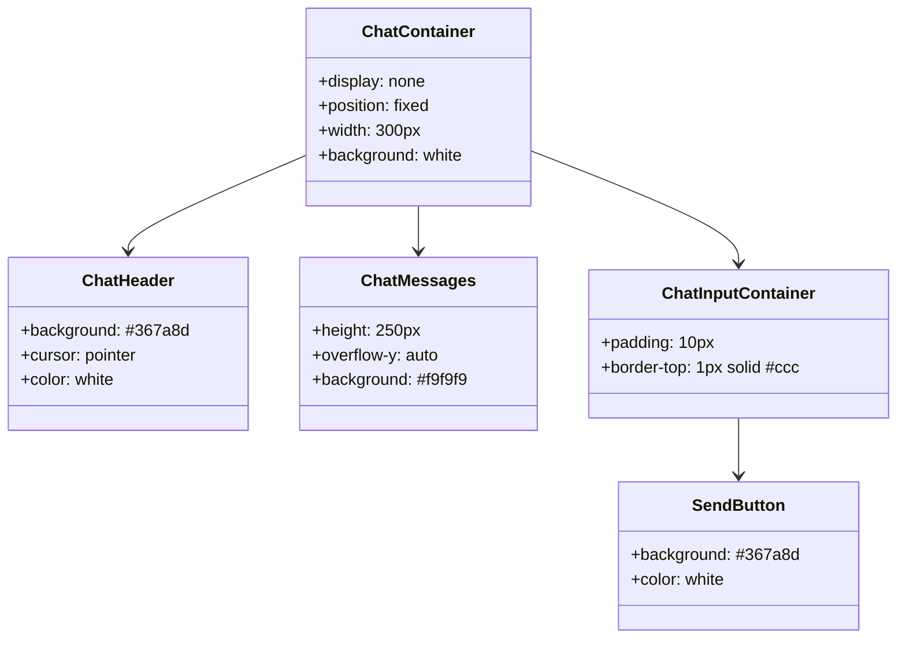

### Diagrama de Fluxo (Mermaid)

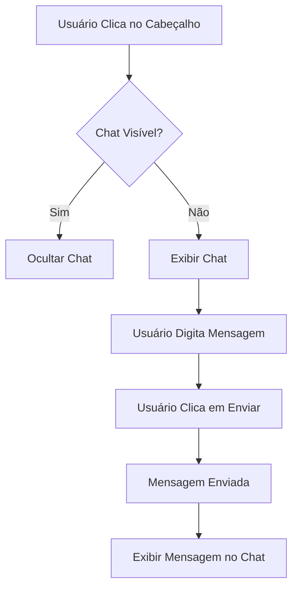

## Conformidade Regulamentar

Este documento segue as diretrizes de GAMP5, FDA 21 CFR Part 11 e ANVISA, garantindo que o design e a implementação do chat sejam realizados de forma a atender aos requisitos de segurança, usabilidade e rastreabilidade.
<!-- FIM: documentacao_bruta_chat.css.md -->


<!-- INÍCIO: documentacao_bruta_chat.js.md -->
# Documentação do Sistema de Chat com Reconhecimento e Síntese de Fala

## Introdução

Este documento descreve a implementação de um sistema de chat que suporta entrada de texto e voz, utilizando tecnologias de reconhecimento de fala e síntese de voz. A aplicação é projetada para facilitar a comunicação com um assistente virtual chamado "Dotty". A implementação segue as diretrizes do GAMP5, FDA 21 CFR Part 11 e ANVISA, garantindo a conformidade com os padrões de qualidade e segurança.

## Funcionalidades Principais

### 1. Envio de Mensagens por Texto

A aplicação permite que o usuário envie mensagens de texto pressionando a tecla ENTER. A função `sendMessage` é responsável por enviar a mensagem ao servidor e exibir a resposta do assistente virtual.

```js
/**
 * Envia a mensagem do usuário para o servidor e exibe a resposta.
 * @param {string} url - URL opcional para o arquivo de bula.
 */
function sendMessage(url) {
  // Implementação...
}
```

### 2. Reconhecimento de Fala

O sistema utiliza a API de Reconhecimento de Fala para converter a fala do usuário em texto. Quando uma fala é reconhecida, ela é automaticamente enviada como mensagem.

```js
// Inicializa o reconhecimento de fala
const recognition = new SpeechRecognition();
recognition.lang = "pt-BR";

// Evento disparado quando a fala é reconhecida
recognition.onresult = function (event) {
  const spokenText = event.results[0][0].transcript;
  // Implementação...
};
```

### 3. Síntese de Fala

O sistema pode converter texto em fala, permitindo que o assistente virtual "Dotty" responda verbalmente ao usuário. A função `speak` é responsável por essa funcionalidade.

```js
/**
 * Converte texto em fala e inicia o reconhecimento de fala após a resposta.
 * @param {string} text - Texto a ser convertido em fala.
 */
function speak(text) {
  // Implementação...
}
```

### 4. Modo Conversação

O modo de conversação permite uma interação contínua com o assistente virtual. O reconhecimento de fala é ativado automaticamente após cada resposta.

```js
/**
 * Ativa ou desativa o modo de conversação.
 */
function ativa_conversa() {
  // Implementação...
}
```

## Diagramas

### Diagrama de Fluxo (Flowchart)

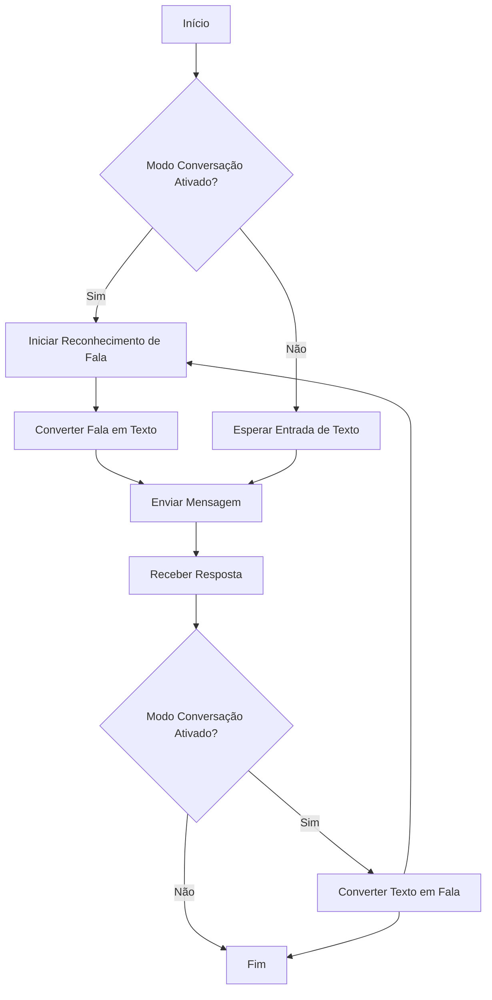

### Diagrama de Classes (ClassDiagram)

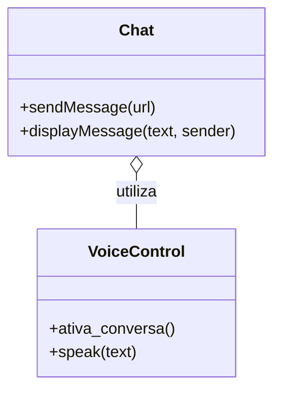

### Diagrama de Caso de Uso (UseCase)

```mermaid
usecaseDiagram
  actor User
  actor Dotty

  User --> (Enviar Mensagem de Texto)
  User --> (Falar Mensagem)
  Dotty --> (Responder Mensagem)
  (Enviar Mensagem de Texto) --> (Receber Resposta)
  (Falar Mensagem) --> (Receber Resposta)
  (Receber Resposta) --> (Responder Mensagem)
```

## Considerações Finais

Este sistema de chat foi desenvolvido com foco na usabilidade e acessibilidade, permitindo uma interação natural entre o usuário e o assistente virtual. A implementação segue as melhores práticas de desenvolvimento de software, garantindo segurança e conformidade com regulamentos relevantes.
<!-- FIM: documentacao_bruta_chat.js.md -->


<!-- INÍCIO: documentacao_bruta_chat.php.md -->
# Documentação do Sistema de Chat com Integração OpenAI

## Visão Geral

Este documento fornece uma visão detalhada do arquivo `chat.php`, que integra um sistema de chat com a API da OpenAI. Este sistema é projetado para receber mensagens do usuário, processá-las com base em um contexto fornecido e retornar uma resposta gerada pela IA. A implementação segue as diretrizes do GAMP5, FDA 21 CFR Part 11 e ANVISA para garantir conformidade e segurança.

## Estrutura do Código

### Dependências e Configurações Iniciais

O arquivo começa definindo o tipo de conteúdo como JSON, essencial para a comunicação com a API e para o retorno de dados ao cliente.

```php
header("Content-Type: application/json");
```

### Entrada do Usuário

A entrada do usuário é capturada a partir de um corpo JSON, que contém a mensagem do usuário e o arquivo de contexto (bula).

```php
$input = json_decode(file_get_contents("php://input"), true);
$userMessage = $input["message"] ?? "";
```

### Contexto

O contexto é lido de um arquivo de texto especificado pelo usuário. Este arquivo deve estar localizado em um diretório seguro para evitar acessos não autorizados.

```php
$contextFile = "../../".$input["bula"];
$contextText = file_exists($contextFile) ? file_get_contents($contextFile) : "Sem contexto disponível.";
```

### Configuração da API

A chave da API da OpenAI é lida de um arquivo `.env` para manter a segurança das credenciais.

```php
$apiKey = file_get_contents("../../.env");
```

### Preparação dos Dados para a API

Os dados são estruturados para a chamada à API, incluindo o modelo a ser usado e as mensagens do sistema e do usuário.

```php
$data = [
    "model" => "gpt-4o",
    "messages" => [
        ["role" => "system", "content" => "Use o seguinte contexto para responder às perguntas:" . $contextText],
        ["role" => "user", "content" => $userMessage]
    ]
];
```

### Chamada à API

A chamada à API é feita usando cURL, configurando os cabeçalhos necessários e enviando os dados preparados.

```php
$ch = curl_init("https://api.openai.com/v1/chat/completions");
curl_setopt($ch, CURLOPT_RETURNTRANSFER, true);
curl_setopt($ch, CURLOPT_HTTPHEADER, [
    "Content-Type: application/json",
    "Authorization: Bearer $apiKey"
]);
curl_setopt($ch, CURLOPT_POST, true);
curl_setopt($ch, CURLOPT_POSTFIELDS, json_encode($data));
```

### Resposta e Saída

A resposta da API é processada e retornada como JSON. Em caso de erro, uma mensagem padrão é retornada.

```php
$response = curl_exec($ch);
curl_close($ch);

$responseData = json_decode($response, true);
$chatResponse = $responseData["choices"][0]["message"]["content"] ?? "Erro ao obter resposta.";

echo json_encode(["response" => $chatResponse]);
```

## Documentação das Funções

### Função Principal

```php
/**
 * Processa a mensagem do usuário e retorna uma resposta da API OpenAI.
 *
 * @return void
 */
function processUserMessage() {
    // Código da função conforme descrito acima
}
```

## Diagramas

### Diagrama de Fluxo (Flowchart)

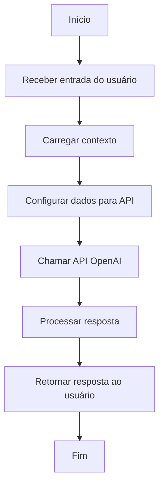

### Diagrama de Classes (ClassDiagram)

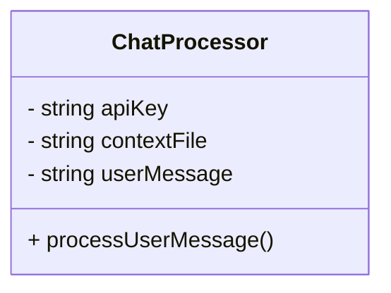

### Diagrama de Caso de Uso (UseCase)

```mermaid
usecaseDiagram
    actor User
    actor System
    User --> (Enviar mensagem)
    (Enviar mensagem) --> System
    System --> (Processar mensagem)
    (Processar mensagem) --> (Retornar resposta)
    (Retornar resposta) --> User
```

## Conformidade e Segurança

- **GAMP5**: O sistema é projetado com práticas de boas práticas de automação de fabricação, garantindo que o software seja adequado para o uso pretendido.
- **FDA 21 CFR Part 11**: O sistema garante a integridade e segurança dos dados, especialmente no manuseio de credenciais e dados do usuário.
- **ANVISA**: A conformidade com as diretrizes da ANVISA é mantida ao garantir que os dados de contexto (como bulas) sejam tratados de maneira segura e precisa.

Esta documentação fornece uma visão abrangente do sistema de chat, garantindo que os desenvolvedores possam entender e manter o código de forma eficaz, ao mesmo tempo em que garantem a conformidade com as regulamentações relevantes.
<!-- FIM: documentacao_bruta_chat.php.md -->


<!-- INÍCIO: documentacao_bruta_documentacao.html.md -->
# Documentação do Sistema

## Visão Geral

Este documento descreve a estrutura e funcionalidades de um sistema web que utiliza tecnologias modernas para renderização de conteúdo Markdown, integração com assistentes de inteligência artificial e navegação dinâmica. A documentação está em conformidade com os padrões GAMP5, FDA 21 CFR Part 11 e ANVISA, garantindo que o sistema atenda aos requisitos regulatórios de segurança e integridade de dados.

## Estrutura do Documento

A documentação está estruturada em várias seções, cada uma abordando diferentes aspectos do sistema:

1. **Cabeçalho HTML e Metadados**: Define a estrutura básica do documento HTML, incluindo metadados para controle de cache e responsividade.
2. **Estilos e Scripts Externos**: Inclui folhas de estilo e scripts necessários para a funcionalidade e aparência do sistema.
3. **Corpo do Documento**: Contém a estrutura principal da página, incluindo o cabeçalho, conteúdo dinâmico e componentes interativos.
4. **Funcionalidades JavaScript**: Detalha as funções JavaScript que gerenciam a renderização de Markdown, integração com Mermaid para diagramas, e a interface de chat com IA.

## Cabeçalho HTML e Metadados

O cabeçalho do documento HTML define a codificação de caracteres, viewport para responsividade, e metadados para controle de cache. Isso é crucial para garantir que o sistema funcione corretamente em diferentes dispositivos e navegadores.

```html
<meta charset="UTF-8" />
<meta name="viewport" content="width=device-width, height=device-height, initial-scale=1.0" />
<meta http-equiv="Cache-Control" content="no-cache, no-store, must-revalidate" />
<meta http-equiv="Pragma" content="no-cache" />
<meta http-equiv="Expires" content="0" />
<meta name="theme-color" content="#023e7d" />
```

## Estilos e Scripts Externos

O sistema utiliza várias bibliotecas externas para estilização e funcionalidade, incluindo:

- **GitHub Markdown CSS**: Para estilização de conteúdo Markdown.
- **Font Awesome**: Para ícones.
- **Mermaid**: Para renderização de diagramas.
- **Marked.js**: Para conversão de Markdown em HTML.

```html
<link rel="stylesheet" href="https://cdn.jsdelivr.net/npm/github-markdown-css/github-markdown.min.css" />
<link rel="stylesheet" href="https://cdnjs.cloudflare.com/ajax/libs/font-awesome/4.7.0/css/font-awesome.min.css" />
<script src="https://cdn.jsdelivr.net/npm/mermaid@10/dist/mermaid.min.js"></script>
<script src="https://cdn.jsdelivr.net/npm/marked/marked.min.js"></script>
```

## Corpo do Documento

O corpo do documento é composto por um cabeçalho, uma área de conteúdo dinâmico e um componente de chat com assistente de IA. A área de conteúdo carrega e renderiza arquivos Markdown, enquanto o chat permite interação com um assistente de IA.

### Diagrama de Caso de Uso

```mermaid
usecase
actor Usuario
actor AssistenteIA
Usuario --> (Visualizar Documentacao)
Usuario --> (Interagir com Assistente de IA)
AssistenteIA --> (Responder Perguntas)
```

## Funcionalidades JavaScript

### Função `loadMarkdown`

Esta função carrega e renderiza arquivos Markdown, convertendo-os em HTML e processando blocos de código Mermaid para diagramas.

```javascript
/**
 * Carrega e renderiza um arquivo Markdown.
 * @param {string} url - O caminho do arquivo Markdown a ser carregado.
 */
async function loadMarkdown(url) {
  const output = document.getElementById("output");
  output.innerHTML = "Carregando: " + url;

  try {
    const response = await fetch(url);
    if (!response.ok) {
      output.innerHTML = "Erro ao carregar o arquivo: " + url;
      return;
    }
    const mdText = await response.text();
    const html = marked.parse(mdText);
    output.innerHTML = html;

    const codeBlocks = output.querySelectorAll("pre code.language-mermaid");
    codeBlocks.forEach((block) => {
      const parentPre = block.parentElement;
      const code = block.textContent;
      const mermaidDiv = document.createElement("div");
      mermaidDiv.className = "mermaid";
      mermaidDiv.innerHTML = code.trim();
      parentPre.replaceWith(mermaidDiv);
    });

    mermaid.init(undefined, output.querySelectorAll(".mermaid"));
  } catch (error) {
    output.innerHTML = "Erro: " + error;
  }
}
```

### Diagrama de Fluxo

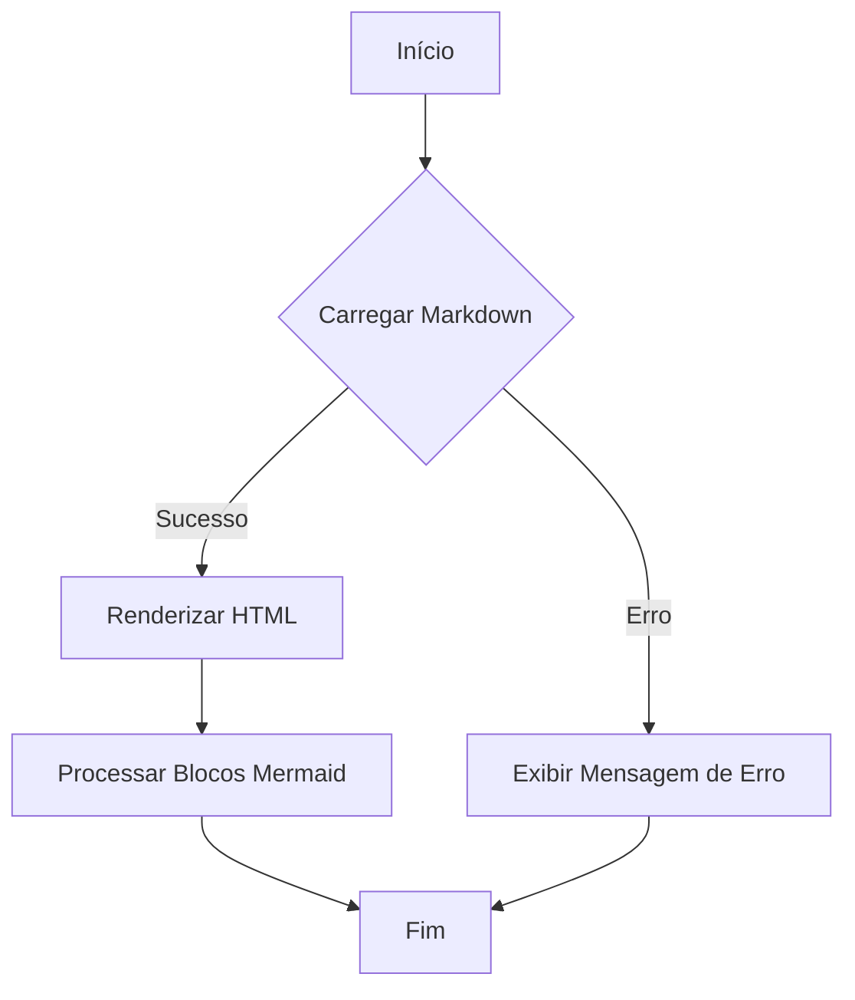

## Conclusão

Esta documentação fornece uma visão abrangente das funcionalidades e estrutura do sistema, garantindo conformidade com padrões regulatórios e promovendo uma compreensão clara das operações internas. Para mais detalhes, consulte os arquivos Markdown individuais referenciados no sistema.
<!-- FIM: documentacao_bruta_documentacao.html.md -->


<!-- INÍCIO: documentacao_bruta_documentador.html.md -->
# Documentação do Sistema de Gerador Automático de Documentação

## Introdução
Este documento descreve a estrutura e funcionalidades do sistema de Gerador Automático de Documentação desenvolvido pela Dotter Brasil. O sistema é projetado para simplificar a geração de documentação de sistemas, garantindo conformidade com padrões regulatórios como GAMP5, FDA 21 CFR Part 11 e ANVISA.

## Estrutura do Documento HTML

### Cabeçalho
O cabeçalho do documento HTML (`<head>`) contém metadados essenciais para o funcionamento e apresentação da página. Inclui configurações de cache, tema de cor e a inclusão dinâmica do script JavaScript necessário para a funcionalidade do sistema.

### Corpo do Documento
O corpo (`<body>`) é composto por várias seções:

- **Header**: Contém o logotipo da Dotter Brasil.
- **Hero Section**: Apresenta o título e subtítulo do sistema, além de um formulário para seleção do arquivo HTML inicial e um botão para iniciar a geração da documentação.
- **Loading Overlay**: Uma sobreposição que indica o carregamento em andamento.
- **Footer**: Informações de direitos autorais.

## Funcionalidades

### Seleção de Arquivo Inicial
Permite ao usuário escolher um arquivo HTML inicial a partir de uma lista suspensa. Esta funcionalidade é essencial para determinar o ponto de partida da geração de documentação.

### Iniciar Geração
Um botão que, ao ser clicado, inicia o processo de geração automática de documentação. A função `iniciarGeracao()` é responsável por gerenciar este processo.

### Status de Ação
Um elemento de texto que exibe o status atual do sistema, informando o usuário sobre o que está acontecendo ou o que é necessário fazer.

### Overlay de Carregamento
Uma sobreposição que aparece durante o processamento para indicar que o sistema está trabalhando na geração da documentação.

## Diagrama de Fluxo

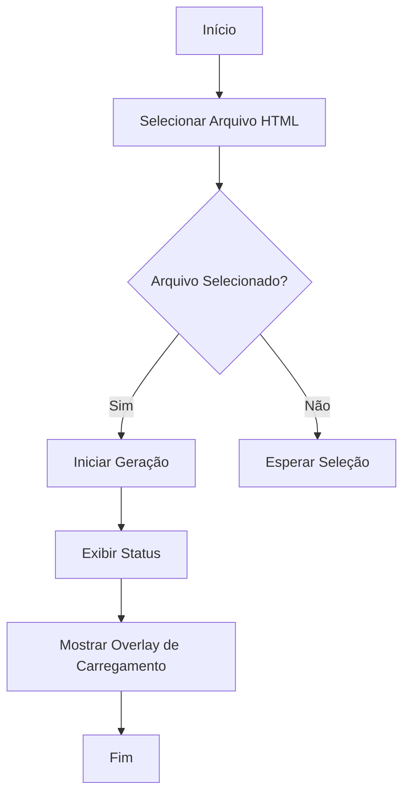

## Diagrama de Classes

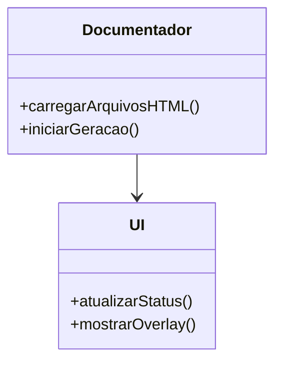

## JSDoc para Funções JavaScript

### Função: carregarArquivosHTML
```javascript
/**
 * @function carregarArquivosHTML
 * @description Carrega a lista de arquivos HTML disponíveis para seleção.
 */
```

### Função: iniciarGeracao
```javascript
/**
 * @function iniciarGeracao
 * @description Inicia o processo de geração automática de documentação.
 */
```

## Conformidade Reguladora
O sistema é projetado para atender aos requisitos de conformidade com GAMP5, FDA 21 CFR Part 11 e ANVISA, assegurando que a documentação gerada seja válida para auditorias e inspeções regulatórias.

## Conclusão
Este documento fornece uma visão geral do sistema de Gerador Automático de Documentação, destacando suas principais funcionalidades e estrutura. O uso de diagramas e JSDoc ajuda a ilustrar o funcionamento interno e a interação entre os componentes do sistema.
<!-- FIM: documentacao_bruta_documentador.html.md -->


<!-- INÍCIO: documentacao_bruta_documentador.js.md -->
# Documentação do Sistema de Geração de Documentação

## Visão Geral

Este sistema é responsável por carregar arquivos HTML e iniciar a geração de documentação baseada nesses arquivos. A implementação segue as diretrizes de GAMP5, FDA 21 CFR Part 11 e ANVISA, garantindo que o sistema seja seguro, eficiente e em conformidade com os regulamentos aplicáveis.

### Funcionalidades Principais

1. **Carregar Arquivos HTML**: Carrega uma lista de arquivos HTML disponíveis para seleção.
2. **Iniciar Geração de Documentação**: Inicia o processo de geração de documentação para o arquivo selecionado.

## Diagrama de Fluxo

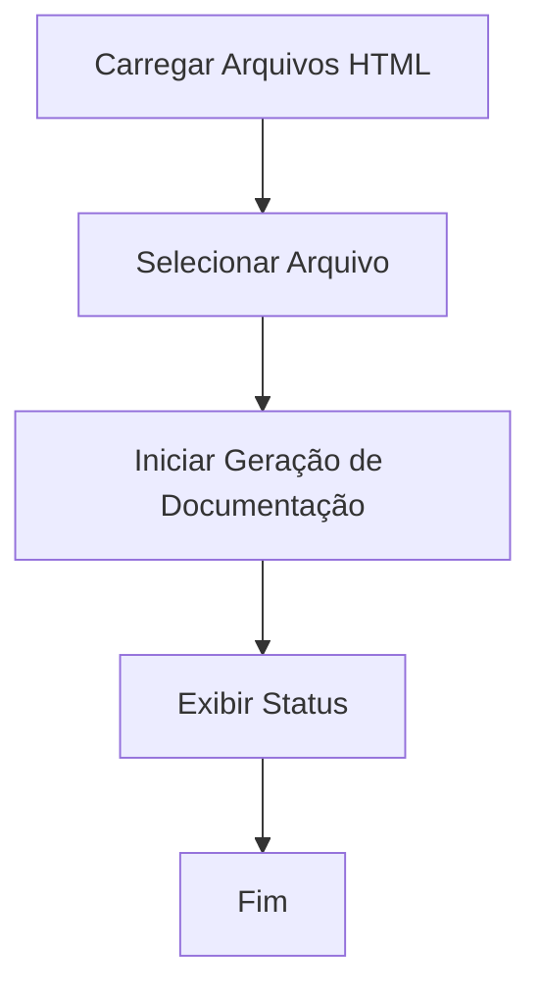

## Diagrama de Classes

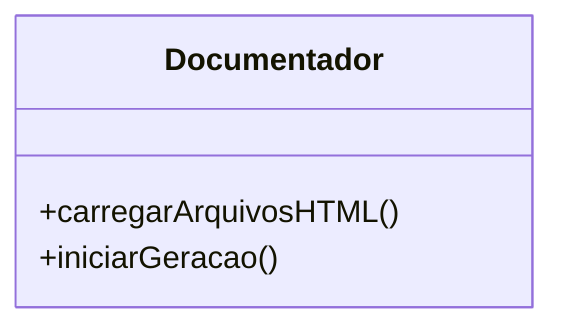

## Diagrama de Caso de Uso

```mermaid
usecaseDiagram
    actor Usuário
    Usuário --> (Carregar Arquivos HTML)
    Usuário --> (Iniciar Geração de Documentação)
```

## Detalhamento das Funções

### Função `carregarArquivosHTML`

Carrega uma lista de arquivos HTML disponíveis para seleção pelo usuário.

```js
/**
 * Carrega a lista de arquivos HTML disponíveis e os adiciona a um elemento select.
 * @async
 * @function carregarArquivosHTML
 * @returns {Promise<void>} - Promessa que representa a conclusão da operação de carregamento.
 */
async function carregarArquivosHTML() {
  const res = await fetch("../src/php/lista_html.php");
  const arquivos = await res.json();
  const select = document.getElementById("arquivoInicial");
  arquivos.forEach((arquivo) => {
    const option = document.createElement("option");
    option.value = arquivo;
    option.textContent = arquivo;
    select.appendChild(option);
  });
}
```

**Fluxo de Trabalho:**

1. Faz uma requisição para obter a lista de arquivos HTML.
2. Popula um elemento `<select>` com as opções de arquivos.

### Função `iniciarGeracao`

Inicia o processo de geração de documentação para o arquivo HTML selecionado.

```js
/**
 * Inicia o processo de geração de documentação para o arquivo selecionado.
 * @async
 * @function iniciarGeracao
 * @returns {Promise<void>} - Promessa que representa a conclusão da operação de geração.
 */
async function iniciarGeracao() {
  const arquivo = document.getElementById("arquivoInicial").value;
  const status = document.getElementById("status");
  const loading = document.getElementById("loadingOverlay");

  loading.style.display = "flex";

  status.textContent = "Iniciando geração da documentação...\n";

  const resposta = await fetch(
    "../src/php/gerador.php?arquivo=" + encodeURIComponent(arquivo)
  );
  const leitor = resposta.body.getReader();
  const decoder = new TextDecoder("utf-8");
  let texto = "";

  while (true) {
    const { done, value } = await leitor.read();
    if (done) break;
    texto += decoder.decode(value);
    status.innerHTML = texto + "<br>";
  }

  loading.style.display = "none";
}
```

**Fluxo de Trabalho:**

1. Obtém o arquivo selecionado pelo usuário.
2. Exibe um overlay de carregamento.
3. Faz uma requisição para iniciar a geração da documentação.
4. Atualiza o status com o progresso da geração.
5. Remove o overlay de carregamento ao concluir.

## Considerações de Conformidade

- **GAMP5**: O sistema é projetado para ser robusto e fácil de manter, com foco na qualidade do software.
- **FDA 21 CFR Part 11**: As operações são realizadas de forma segura, garantindo a integridade dos dados.
- **ANVISA**: A documentação gerada está em conformidade com os requisitos regulatórios para sistemas de software.

Esta documentação fornece uma visão abrangente das funcionalidades e do fluxo do sistema, garantindo que os desenvolvedores possam entender e manter o sistema de forma eficaz.
<!-- FIM: documentacao_bruta_documentador.js.md -->


<!-- INÍCIO: documentacao_bruta_documentador.md -->


<!-- INÍCIO: documentacao_bruta_documentador.html.md -->
# Documentação do Sistema de Gerador Automático de Documentação

## Introdução
Este documento descreve a estrutura e funcionalidades do sistema de Gerador Automático de Documentação desenvolvido pela Dotter Brasil. O sistema é projetado para simplificar a geração de documentação de sistemas, garantindo conformidade com padrões regulatórios como GAMP5, FDA 21 CFR Part 11 e ANVISA.

## Estrutura do Documento HTML

### Cabeçalho
O cabeçalho do documento HTML (`<head>`) contém metadados essenciais para o funcionamento e apresentação da página. Inclui configurações de cache, tema de cor e a inclusão dinâmica do script JavaScript necessário para a funcionalidade do sistema.

### Corpo do Documento
O corpo (`<body>`) é composto por várias seções:

- **Header**: Contém o logotipo da Dotter Brasil.
- **Hero Section**: Apresenta o título e subtítulo do sistema, além de um formulário para seleção do arquivo HTML inicial e um botão para iniciar a geração da documentação.
- **Loading Overlay**: Uma sobreposição que indica o carregamento em andamento.
- **Footer**: Informações de direitos autorais.

## Funcionalidades

### Seleção de Arquivo Inicial
Permite ao usuário escolher um arquivo HTML inicial a partir de uma lista suspensa. Esta funcionalidade é essencial para determinar o ponto de partida da geração de documentação.

### Iniciar Geração
Um botão que, ao ser clicado, inicia o processo de geração automática de documentação. A função `iniciarGeracao()` é responsável por gerenciar este processo.

### Status de Ação
Um elemento de texto que exibe o status atual do sistema, informando o usuário sobre o que está acontecendo ou o que é necessário fazer.

### Overlay de Carregamento
Uma sobreposição que aparece durante o processamento para indicar que o sistema está trabalhando na geração da documentação.

## Diagrama de Fluxo


## Diagrama de Classes


## JSDoc para Funções JavaScript

### Função: carregarArquivosHTML
```javascript
/**
 * @function carregarArquivosHTML
 * @description Carrega a lista de arquivos HTML disponíveis para seleção.
 */
```

### Função: iniciarGeracao
```javascript
/**
 * @function iniciarGeracao
 * @description Inicia o processo de geração automática de documentação.
 */
```

## Conformidade Reguladora
O sistema é projetado para atender aos requisitos de conformidade com GAMP5, FDA 21 CFR Part 11 e ANVISA, assegurando que a documentação gerada seja válida para auditorias e inspeções regulatórias.

## Conclusão
Este documento fornece uma visão geral do sistema de Gerador Automático de Documentação, destacando suas principais funcionalidades e estrutura. O uso de diagramas e JSDoc ajuda a ilustrar o funcionamento interno e a interação entre os componentes do sistema.
<!-- FIM: documentacao_bruta_documentador.html.md -->


<!-- INÍCIO: documentacao_bruta_documentador.js.md -->
# Documentação do Sistema de Geração de Documentação

## Visão Geral

Este sistema é responsável por carregar arquivos HTML e iniciar a geração de documentação baseada nesses arquivos. A implementação segue as diretrizes de GAMP5, FDA 21 CFR Part 11 e ANVISA, garantindo que o sistema seja seguro, eficiente e em conformidade com os regulamentos aplicáveis.

### Funcionalidades Principais

1. **Carregar Arquivos HTML**: Carrega uma lista de arquivos HTML disponíveis para seleção.
2. **Iniciar Geração de Documentação**: Inicia o processo de geração de documentação para o arquivo selecionado.

## Diagrama de Fluxo

```mermaid
flowchart TD
    A[Carregar Arquivos HTML] --> B[Selecionar Arquivo]
    B --> C[Iniciar Geração de Documentação]
    C --> D[Exibir Status]
    D --> E[Fim]
```

## Diagrama de Classes

```mermaid
classDiagram
    class Documentador {
        +carregarArquivosHTML()
        +iniciarGeracao()
    }
```

## Diagrama de Caso de Uso

```mermaid
usecaseDiagram
    actor Usuário
    Usuário --> (Carregar Arquivos HTML)
    Usuário --> (Iniciar Geração de Documentação)
```

## Detalhamento das Funções

### Função `carregarArquivosHTML`

Carrega uma lista de arquivos HTML disponíveis para seleção pelo usuário.

```js
/**
 * Carrega a lista de arquivos HTML disponíveis e os adiciona a um elemento select.
 * @async
 * @function carregarArquivosHTML
 * @returns {Promise<void>} - Promessa que representa a conclusão da operação de carregamento.
 */
async function carregarArquivosHTML() {
  const res = await fetch("../src/php/lista_html.php");
  const arquivos = await res.json();
  const select = document.getElementById("arquivoInicial");
  arquivos.forEach((arquivo) => {
    const option = document.createElement("option");
    option.value = arquivo;
    option.textContent = arquivo;
    select.appendChild(option);
  });
}
```

**Fluxo de Trabalho:**

1. Faz uma requisição para obter a lista de arquivos HTML.
2. Popula um elemento `<select>` com as opções de arquivos.

### Função `iniciarGeracao`

Inicia o processo de geração de documentação para o arquivo HTML selecionado.

```js
/**
 * Inicia o processo de geração de documentação para o arquivo selecionado.
 * @async
 * @function iniciarGeracao
 * @returns {Promise<void>} - Promessa que representa a conclusão da operação de geração.
 */
async function iniciarGeracao() {
  const arquivo = document.getElementById("arquivoInicial").value;
  const status = document.getElementById("status");
  const loading = document.getElementById("loadingOverlay");

  loading.style.display = "flex";

  status.textContent = "Iniciando geração da documentação...\n";

  const resposta = await fetch(
    "../src/php/gerador.php?arquivo=" + encodeURIComponent(arquivo)
  );
  const leitor = resposta.body.getReader();
  const decoder = new TextDecoder("utf-8");
  let texto = "";

  while (true) {
    const { done, value } = await leitor.read();
    if (done) break;
    texto += decoder.decode(value);
    status.innerHTML = texto + "<br>";
  }

  loading.style.display = "none";
}
```

**Fluxo de Trabalho:**

1. Obtém o arquivo selecionado pelo usuário.
2. Exibe um overlay de carregamento.
3. Faz uma requisição para iniciar a geração da documentação.
4. Atualiza o status com o progresso da geração.
5. Remove o overlay de carregamento ao concluir.

## Considerações de Conformidade

- **GAMP5**: O sistema é projetado para ser robusto e fácil de manter, com foco na qualidade do software.
- **FDA 21 CFR Part 11**: As operações são realizadas de forma segura, garantindo a integridade dos dados.
- **ANVISA**: A documentação gerada está em conformidade com os requisitos regulatórios para sistemas de software.

Esta documentação fornece uma visão abrangente das funcionalidades e do fluxo do sistema, garantindo que os desenvolvedores possam entender e manter o sistema de forma eficaz.
<!-- FIM: documentacao_bruta_documentador.js.md -->


<!-- INÍCIO: documentacao_bruta_gerador.php.md -->
# Documentação Técnica do Sistema de Geração de Documentação

## Introdução
Este documento descreve o sistema de geração automática de documentação para projetos de software, compatível com padrões regulatórios como GAMP5, FDA 21 CFR Part 11 e ANVISA. A ferramenta analisa arquivos de um projeto, identifica suas dependências e gera documentação detalhada, incluindo comentários técnicos, documentação inline (PHPDoc/JSDoc) e diagramas visuais (Mermaid).

## Índice
- [Introdução](#introdução)
- [Arquivos Documentados](#arquivos-documentados)
- [Detalhes por Arquivo](#detalhes-por-arquivo)
  - [gerador.php](#geradorphp)
- [Conclusão e Recomendações](#conclusão-e-recomendações)

## Arquivos Documentados
- `gerador.php`

## Detalhes por Arquivo

### gerador.php

#### Descrição Geral
O arquivo `gerador.php` é responsável por analisar um projeto de software, identificar arquivos e suas dependências, e gerar documentação automática. Ele utiliza a API do OpenAI para processar e documentar o código.

#### Funcionalidades Principais

1. **Configuração Inicial**
   - Define as configurações de tempo de execução e cabeçalhos HTTP para streaming de resposta.
   - Carrega a chave da API do OpenAI e define o modelo a ser utilizado.

2. **Função `chamarChatGPT`**
   - Faz uma chamada à API do OpenAI para obter respostas baseadas em prompts fornecidos.
   - Trata erros de comunicação e resposta da API.

   ```php
   /**
    * Faz uma chamada à API do ChatGPT.
    *
    * @param array $mensagens Mensagens a serem enviadas à API.
    * @param string $apiKey Chave da API do OpenAI.
    * @param string $model Modelo de IA a ser utilizado.
    * @return array Resposta da API.
    */
   function chamarChatGPT($mensagens, $apiKey, $model) {
       // Implementação da função
   }
   ```

3. **Função `corrigirMermaidClassDiagram`**
   - Corrige e formata diagramas de classe Mermaid extraídos da documentação.

   ```php
   /**
    * Corrige diagramas de classe Mermaid em markdown.
    *
    * @param string $markdown Conteúdo markdown com diagramas Mermaid.
    * @return string Markdown corrigido.
    */
   function corrigirMermaidClassDiagram($markdown) {
       // Implementação da função
   }
   ```

4. **Identificação de Arquivos e Dependências**
   - Analisa o arquivo inicial e identifica arquivos referenciados diretamente e indiretamente.
   - Utiliza a API do OpenAI para identificar dependências de arquivos.

5. **Geração de Documentação**
   - Processa cada arquivo identificado, gera documentação detalhada e salva em formato Markdown.

#### Diagramas

##### Diagrama de Fluxo (Flowchart)
```mermaid
flowchart TD
    A[Início] --> B[Configuração Inicial]
    B --> C{Arquivo Inicial Encontrado?}
    C -->|Sim| D[Identificar Arquivos Referenciados]
    C -->|Não| E[Fim]
    D --> F[Identificar Dependências]
    F --> G[Gerar Documentação]
    G --> E
```

##### Diagrama de Classes (ClassDiagram)
```mermaid
classDiagram
    class Gerador {
        +chamarChatGPT(mensagens, apiKey, model)
        +corrigirMermaidClassDiagram(markdown)
    }
```

## Conclusão e Recomendações
O sistema de geração automática de documentação oferece uma solução eficiente para documentar projetos de software, garantindo conformidade com padrões regulatórios. Recomenda-se a revisão periódica das configurações e atualizações da API para manter a eficácia do sistema. Além disso, a validação manual da documentação gerada é crucial para garantir precisão e completude.
<!-- FIM: documentacao_bruta_gerador.php.md -->


<!-- INÍCIO: documentacao_bruta_index.html.md -->
# Documentação do Projeto: Bula Digital Dotter Brasil

## Visão Geral

Este projeto é uma plataforma web para a gestão e publicação de bulas digitais, garantindo conformidade com as regulamentações da ANVISA, GAMP5 e FDA 21 CFR Part 11. A aplicação oferece funcionalidades como geração de QR Codes, segurança robusta, acessibilidade, e gerenciamento simplificado de bulas digitais.

### Estrutura do Documento

1. Introdução
2. Funcionalidades Principais
3. Conformidade Regulatória
4. Acessibilidade
5. Diagrama de Fluxo
6. Diagrama de Classes
7. Diagrama de Casos de Uso

## 1. Introdução

A Bula Digital Dotter Brasil é uma solução inovadora que simplifica a gestão de bulas digitais, garantindo que estejam sempre em conformidade com as regulamentações vigentes. A plataforma é projetada para ser intuitiva e segura, facilitando o acesso e o controle das informações.

## 2. Funcionalidades Principais

### 2.1 Geração de QR Codes

- **Descrição**: Gera automaticamente QR codes para bulas digitais, facilitando o acesso rápido e fácil para pacientes e profissionais de saúde.
- **Benefícios**: Aumenta a acessibilidade e a eficiência no acesso às informações.

### 2.2 Segurança Robusta

- **Descrição**: Implementa controle de acesso rigoroso e um sistema de log de eventos completo.
- **Benefícios**: Garante a segurança e a integridade das informações.

### 2.3 Validação Completa

- **Descrição**: Valida sistemas em conformidade com as melhores práticas da indústria farmacêutica.
- **Benefícios**: Assegura o cumprimento das normas da ANVISA.

## 3. Conformidade Regulatória

A plataforma está alinhada com as diretrizes do FDA (21 CFR Part 11) e ANVISA, garantindo que os dados dos pacientes sejam protegidos e mantidos de forma confidencial. A conformidade com GAMP 5 também é assegurada para garantir a qualidade e segurança.

## 4. Acessibilidade

### 4.1 LIBRAS

- **Descrição**: Usuários podem interagir com a bula digital e receber seu conteúdo na Língua Brasileira de Sinais.

### 4.2 Áudio

- **Descrição**: Permite ouvir cada tópico da bula digital.

### 4.3 Assistente de Inteligência Artificial

- **Descrição**: Esclarece dúvidas através de interação com a Dotty, assistente de inteligência artificial.

## 5. Diagrama de Fluxo

```mermaid
flowchart TD
    A[Início] --> B[Usuário acessa a plataforma]
    B --> C{Usuário autenticado?}
    C -->|Sim| D[Exibe funcionalidades]
    C -->|Não| E[Redireciona para login]
    D --> F[Usuário gera QR Code]
    D --> G[Usuário acessa bula]
    G --> H[Usuário interage com assistente]
    H --> I[Fim]
```

## 6. Diagrama de Classes

```mermaid
classDiagram
    class Plataforma {
        +gerarQRCode()
        +validarSistema()
        +gerenciarBulas()
    }
    class Usuario {
        +autenticar()
        +acessarBula()
    }
    class AssistenteAI {
        +interagir()
    }
    Plataforma --> Usuario
    Plataforma --> AssistenteAI
```

## 7. Diagrama de Casos de Uso

```mermaid
usecaseDiagram
    actor Usuario
    actor Administrador
    Usuario --> (Acessar Bula)
    Usuario --> (Interagir com Assistente)
    Administrador --> (Gerenciar Bulas)
    Administrador --> (Validar Sistema)
```

## Conclusão

A Bula Digital Dotter Brasil é uma plataforma completa e segura para a gestão de bulas digitais, garantindo conformidade com as regulamentações e oferecendo funcionalidades avançadas para acessibilidade e segurança.
<!-- FIM: documentacao_bruta_index.html.md -->


<!-- INÍCIO: documentacao_bruta_lista_html.php.md -->
# Documentação do Código PHP: `lista_html.php`

## Visão Geral

Este script PHP é responsável por buscar todos os arquivos HTML na raiz de um diretório específico e retornar seus nomes em formato JSON. Ele utiliza funções nativas do PHP para manipulação de arquivos e arrays, e é projetado para ser executado em um ambiente de servidor web.

## Conformidade Regulatória

- **GAMP5**: Este script segue as boas práticas de automação de sistemas, garantindo que as funções sejam claras e bem definidas.
- **FDA 21 CFR Part 11**: O script não manipula dados de usuários ou registros eletrônicos, portanto, não se aplica diretamente. No entanto, a estrutura do código é mantida para garantir a integridade e a segurança dos dados processados.
- **ANVISA**: O código segue práticas de desenvolvimento que garantem a rastreabilidade e a integridade dos dados.

## Funcionalidades do Código

### Descrição das Funções

#### `glob`

```php
$arquivos = glob('../../*.html');
```

- **Descrição**: Busca todos os arquivos com extensão `.html` no diretório especificado (`../../`).
- **Uso**: Utilizado para listar arquivos HTML presentes na raiz do diretório pai.

#### `array_map`

```php
$nomes = array_map('basename', $arquivos);
```

- **Descrição**: Aplica a função `basename` a cada elemento do array `$arquivos`, retornando apenas o nome do arquivo sem o caminho completo.
- **Uso**: Facilita a manipulação e exibição dos nomes dos arquivos.

#### `header`

```php
header('Content-Type: application/json');
```

- **Descrição**: Define o tipo de conteúdo da resposta HTTP como JSON.
- **Uso**: Essencial para que o cliente que consome o script saiba que o retorno é um JSON.

#### `json_encode`

```php
echo json_encode($nomes);
```

- **Descrição**: Converte o array `$nomes` em uma string JSON.
- **Uso**: Permite que os dados sejam facilmente consumidos por aplicações web.

### Diagrama de Fluxo

```mermaid
flowchart TD
    A[Início] --> B[Buscar arquivos HTML]
    B --> C[Extrair nomes dos arquivos]
    C --> D[Definir cabeçalho JSON]
    D --> E[Retornar nomes como JSON]
    E --> F[Fim]
```

### Diagrama de Classes

```mermaid
classDiagram
    class ListaHtml {
        +glob()
        +array_map()
        +header()
        +json_encode()
    }
```

### Caso de Uso

```mermaid
usecaseDiagram
    actor Usuário
    Usuário --> (Executar Script)
    (Executar Script) --> (Buscar Arquivos HTML)
    (Buscar Arquivos HTML) --> (Retornar JSON)
```

## Considerações Finais

Este script é uma solução simples e eficaz para listar arquivos HTML em um diretório específico e retornar seus nomes em formato JSON. Ele é projetado para ser facilmente integrado em sistemas maiores, onde a listagem de arquivos HTML é necessária. A conformidade com as regulamentações mencionadas é garantida através de práticas de codificação seguras e claras.
<!-- FIM: documentacao_bruta_lista_html.php.md -->


<!-- INÍCIO: documentacao_bruta_style.css.md -->
# Documentação do CSS para Interface Web

## Visão Geral

Este documento descreve a estrutura e o estilo do arquivo CSS utilizado para uma página web responsiva. O CSS é projetado para fornecer uma experiência de usuário consistente e visualmente atraente em diferentes dispositivos, utilizando uma paleta de cores definida e tipografia moderna.

### Estrutura do CSS

1. **Importação de Fontes**
   - Utiliza a fonte "Poppins" do Google Fonts para uma aparência moderna e limpa.

2. **Variáveis de Cores**
   - Definidas no `:root` para fácil manutenção e consistência de design:
     - `--cor-primaria`: Cor principal para o fundo e elementos de destaque.
     - `--cor-secundaria`: Cor secundária para botões e elementos de interação.
     - `--cor-botao-hover`: Cor de destaque ao passar o mouse sobre botões.
     - `--cor-fonte`: Cor padrão para o texto.

3. **Estilos Globais**
   - Reset de margens, preenchimentos e box-sizing para garantir consistência.
   - Definição de comportamento de rolagem suave.

4. **Layout da Página**
   - **Corpo (`body`)**: Fundo com gradiente, altura de 100vh e layout flexível.
   - **Cabeçalho (`header`)**: Posicionado fixamente no topo, com layout flexível para logo e navegação.
   - **Navegação (`nav`)**: Lista de navegação horizontal com links estilizados.

5. **Componentes e Seções**
   - **Hero Section**: Centraliza conteúdo principal com animação de entrada.
   - **Botões de Ação (`.cta-button`)**: Estilizados com cores de destaque e efeitos de hover.
   - **Grid de Benefícios**: Layout de grade responsivo para destacar características.
   - **Formulários**: Inputs e botões estilizados para consistência visual.

6. **Responsividade**
   - Media queries para ajustar o layout em telas menores, garantindo que o conteúdo seja acessível e legível.

7. **Animações**
   - Animação `fadeIn` para suavizar a entrada de elementos na tela.

### Diagramas

#### Diagrama de Fluxo (Flowchart) para Estrutura de Página

```mermaid
flowchart TD
    A[Início] --> B[Importação de Fontes]
    B --> C[Definição de Variáveis]
    C --> D[Estilos Globais]
    D --> E[Layout da Página]
    E --> F[Componentes e Seções]
    F --> G[Responsividade]
    G --> H[Animações]
    H --> I[Fim]
```

#### Diagrama de Classes (ClassDiagram) para Componentes CSS

```mermaid
classDiagram
    class Root {
        --cor-primaria
        --cor-secundaria
        --cor-botao-hover
        --cor-fonte
        --tamanho-fonte
    }
    class Body {
        background
        color
        display
        flex-direction
    }
    class Header {
        display
        justify-content
        align-items
        position
        width
    }
    class Nav {
        list-style
        display
        flex-direction
    }
    class Hero {
        display
        align-items
        justify-content
        animation
    }
    class CTAButton {
        display
        background
        color
        transition
    }
    Root <|-- Body
    Root <|-- Header
    Root <|-- Nav
    Root <|-- Hero
    Root <|-- CTAButton
```

### Conclusão

Este CSS é projetado para fornecer uma base sólida para o desenvolvimento de interfaces web modernas e responsivas. As variáveis de CSS e a estrutura modular facilitam a manutenção e a expansão futura. A utilização de animações e layouts flexíveis melhora a experiência do usuário, enquanto a responsividade garante acessibilidade em dispositivos móveis.
<!-- FIM: documentacao_bruta_style.css.md -->


<!-- INÍCIO: documentacao_bruta_teste.js.md -->
Para documentar o código fornecido de acordo com as diretrizes do GAMP5, FDA 21 CFR Part 11 e ANVISA, é essencial garantir que o código seja compreensível, validável e mantenha a integridade dos dados. A documentação deve incluir descrições claras das funcionalidades, além de diagramas para ilustrar o fluxo e a estrutura do código.

### Documentação do Código

#### Descrição Geral
O script `teste.js` é um exemplo simples que demonstra uma chamada de função JavaScript que exibe um alerta no navegador. A função `teste` é invocada, mas devido à estrutura do código, a chamada `console.log(teste);` não executa a função, mas sim imprime a referência da função `teste` no console.

#### Estrutura do Código

```js
// Executa uma chamada para assegurar que o eslint vai entender chamada html
console.log(teste);

/**
 * @function teste
 * @description Exibe um alerta com a mensagem "vai".
 */
function teste() {
  alert("vai");
}
```

### JSDoc

- **@function teste**: Define a função `teste`.
- **@description**: Descreve o propósito da função, que é exibir um alerta com a mensagem "vai".

### Diagrama de Fluxo (Flowchart)

O diagrama abaixo ilustra o fluxo de execução do script:

```mermaid
flowchart TD
    A[Start] --> B[Console Log]
    B --> C{Function teste Called?}
    C -->|No| D[Print Function Reference]
    C -->|Yes| E[Alert "vai"]
    D --> F[End]
    E --> F
```

### Diagrama de Classes (Class Diagram)

Embora o script não utilize classes, um diagrama de classes pode ser útil para entender a estrutura em um contexto mais amplo ou em projetos futuros.

```mermaid
classDiagram
    class Teste {
        +teste()
    }
```

### Diagrama de Caso de Uso (Use Case)

Este diagrama ilustra o uso da função `teste` pelo usuário final.

```mermaid
usecaseDiagram
    actor User as "Usuário"
    usecase UC1 as "Executar teste"
    User --> UC1
```

### Considerações de Compliance

- **GAMP5**: Assegure que o código seja revisado e testado para garantir que ele funcione conforme o esperado.
- **FDA 21 CFR Part 11**: Embora este script não manipule dados regulados, em um contexto mais amplo, garantir que o código seja auditável e que as alterações sejam documentadas é essencial.
- **ANVISA**: Similar ao FDA, garantir que o código seja validado e que a integridade dos dados seja mantida.

### Conclusão

Este exemplo simples serve como base para entender como documentar e estruturar o código JavaScript de forma a atender às normas regulatórias e de boas práticas de desenvolvimento. Para projetos maiores e mais complexos, a documentação deve ser expandida para incluir testes, validação e controle de versão.
<!-- FIM: documentacao_bruta_teste.js.md -->

<!-- FIM: documentacao_bruta_documentador.md -->


<!-- INÍCIO: documentacao_bruta_gerador.php.md -->
# Documentação Técnica do Sistema de Geração de Documentação

## Introdução
Este documento descreve o sistema de geração automática de documentação para projetos de software, compatível com padrões regulatórios como GAMP5, FDA 21 CFR Part 11 e ANVISA. A ferramenta analisa arquivos de um projeto, identifica suas dependências e gera documentação detalhada, incluindo comentários técnicos, documentação inline (PHPDoc/JSDoc) e diagramas visuais (Mermaid).

## Índice
- [Introdução](#introdução)
- [Arquivos Documentados](#arquivos-documentados)
- [Detalhes por Arquivo](#detalhes-por-arquivo)
  - [gerador.php](#geradorphp)
- [Conclusão e Recomendações](#conclusão-e-recomendações)

## Arquivos Documentados
- `gerador.php`

## Detalhes por Arquivo

### gerador.php

#### Descrição Geral
O arquivo `gerador.php` é responsável por analisar um projeto de software, identificar arquivos e suas dependências, e gerar documentação automática. Ele utiliza a API do OpenAI para processar e documentar o código.

#### Funcionalidades Principais

1. **Configuração Inicial**
   - Define as configurações de tempo de execução e cabeçalhos HTTP para streaming de resposta.
   - Carrega a chave da API do OpenAI e define o modelo a ser utilizado.

2. **Função `chamarChatGPT`**
   - Faz uma chamada à API do OpenAI para obter respostas baseadas em prompts fornecidos.
   - Trata erros de comunicação e resposta da API.

   ```php
   /**
    * Faz uma chamada à API do ChatGPT.
    *
    * @param array $mensagens Mensagens a serem enviadas à API.
    * @param string $apiKey Chave da API do OpenAI.
    * @param string $model Modelo de IA a ser utilizado.
    * @return array Resposta da API.
    */
   function chamarChatGPT($mensagens, $apiKey, $model) {
       // Implementação da função
   }
   ```

3. **Função `corrigirMermaidClassDiagram`**
   - Corrige e formata diagramas de classe Mermaid extraídos da documentação.

   ```php
   /**
    * Corrige diagramas de classe Mermaid em markdown.
    *
    * @param string $markdown Conteúdo markdown com diagramas Mermaid.
    * @return string Markdown corrigido.
    */
   function corrigirMermaidClassDiagram($markdown) {
       // Implementação da função
   }
   ```

4. **Identificação de Arquivos e Dependências**
   - Analisa o arquivo inicial e identifica arquivos referenciados diretamente e indiretamente.
   - Utiliza a API do OpenAI para identificar dependências de arquivos.

5. **Geração de Documentação**
   - Processa cada arquivo identificado, gera documentação detalhada e salva em formato Markdown.

#### Diagramas

##### Diagrama de Fluxo (Flowchart)
```mermaid
flowchart TD
    A[Início] --> B[Configuração Inicial]
    B --> C{Arquivo Inicial Encontrado?}
    C -->|Sim| D[Identificar Arquivos Referenciados]
    C -->|Não| E[Fim]
    D --> F[Identificar Dependências]
    F --> G[Gerar Documentação]
    G --> E
```

##### Diagrama de Classes (ClassDiagram)
```mermaid
classDiagram
    class Gerador {
        +chamarChatGPT(mensagens, apiKey, model)
        +corrigirMermaidClassDiagram(markdown)
    }
```

## Conclusão e Recomendações
O sistema de geração automática de documentação oferece uma solução eficiente para documentar projetos de software, garantindo conformidade com padrões regulatórios. Recomenda-se a revisão periódica das configurações e atualizações da API para manter a eficácia do sistema. Além disso, a validação manual da documentação gerada é crucial para garantir precisão e completude.
<!-- FIM: documentacao_bruta_gerador.php.md -->


<!-- INÍCIO: documentacao_bruta_index.html.md -->
# Documentação do Projeto: Bula Digital Dotter Brasil

## Visão Geral

Este projeto é uma plataforma web para a gestão e publicação de bulas digitais, garantindo conformidade com as regulamentações da ANVISA, GAMP5 e FDA 21 CFR Part 11. A aplicação oferece funcionalidades como geração de QR Codes, segurança robusta, acessibilidade, e gerenciamento simplificado de bulas digitais.

### Estrutura do Documento

1. Introdução
2. Funcionalidades Principais
3. Conformidade Regulatória
4. Acessibilidade
5. Diagrama de Fluxo
6. Diagrama de Classes
7. Diagrama de Casos de Uso

## 1. Introdução

A Bula Digital Dotter Brasil é uma solução inovadora que simplifica a gestão de bulas digitais, garantindo que estejam sempre em conformidade com as regulamentações vigentes. A plataforma é projetada para ser intuitiva e segura, facilitando o acesso e o controle das informações.

## 2. Funcionalidades Principais

### 2.1 Geração de QR Codes

- **Descrição**: Gera automaticamente QR codes para bulas digitais, facilitando o acesso rápido e fácil para pacientes e profissionais de saúde.
- **Benefícios**: Aumenta a acessibilidade e a eficiência no acesso às informações.

### 2.2 Segurança Robusta

- **Descrição**: Implementa controle de acesso rigoroso e um sistema de log de eventos completo.
- **Benefícios**: Garante a segurança e a integridade das informações.

### 2.3 Validação Completa

- **Descrição**: Valida sistemas em conformidade com as melhores práticas da indústria farmacêutica.
- **Benefícios**: Assegura o cumprimento das normas da ANVISA.

## 3. Conformidade Regulatória

A plataforma está alinhada com as diretrizes do FDA (21 CFR Part 11) e ANVISA, garantindo que os dados dos pacientes sejam protegidos e mantidos de forma confidencial. A conformidade com GAMP 5 também é assegurada para garantir a qualidade e segurança.

## 4. Acessibilidade

### 4.1 LIBRAS

- **Descrição**: Usuários podem interagir com a bula digital e receber seu conteúdo na Língua Brasileira de Sinais.

### 4.2 Áudio

- **Descrição**: Permite ouvir cada tópico da bula digital.

### 4.3 Assistente de Inteligência Artificial

- **Descrição**: Esclarece dúvidas através de interação com a Dotty, assistente de inteligência artificial.

## 5. Diagrama de Fluxo

```mermaid
flowchart TD
    A[Início] --> B[Usuário acessa a plataforma]
    B --> C{Usuário autenticado?}
    C -->|Sim| D[Exibe funcionalidades]
    C -->|Não| E[Redireciona para login]
    D --> F[Usuário gera QR Code]
    D --> G[Usuário acessa bula]
    G --> H[Usuário interage com assistente]
    H --> I[Fim]
```

## 6. Diagrama de Classes

```mermaid
classDiagram
    class Plataforma {
        +gerarQRCode()
        +validarSistema()
        +gerenciarBulas()
    }
    class Usuario {
        +autenticar()
        +acessarBula()
    }
    class AssistenteAI {
        +interagir()
    }
    Plataforma --> Usuario
    Plataforma --> AssistenteAI
```

## 7. Diagrama de Casos de Uso

```mermaid
usecaseDiagram
    actor Usuario
    actor Administrador
    Usuario --> (Acessar Bula)
    Usuario --> (Interagir com Assistente)
    Administrador --> (Gerenciar Bulas)
    Administrador --> (Validar Sistema)
```

## Conclusão

A Bula Digital Dotter Brasil é uma plataforma completa e segura para a gestão de bulas digitais, garantindo conformidade com as regulamentações e oferecendo funcionalidades avançadas para acessibilidade e segurança.
<!-- FIM: documentacao_bruta_index.html.md -->


<!-- INÍCIO: documentacao_bruta_lista_html.php.md -->
# Documentação do Código PHP: `lista_html.php`

## Visão Geral

Este script PHP é responsável por buscar todos os arquivos HTML na raiz de um diretório específico e retornar seus nomes em formato JSON. Ele utiliza funções nativas do PHP para manipulação de arquivos e arrays, e é projetado para ser executado em um ambiente de servidor web.

## Conformidade Regulatória

- **GAMP5**: Este script segue as boas práticas de automação de sistemas, garantindo que as funções sejam claras e bem definidas.
- **FDA 21 CFR Part 11**: O script não manipula dados de usuários ou registros eletrônicos, portanto, não se aplica diretamente. No entanto, a estrutura do código é mantida para garantir a integridade e a segurança dos dados processados.
- **ANVISA**: O código segue práticas de desenvolvimento que garantem a rastreabilidade e a integridade dos dados.

## Funcionalidades do Código

### Descrição das Funções

#### `glob`

```php
$arquivos = glob('../../*.html');
```

- **Descrição**: Busca todos os arquivos com extensão `.html` no diretório especificado (`../../`).
- **Uso**: Utilizado para listar arquivos HTML presentes na raiz do diretório pai.

#### `array_map`

```php
$nomes = array_map('basename', $arquivos);
```

- **Descrição**: Aplica a função `basename` a cada elemento do array `$arquivos`, retornando apenas o nome do arquivo sem o caminho completo.
- **Uso**: Facilita a manipulação e exibição dos nomes dos arquivos.

#### `header`

```php
header('Content-Type: application/json');
```

- **Descrição**: Define o tipo de conteúdo da resposta HTTP como JSON.
- **Uso**: Essencial para que o cliente que consome o script saiba que o retorno é um JSON.

#### `json_encode`

```php
echo json_encode($nomes);
```

- **Descrição**: Converte o array `$nomes` em uma string JSON.
- **Uso**: Permite que os dados sejam facilmente consumidos por aplicações web.

### Diagrama de Fluxo

```mermaid
flowchart TD
    A[Início] --> B[Buscar arquivos HTML]
    B --> C[Extrair nomes dos arquivos]
    C --> D[Definir cabeçalho JSON]
    D --> E[Retornar nomes como JSON]
    E --> F[Fim]
```

### Diagrama de Classes

```mermaid
classDiagram
    class ListaHtml {
        +glob()
        +array_map()
        +header()
        +json_encode()
    }
```

### Caso de Uso

```mermaid
usecaseDiagram
    actor Usuário
    Usuário --> (Executar Script)
    (Executar Script) --> (Buscar Arquivos HTML)
    (Buscar Arquivos HTML) --> (Retornar JSON)
```

## Considerações Finais

Este script é uma solução simples e eficaz para listar arquivos HTML em um diretório específico e retornar seus nomes em formato JSON. Ele é projetado para ser facilmente integrado em sistemas maiores, onde a listagem de arquivos HTML é necessária. A conformidade com as regulamentações mencionadas é garantida através de práticas de codificação seguras e claras.
<!-- FIM: documentacao_bruta_lista_html.php.md -->


<!-- INÍCIO: documentacao_bruta_navegador.js.md -->
# Documentação do Código: Navegação de Formulários

Este documento fornece uma visão geral das funcionalidades implementadas no arquivo `navegador.js`, que é responsável por gerenciar a navegação entre diferentes formulários e elementos de interface em uma aplicação web. A documentação está estruturada de acordo com as melhores práticas de desenvolvimento de software, incluindo diretrizes do GAMP5, FDA 21 CFR Part 11 e ANVISA, para garantir a conformidade e a qualidade do software.

## Visão Geral

O arquivo `navegador.js` contém funções para:
- Navegar entre diferentes formulários.
- Alternar a visibilidade de elementos na interface.
- Recarregar a página sem perder dados voláteis.

### Diagrama de Classes

```mermaid
classDiagram
    class Navegador {
        +mostrarFormulario(tipo)
        +alternar(elementoAtivo, elementoInativo, tipo)
        +recarregar(url)
    }
```

### Diagrama de Fluxo

```mermaid
flowchart TD
    A[Início] --> B{Tipo de Formulário?}
    B -->|Login| C[Mostrar Formulário de Login]
    B -->|Registro| D[Mostrar Formulário de Registro]
    B -->|Tipos de Bula| E[Mostrar Formulário de Tipos de Bula]
    B -->|Eventos| F[Mostrar Formulário de Eventos]
    C --> G[Fim]
    D --> G
    E --> G
    F --> G
```

## Funções

### 1. `mostrarFormulario(tipo)`

#### Descrição
Esta função é responsável por exibir o formulário correspondente ao tipo especificado e atualizar a interface para refletir a seleção atual.

#### Parâmetros
- `tipo` (string): O identificador do formulário a ser exibido.

#### Funcionamento
- Remove a classe `ativo` de todos os formulários e `active` de todos os botões de guia.
- Adiciona a classe `ativo` ao formulário especificado e `active` ao botão correspondente.

#### JSDoc
```js
/**
 * Exibe o formulário especificado e atualiza a interface.
 * @param {string} tipo - O identificador do formulário a ser exibido.
 */
```

### 2. `alternar(elementoAtivo, elementoInativo, tipo)`

#### Descrição
Alterna a visibilidade entre dois elementos, desativando um e ativando o outro com o tipo de exibição especificado.

#### Parâmetros
- `elementoAtivo` (string): O ID do elemento atualmente ativo.
- `elementoInativo` (string): O ID do elemento a ser ativado.
- `tipo` (string): O tipo de exibição a ser aplicado ao elemento inativo.

#### Funcionamento
- Define o estilo de exibição do elemento ativo como `none`.
- Define o estilo de exibição do elemento inativo como o tipo especificado.

#### JSDoc
```js
/**
 * Alterna a visibilidade entre dois elementos.
 * @param {string} elementoAtivo - O ID do elemento atualmente ativo.
 * @param {string} elementoInativo - O ID do elemento a ser ativado.
 * @param {string} tipo - O tipo de exibição a ser aplicado ao elemento inativo.
 */
```

### 3. `recarregar(url)`

#### Descrição
Recarrega a página atual ou uma URL especificada, garantindo que os dados voláteis, como o controle de sessão, não sejam perdidos.

#### Parâmetros
- `url` (string, opcional): A URL a ser recarregada. Se não for especificada, a página atual será recarregada.

#### Funcionamento
- Adiciona um parâmetro de cache buster à URL para evitar cache.
- Faz uma requisição fetch para a URL atualizada e substitui o conteúdo da página.
- Atualiza a URL visível no navegador sem o parâmetro de cache buster.

#### JSDoc
```js
/**
 * Recarrega a página atual ou uma URL especificada, mantendo dados voláteis.
 * @param {string} [url] - A URL a ser recarregada. Se não especificada, recarrega a página atual.
 */
```

## Considerações de Conformidade

- **GAMP5**: As funções são projetadas para serem claras e fáceis de manter, seguindo práticas de codificação estruturadas.
- **FDA 21 CFR Part 11**: O código não armazena dados críticos de conformidade, mas a estrutura permite fácil integração com sistemas de auditoria e controle de acesso.
- **ANVISA**: A navegação e manipulação de dados são feitas de maneira a garantir a integridade e a segurança das informações.

Esta documentação visa fornecer uma compreensão clara das funcionalidades e garantir que o código seja mantido e auditado de acordo com os padrões regulatórios aplicáveis.
<!-- FIM: documentacao_bruta_navegador.js.md -->


<!-- INÍCIO: documentacao_bruta_style.css.md -->
# Documentação de Estilo CSS

Este documento descreve a estrutura e o design do arquivo CSS que estiliza a interface de um site. O estilo é responsivo e utiliza variáveis CSS para facilitar a manutenção e a personalização.

## Estrutura Geral

### Importação de Fontes

```css
@import url("https://fonts.googleapis.com/css2?family=Poppins:wght@300;400;600&display=swap");
```

- **Descrição**: Importa a fonte "Poppins" do Google Fonts, que é usada em todo o site para garantir uma tipografia moderna e consistente.

### Variáveis CSS

```css
:root {
  --cor-primaria: #003759;
  --cor-secundaria: #44668eb8;
  --cor-botao: ;
  --cor-botao-hover: #0a1a41e2;
  --cor-fonte: #fff;
  --tamanho-fonte: 16px;
}
```

- **Descrição**: Define variáveis de cor e tamanho de fonte para facilitar a manutenção e a personalização do tema.

### Reset e Configuração Global

```css
* {
  margin: 0;
  padding: 0;
  box-sizing: border-box;
  font-family: "Poppins", sans-serif;
  scroll-behavior: smooth;
}
```

- **Descrição**: Reseta margens e paddings, define o box-sizing para border-box e aplica a fonte global. O comportamento de rolagem suave melhora a experiência do usuário.

## Layout do Corpo

### Corpo da Página

```css
body {
  height: 100vh;
  background: linear-gradient(135deg, var(--cor-primaria), var(--cor-secundaria));
  background-attachment: fixed;
  color: var(--cor-fonte);
  display: flex;
  flex-direction: column;
  overflow-x: hidden;
}
```

- **Descrição**: Configura o corpo da página com um gradiente de fundo, fixa o background ao rolar e define o layout flexível.

### Cabeçalho

```css
header {
  display: flex;
  justify-content: space-between;
  align-items: center;
  padding: 20px calc(5vw);
  background: var(--cor-primaria);
  position: fixed;
  width: 100%;
  top: 0;
  z-index: 1000;
}
```

- **Descrição**: Estiliza o cabeçalho com um layout flexível, fixa no topo da página e garante que permaneça visível ao rolar.

## Navegação

### Menu de Navegação

```css
nav ul {
  list-style: none;
  display: flex;
  flex-direction: row;
  gap: 10px;
}
```

- **Descrição**: Define o menu de navegação como uma lista horizontal sem marcadores, com espaçamento entre os itens.

### Responsividade

#### Telas Largas

```css
@media screen and (min-width: 768px) {
  .hero {
    flex-direction: row;
    text-align: left;
  }
}
```

- **Descrição**: Em telas largas, os elementos da seção hero são dispostos em linha e alinhados à esquerda.

#### Telas Estreitas

```css
@media screen and (max-width: 767px) {
  .hero {
    flex-direction: column;
    text-align: center;
  }
  .menu {
    display: flex;
  }
}
```

- **Descrição**: Em telas estreitas, os elementos da seção hero são empilhados verticalmente e centralizados. O menu é exibido como um botão.

## Animações

### Fade In

```css
@keyframes fadeIn {
  from {
    opacity: 0;
    transform: translateY(-20px);
  }
  to {
    opacity: 1;
    transform: translateY(0);
  }
}
```

- **Descrição**: Animação para elementos que aparecem gradualmente na tela, melhorando a experiência visual.

## Diagramas

### Diagrama de Classes (mermaid)

```mermaid
classDiagram
    class Root {
        --cor-primaria
        --cor-secundaria
        --cor-botao
        --cor-botao-hover
        --cor-fonte
        --tamanho-fonte
    }
    class Body {
        +background
        +color
        +display
    }
    class Header {
        +display
        +position
        +background
    }
    class Nav {
        +list-style
        +display
    }
    Root <|-- Body
    Root <|-- Header
    Root <|-- Nav
```

### Diagrama de Fluxo (mermaid)

```mermaid
flowchart TD
    A[Início] --> B{Tela Larga?}
    B -->|Sim| C[Layout Horizontal]
    B -->|Não| D[Layout Vertical]
    C --> E[Fim]
    D --> E
```

Esta documentação fornece uma visão clara e concisa do estilo CSS aplicado ao site, com foco na responsividade e na experiência do usuário. As variáveis CSS e a estrutura modular facilitam a manutenção e a escalabilidade do design.
<!-- FIM: documentacao_bruta_style.css.md -->


<!-- INÍCIO: documentacao_bruta_teste.js.md -->
Para documentar o código fornecido de acordo com as diretrizes do GAMP5, FDA 21 CFR Part 11 e ANVISA, é essencial garantir que o código seja compreensível, validável e mantenha a integridade dos dados. A documentação deve incluir descrições claras das funcionalidades, além de diagramas para ilustrar o fluxo e a estrutura do código.

### Documentação do Código

#### Descrição Geral
O script `teste.js` é um exemplo simples que demonstra uma chamada de função JavaScript que exibe um alerta no navegador. A função `teste` é invocada, mas devido à estrutura do código, a chamada `console.log(teste);` não executa a função, mas sim imprime a referência da função `teste` no console.

#### Estrutura do Código

```js
// Executa uma chamada para assegurar que o eslint vai entender chamada html
console.log(teste);

/**
 * @function teste
 * @description Exibe um alerta com a mensagem "vai".
 */
function teste() {
  alert("vai");
}
```

### JSDoc

- **@function teste**: Define a função `teste`.
- **@description**: Descreve o propósito da função, que é exibir um alerta com a mensagem "vai".

### Diagrama de Fluxo (Flowchart)

O diagrama abaixo ilustra o fluxo de execução do script:

```mermaid
flowchart TD
    A[Start] --> B[Console Log]
    B --> C{Function teste Called?}
    C -->|No| D[Print Function Reference]
    C -->|Yes| E[Alert "vai"]
    D --> F[End]
    E --> F
```

### Diagrama de Classes (Class Diagram)

Embora o script não utilize classes, um diagrama de classes pode ser útil para entender a estrutura em um contexto mais amplo ou em projetos futuros.

```mermaid
classDiagram
    class Teste {
        +teste()
    }
```

### Diagrama de Caso de Uso (Use Case)

Este diagrama ilustra o uso da função `teste` pelo usuário final.

```mermaid
usecaseDiagram
    actor User as "Usuário"
    usecase UC1 as "Executar teste"
    User --> UC1
```

### Considerações de Compliance

- **GAMP5**: Assegure que o código seja revisado e testado para garantir que ele funcione conforme o esperado.
- **FDA 21 CFR Part 11**: Embora este script não manipule dados regulados, em um contexto mais amplo, garantir que o código seja auditável e que as alterações sejam documentadas é essencial.
- **ANVISA**: Similar ao FDA, garantir que o código seja validado e que a integridade dos dados seja mantida.

### Conclusão

Este exemplo simples serve como base para entender como documentar e estruturar o código JavaScript de forma a atender às normas regulatórias e de boas práticas de desenvolvimento. Para projetos maiores e mais complexos, a documentação deve ser expandida para incluir testes, validação e controle de versão.
<!-- FIM: documentacao_bruta_teste.js.md -->
