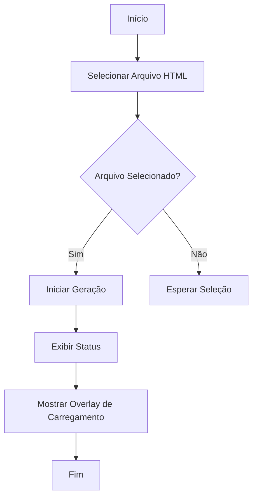
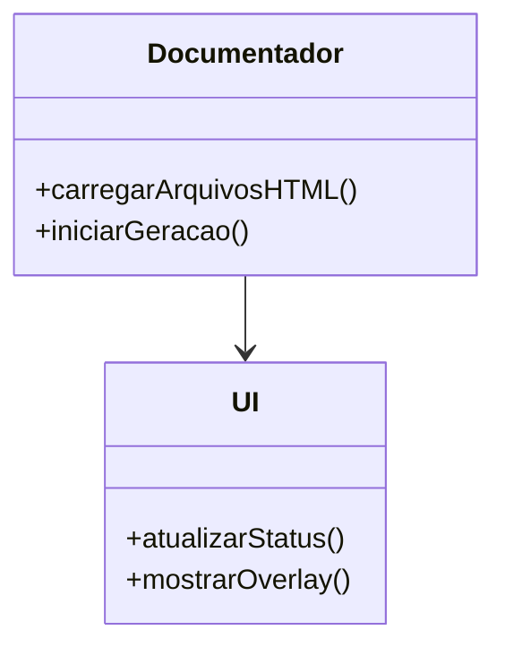

# Documentação do Sistema de Gerador Automático de Documentação

## Introdução
Este documento descreve a estrutura e funcionalidades do sistema de Gerador Automático de Documentação desenvolvido pela Dotter Brasil. O sistema é projetado para simplificar a geração de documentação de sistemas, garantindo conformidade com padrões regulatórios como GAMP5, FDA 21 CFR Part 11 e ANVISA.

## Estrutura do Documento HTML

### Cabeçalho
O cabeçalho do documento HTML (`<head>`) contém metadados essenciais para o funcionamento e apresentação da página. Inclui configurações de cache, tema de cor e a inclusão dinâmica do script JavaScript necessário para a funcionalidade do sistema.

### Corpo do Documento
O corpo (`<body>`) é composto por várias seções:

- **Header**: Contém o logotipo da Dotter Brasil.
- **Hero Section**: Apresenta o título e subtítulo do sistema, além de um formulário para seleção do arquivo HTML inicial e um botão para iniciar a geração da documentação.
- **Loading Overlay**: Uma sobreposição que indica o carregamento em andamento.
- **Footer**: Informações de direitos autorais.

## Funcionalidades

### Seleção de Arquivo Inicial
Permite ao usuário escolher um arquivo HTML inicial a partir de uma lista suspensa. Esta funcionalidade é essencial para determinar o ponto de partida da geração de documentação.

### Iniciar Geração
Um botão que, ao ser clicado, inicia o processo de geração automática de documentação. A função `iniciarGeracao()` é responsável por gerenciar este processo.

### Status de Ação
Um elemento de texto que exibe o status atual do sistema, informando o usuário sobre o que está acontecendo ou o que é necessário fazer.

### Overlay de Carregamento
Uma sobreposição que aparece durante o processamento para indicar que o sistema está trabalhando na geração da documentação.

## Diagrama de Fluxo



## Diagrama de Classes



## JSDoc para Funções JavaScript

### Função: carregarArquivosHTML
```javascript
/**
 * @function carregarArquivosHTML
 * @description Carrega a lista de arquivos HTML disponíveis para seleção.
 */
```

### Função: iniciarGeracao
```javascript
/**
 * @function iniciarGeracao
 * @description Inicia o processo de geração automática de documentação.
 */
```

## Conformidade Reguladora
O sistema é projetado para atender aos requisitos de conformidade com GAMP5, FDA 21 CFR Part 11 e ANVISA, assegurando que a documentação gerada seja válida para auditorias e inspeções regulatórias.

## Conclusão
Este documento fornece uma visão geral do sistema de Gerador Automático de Documentação, destacando suas principais funcionalidades e estrutura. O uso de diagramas e JSDoc ajuda a ilustrar o funcionamento interno e a interação entre os componentes do sistema.