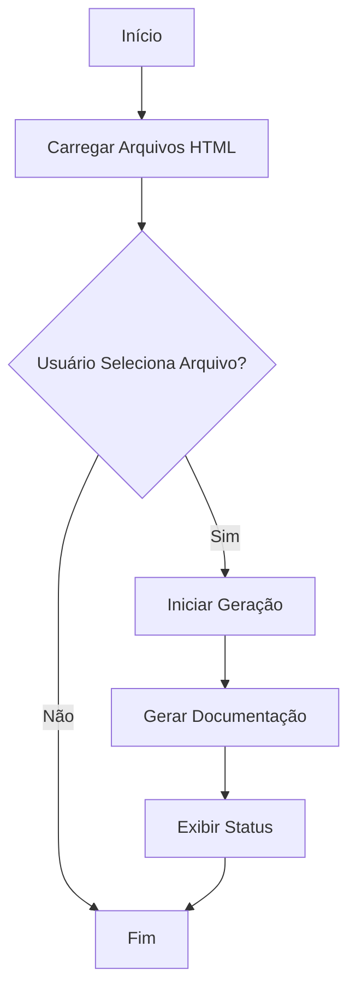

# Documentação do Sistema: Gerador Automático de Documentação

Este documento fornece uma visão geral do sistema "Gerador Automático de Documentação" desenvolvido pela Dotter Brasil. A aplicação é projetada para simplificar a geração de documentação de sistemas, garantindo conformidade com normas como GAMP5, FDA 21 CFR Part 11 e ANVISA.

## Estrutura do Documento

1. **Visão Geral do Sistema**
2. **Funcionalidades Principais**
3. **Diagramas de Arquitetura**
4. **Detalhamento do Código**
5. **Conformidade Regulatória**

---

## 1. Visão Geral do Sistema

O sistema é uma aplicação web que permite aos usuários selecionar um arquivo HTML inicial para gerar automaticamente a documentação associada. Ele é acessível via navegador e não requer instalação local.

## 2. Funcionalidades Principais

- **Seleção de Arquivo HTML Inicial**: O usuário pode escolher um arquivo HTML de uma lista para iniciar o processo de documentação.
- **Geração Automática de Documentação**: Após a seleção do arquivo, a documentação é gerada automaticamente.
- **Feedback ao Usuário**: O sistema fornece feedback visual sobre o status do processo de geração.

## 3. Diagramas de Arquitetura

### Diagrama de Fluxo (Flowchart)



### Diagrama de Caso de Uso (Use Case)

```mermaid
usecaseDiagram
    actor Usuário
    Usuário --> (Selecionar Arquivo HTML)
    Usuário --> (Iniciar Geração)
    (Iniciar Geração) --> (Gerar Documentação)
    (Gerar Documentação) --> (Exibir Status)
```

## 4. Detalhamento do Código

### HTML

O arquivo `documentador.html` é o ponto de entrada da aplicação. Ele define a estrutura básica da interface do usuário.

#### Elementos Principais

- **Cabeçalho e Rodapé**: Incluem a marca da empresa e direitos autorais.
- **Seção Hero**: Contém o título e descrição do sistema, além de controles para interação do usuário.
- **Overlay de Carregamento**: Exibido durante o processo de geração para indicar que o sistema está em operação.

### JavaScript

O script `documentador.js` é responsável por carregar dinamicamente o arquivo JavaScript necessário e gerenciar a lógica de geração de documentação.

#### Funções Principais

```javascript
/**
 * Carrega os arquivos HTML disponíveis para seleção.
 */
function carregarArquivosHTML() {
    // Lógica para carregar e popular o dropdown de arquivos HTML
}

/**
 * Inicia o processo de geração de documentação.
 */
function iniciarGeracao() {
    // Lógica para iniciar a geração de documentação
    document.getElementById('status').innerText = "Geração em andamento...";
}
```

## 5. Conformidade Regulatória

O sistema foi desenvolvido em conformidade com as seguintes normas:

- **GAMP5**: Garantia de que o sistema é adequado para o uso pretendido e que os riscos são geridos de forma eficaz.
- **FDA 21 CFR Part 11**: Assegura que os registros eletrônicos são confiáveis e equivalentes aos registros em papel.
- **ANVISA**: Conformidade com as regulamentações brasileiras para sistemas de informação em saúde.

---

Esta documentação fornece uma visão abrangente do sistema e suas funcionalidades, garantindo que os usuários possam operar e compreender o sistema de forma eficaz e em conformidade com as regulamentações aplicáveis.