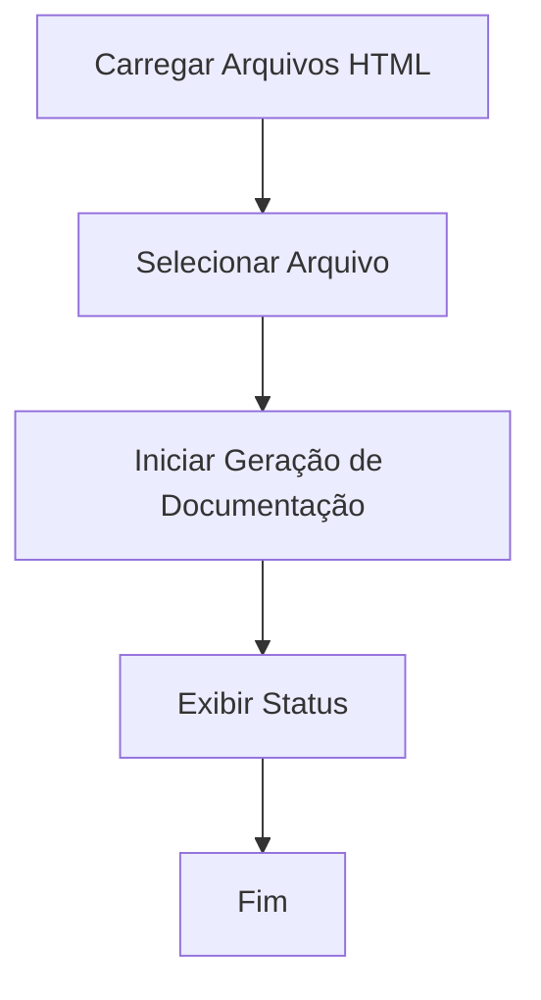
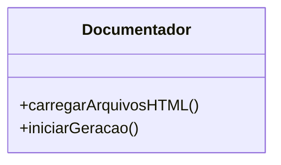

# Documentação do Sistema de Geração de Documentação

## Visão Geral

Este sistema é responsável por carregar arquivos HTML e iniciar a geração de documentação baseada nesses arquivos. A implementação segue as diretrizes de GAMP5, FDA 21 CFR Part 11 e ANVISA, garantindo que o sistema seja seguro, eficiente e em conformidade com os regulamentos aplicáveis.

### Funcionalidades Principais

1. **Carregar Arquivos HTML**: Carrega uma lista de arquivos HTML disponíveis para seleção.
2. **Iniciar Geração de Documentação**: Inicia o processo de geração de documentação para o arquivo selecionado.

## Diagrama de Fluxo



## Diagrama de Classes



## Diagrama de Caso de Uso

```mermaid
usecaseDiagram
    actor Usuário
    Usuário --> (Carregar Arquivos HTML)
    Usuário --> (Iniciar Geração de Documentação)
```

## Detalhamento das Funções

### Função `carregarArquivosHTML`

Carrega uma lista de arquivos HTML disponíveis para seleção pelo usuário.

```js
/**
 * Carrega a lista de arquivos HTML disponíveis e os adiciona a um elemento select.
 * @async
 * @function carregarArquivosHTML
 * @returns {Promise<void>} - Promessa que representa a conclusão da operação de carregamento.
 */
async function carregarArquivosHTML() {
  const res = await fetch("../src/php/lista_html.php");
  const arquivos = await res.json();
  const select = document.getElementById("arquivoInicial");
  arquivos.forEach((arquivo) => {
    const option = document.createElement("option");
    option.value = arquivo;
    option.textContent = arquivo;
    select.appendChild(option);
  });
}
```

**Fluxo de Trabalho:**

1. Faz uma requisição para obter a lista de arquivos HTML.
2. Popula um elemento `<select>` com as opções de arquivos.

### Função `iniciarGeracao`

Inicia o processo de geração de documentação para o arquivo HTML selecionado.

```js
/**
 * Inicia o processo de geração de documentação para o arquivo selecionado.
 * @async
 * @function iniciarGeracao
 * @returns {Promise<void>} - Promessa que representa a conclusão da operação de geração.
 */
async function iniciarGeracao() {
  const arquivo = document.getElementById("arquivoInicial").value;
  const status = document.getElementById("status");
  const loading = document.getElementById("loadingOverlay");

  loading.style.display = "flex";

  status.textContent = "Iniciando geração da documentação...\n";

  const resposta = await fetch(
    "../src/php/gerador.php?arquivo=" + encodeURIComponent(arquivo)
  );
  const leitor = resposta.body.getReader();
  const decoder = new TextDecoder("utf-8");
  let texto = "";

  while (true) {
    const { done, value } = await leitor.read();
    if (done) break;
    texto += decoder.decode(value);
    status.innerHTML = texto + "<br>";
  }

  loading.style.display = "none";
}
```

**Fluxo de Trabalho:**

1. Obtém o arquivo selecionado pelo usuário.
2. Exibe um overlay de carregamento.
3. Faz uma requisição para iniciar a geração da documentação.
4. Atualiza o status com o progresso da geração.
5. Remove o overlay de carregamento ao concluir.

## Considerações de Conformidade

- **GAMP5**: O sistema é projetado para ser robusto e fácil de manter, com foco na qualidade do software.
- **FDA 21 CFR Part 11**: As operações são realizadas de forma segura, garantindo a integridade dos dados.
- **ANVISA**: A documentação gerada está em conformidade com os requisitos regulatórios para sistemas de software.

Esta documentação fornece uma visão abrangente das funcionalidades e do fluxo do sistema, garantindo que os desenvolvedores possam entender e manter o sistema de forma eficaz.