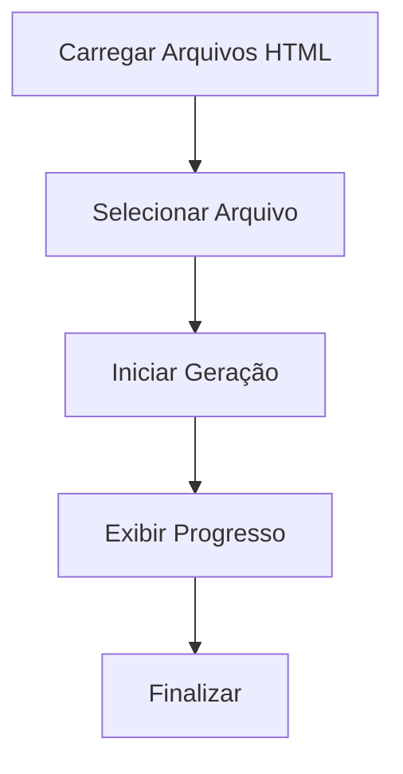
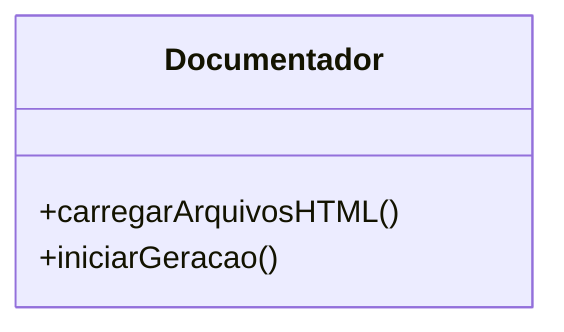

# Documentação do Sistema de Geração de Documentação

## Visão Geral

Este sistema foi desenvolvido para automatizar a geração de documentação de arquivos HTML. A aplicação busca arquivos disponíveis, permite ao usuário selecionar um arquivo e, em seguida, gera a documentação correspondente, exibindo o progresso em tempo real.

### Requisitos Regulatórios

- **GAMP5**: Garantir que o software seja validado e que os processos sejam documentados de forma a garantir a qualidade.
- **FDA 21 CFR Part 11**: Assegurar que os registros eletrônicos sejam confiáveis e equivalentes aos registros em papel.
- **ANVISA**: Cumprir com as regulamentações brasileiras para sistemas informatizados em saúde.

## Diagrama de Fluxo



## Diagrama de Classes



## Diagrama de Caso de Uso

```mermaid
usecaseDiagram
    actor Usuário
    Usuário --> (Carregar Arquivos HTML)
    Usuário --> (Selecionar Arquivo)
    Usuário --> (Iniciar Geração)
    Usuário --> (Visualizar Progresso)
```

## Código Fonte

### Função `carregarArquivosHTML`

```js
/**
 * @function carregarArquivosHTML
 * @description Carrega a lista de arquivos HTML disponíveis para seleção.
 * @async
 * @returns {Promise<void>}
 * @example
 * carregarArquivosHTML();
 */
async function carregarArquivosHTML() {
  const res = await fetch("../src/php/lista_html.php");
  const arquivos = await res.json();
  const select = document.getElementById("arquivoInicial");
  arquivos.forEach((arquivo) => {
    const option = document.createElement("option");
    option.value = arquivo;
    option.textContent = arquivo;
    select.appendChild(option);
  });
}
```

- **Descrição**: Esta função busca uma lista de arquivos HTML do servidor e popula um elemento `<select>` com as opções disponíveis.
- **Fluxo**:
  1. Faz uma requisição para obter a lista de arquivos.
  2. Converte a resposta para JSON.
  3. Itera sobre os arquivos e adiciona cada um como uma opção no elemento de seleção.

### Função `iniciarGeracao`

```js
/**
 * @function iniciarGeracao
 * @description Inicia o processo de geração da documentação para o arquivo selecionado.
 * @async
 * @returns {Promise<void>}
 * @example
 * iniciarGeracao();
 */
async function iniciarGeracao() {
  const arquivo = document.getElementById("arquivoInicial").value;
  const status = document.getElementById("status");
  const loading = document.getElementById("loadingOverlay");

  loading.style.display = "flex";

  status.textContent = "Iniciando geração da documentação...\n";

  const resposta = await fetch(
    "../src/php/gerador.php?arquivo=" + encodeURIComponent(arquivo)
  );
  const leitor = resposta.body.getReader();
  const decoder = new TextDecoder("utf-8");
  let texto = "";

  while (true) {
    const { done, value } = await leitor.read();
    if (done) break;
    texto += decoder.decode(value);
    status.innerHTML = texto + "<br>";
  }

  loading.style.display = "none";
}
```

- **Descrição**: Esta função inicia a geração da documentação para o arquivo selecionado e atualiza o status em tempo real.
- **Fluxo**:
  1. Obtém o arquivo selecionado.
  2. Exibe um overlay de carregamento.
  3. Atualiza o status para indicar o início do processo.
  4. Faz uma requisição para o servidor para iniciar a geração.
  5. Lê a resposta em partes, decodificando e atualizando o status conforme os dados são recebidos.
  6. Oculta o overlay de carregamento ao final do processo.

## Considerações Finais

Este sistema foi projetado para ser robusto e atender aos requisitos regulatórios, garantindo a integridade e a rastreabilidade dos registros eletrônicos. A documentação gerada é essencial para a conformidade e a manutenção da qualidade do software.