<!-- INÍCIO: documentacao_bruta_documentador.html.md -->
# Documentação do Sistema de Gerador Automático de Documentação

## Introdução
Este documento descreve a estrutura e funcionalidades do sistema de Gerador Automático de Documentação desenvolvido pela Dotter Brasil. O sistema é projetado para simplificar a geração de documentação de sistemas, garantindo conformidade com padrões regulatórios como GAMP5, FDA 21 CFR Part 11 e ANVISA.

## Estrutura do Documento HTML

### Cabeçalho
O cabeçalho do documento HTML (`<head>`) contém metadados essenciais para o funcionamento e apresentação da página. Inclui configurações de cache, tema de cor e a inclusão dinâmica do script JavaScript necessário para a funcionalidade do sistema.

### Corpo do Documento
O corpo (`<body>`) é composto por várias seções:

- **Header**: Contém o logotipo da Dotter Brasil.
- **Hero Section**: Apresenta o título e subtítulo do sistema, além de um formulário para seleção do arquivo HTML inicial e um botão para iniciar a geração da documentação.
- **Loading Overlay**: Uma sobreposição que indica o carregamento em andamento.
- **Footer**: Informações de direitos autorais.

## Funcionalidades

### Seleção de Arquivo Inicial
Permite ao usuário escolher um arquivo HTML inicial a partir de uma lista suspensa. Esta funcionalidade é essencial para determinar o ponto de partida da geração de documentação.

### Iniciar Geração
Um botão que, ao ser clicado, inicia o processo de geração automática de documentação. A função `iniciarGeracao()` é responsável por gerenciar este processo.

### Status de Ação
Um elemento de texto que exibe o status atual do sistema, informando o usuário sobre o que está acontecendo ou o que é necessário fazer.

### Overlay de Carregamento
Uma sobreposição que aparece durante o processamento para indicar que o sistema está trabalhando na geração da documentação.

## Diagrama de Fluxo

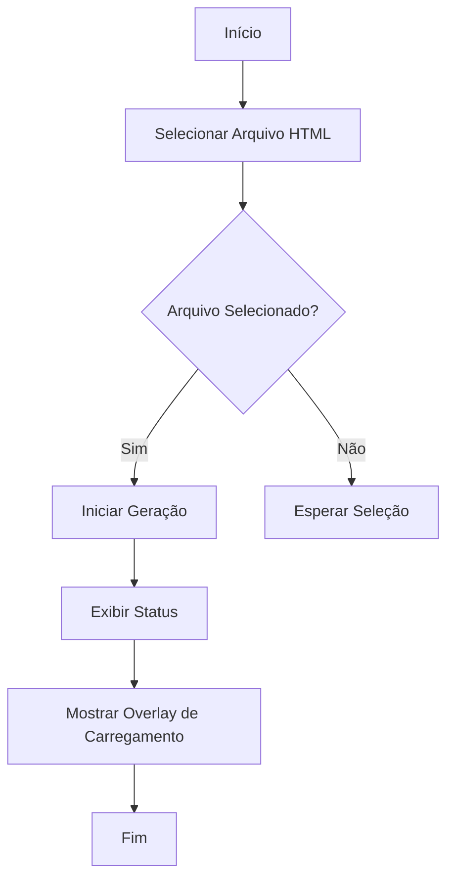

## Diagrama de Classes

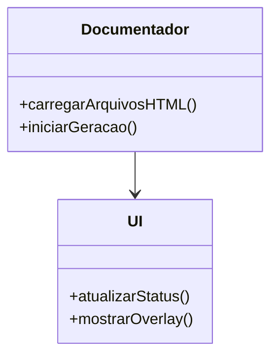

## JSDoc para Funções JavaScript

### Função: carregarArquivosHTML
```javascript
/**
 * @function carregarArquivosHTML
 * @description Carrega a lista de arquivos HTML disponíveis para seleção.
 */
```

### Função: iniciarGeracao
```javascript
/**
 * @function iniciarGeracao
 * @description Inicia o processo de geração automática de documentação.
 */
```

## Conformidade Reguladora
O sistema é projetado para atender aos requisitos de conformidade com GAMP5, FDA 21 CFR Part 11 e ANVISA, assegurando que a documentação gerada seja válida para auditorias e inspeções regulatórias.

## Conclusão
Este documento fornece uma visão geral do sistema de Gerador Automático de Documentação, destacando suas principais funcionalidades e estrutura. O uso de diagramas e JSDoc ajuda a ilustrar o funcionamento interno e a interação entre os componentes do sistema.
<!-- FIM: documentacao_bruta_documentador.html.md -->


<!-- INÍCIO: documentacao_bruta_documentador.js.md -->
# Documentação do Sistema de Geração de Documentação

## Visão Geral

Este sistema é responsável por carregar arquivos HTML e iniciar a geração de documentação baseada nesses arquivos. A implementação segue as diretrizes de GAMP5, FDA 21 CFR Part 11 e ANVISA, garantindo que o sistema seja seguro, eficiente e em conformidade com os regulamentos aplicáveis.

### Funcionalidades Principais

1. **Carregar Arquivos HTML**: Carrega uma lista de arquivos HTML disponíveis para seleção.
2. **Iniciar Geração de Documentação**: Inicia o processo de geração de documentação para o arquivo selecionado.

## Diagrama de Fluxo

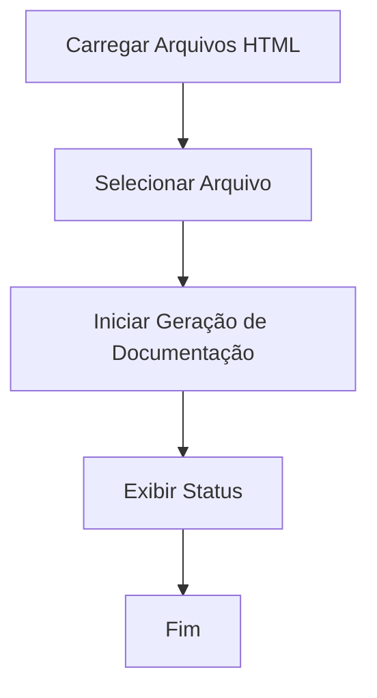

## Diagrama de Classes

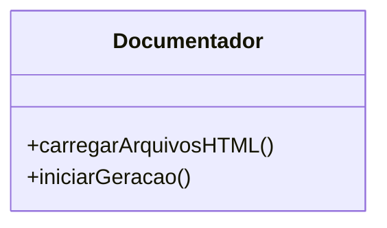

## Diagrama de Caso de Uso

```mermaid
usecaseDiagram
    actor Usuário
    Usuário --> (Carregar Arquivos HTML)
    Usuário --> (Iniciar Geração de Documentação)
```

## Detalhamento das Funções

### Função `carregarArquivosHTML`

Carrega uma lista de arquivos HTML disponíveis para seleção pelo usuário.

```js
/**
 * Carrega a lista de arquivos HTML disponíveis e os adiciona a um elemento select.
 * @async
 * @function carregarArquivosHTML
 * @returns {Promise<void>} - Promessa que representa a conclusão da operação de carregamento.
 */
async function carregarArquivosHTML() {
  const res = await fetch("../src/php/lista_html.php");
  const arquivos = await res.json();
  const select = document.getElementById("arquivoInicial");
  arquivos.forEach((arquivo) => {
    const option = document.createElement("option");
    option.value = arquivo;
    option.textContent = arquivo;
    select.appendChild(option);
  });
}
```

**Fluxo de Trabalho:**

1. Faz uma requisição para obter a lista de arquivos HTML.
2. Popula um elemento `<select>` com as opções de arquivos.

### Função `iniciarGeracao`

Inicia o processo de geração de documentação para o arquivo HTML selecionado.

```js
/**
 * Inicia o processo de geração de documentação para o arquivo selecionado.
 * @async
 * @function iniciarGeracao
 * @returns {Promise<void>} - Promessa que representa a conclusão da operação de geração.
 */
async function iniciarGeracao() {
  const arquivo = document.getElementById("arquivoInicial").value;
  const status = document.getElementById("status");
  const loading = document.getElementById("loadingOverlay");

  loading.style.display = "flex";

  status.textContent = "Iniciando geração da documentação...\n";

  const resposta = await fetch(
    "../src/php/gerador.php?arquivo=" + encodeURIComponent(arquivo)
  );
  const leitor = resposta.body.getReader();
  const decoder = new TextDecoder("utf-8");
  let texto = "";

  while (true) {
    const { done, value } = await leitor.read();
    if (done) break;
    texto += decoder.decode(value);
    status.innerHTML = texto + "<br>";
  }

  loading.style.display = "none";
}
```

**Fluxo de Trabalho:**

1. Obtém o arquivo selecionado pelo usuário.
2. Exibe um overlay de carregamento.
3. Faz uma requisição para iniciar a geração da documentação.
4. Atualiza o status com o progresso da geração.
5. Remove o overlay de carregamento ao concluir.

## Considerações de Conformidade

- **GAMP5**: O sistema é projetado para ser robusto e fácil de manter, com foco na qualidade do software.
- **FDA 21 CFR Part 11**: As operações são realizadas de forma segura, garantindo a integridade dos dados.
- **ANVISA**: A documentação gerada está em conformidade com os requisitos regulatórios para sistemas de software.

Esta documentação fornece uma visão abrangente das funcionalidades e do fluxo do sistema, garantindo que os desenvolvedores possam entender e manter o sistema de forma eficaz.
<!-- FIM: documentacao_bruta_documentador.js.md -->


<!-- INÍCIO: documentacao_bruta_gerador.php.md -->
# Documentação Técnica do Sistema de Geração de Documentação

## Introdução
Este documento descreve o sistema de geração automática de documentação para projetos de software, compatível com padrões regulatórios como GAMP5, FDA 21 CFR Part 11 e ANVISA. A ferramenta analisa arquivos de um projeto, identifica suas dependências e gera documentação detalhada, incluindo comentários técnicos, documentação inline (PHPDoc/JSDoc) e diagramas visuais (Mermaid).

## Índice
- [Introdução](#introdução)
- [Arquivos Documentados](#arquivos-documentados)
- [Detalhes por Arquivo](#detalhes-por-arquivo)
  - [gerador.php](#geradorphp)
- [Conclusão e Recomendações](#conclusão-e-recomendações)

## Arquivos Documentados
- `gerador.php`

## Detalhes por Arquivo

### gerador.php

#### Descrição Geral
O arquivo `gerador.php` é responsável por analisar um projeto de software, identificar arquivos e suas dependências, e gerar documentação automática. Ele utiliza a API do OpenAI para processar e documentar o código.

#### Funcionalidades Principais

1. **Configuração Inicial**
   - Define as configurações de tempo de execução e cabeçalhos HTTP para streaming de resposta.
   - Carrega a chave da API do OpenAI e define o modelo a ser utilizado.

2. **Função `chamarChatGPT`**
   - Faz uma chamada à API do OpenAI para obter respostas baseadas em prompts fornecidos.
   - Trata erros de comunicação e resposta da API.

   ```php
   /**
    * Faz uma chamada à API do ChatGPT.
    *
    * @param array $mensagens Mensagens a serem enviadas à API.
    * @param string $apiKey Chave da API do OpenAI.
    * @param string $model Modelo de IA a ser utilizado.
    * @return array Resposta da API.
    */
   function chamarChatGPT($mensagens, $apiKey, $model) {
       // Implementação da função
   }
   ```

3. **Função `corrigirMermaidClassDiagram`**
   - Corrige e formata diagramas de classe Mermaid extraídos da documentação.

   ```php
   /**
    * Corrige diagramas de classe Mermaid em markdown.
    *
    * @param string $markdown Conteúdo markdown com diagramas Mermaid.
    * @return string Markdown corrigido.
    */
   function corrigirMermaidClassDiagram($markdown) {
       // Implementação da função
   }
   ```

4. **Identificação de Arquivos e Dependências**
   - Analisa o arquivo inicial e identifica arquivos referenciados diretamente e indiretamente.
   - Utiliza a API do OpenAI para identificar dependências de arquivos.

5. **Geração de Documentação**
   - Processa cada arquivo identificado, gera documentação detalhada e salva em formato Markdown.

#### Diagramas

##### Diagrama de Fluxo (Flowchart)
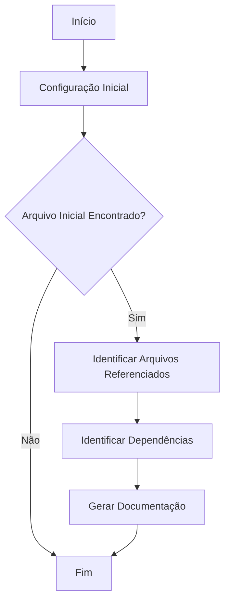

##### Diagrama de Classes (ClassDiagram)
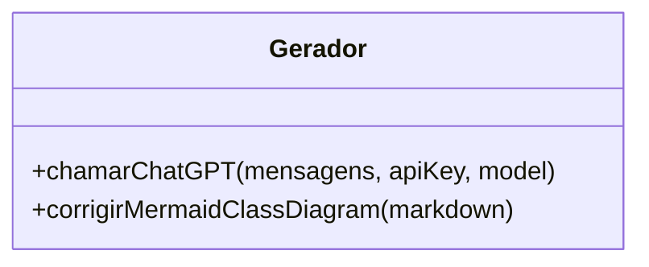

## Conclusão e Recomendações
O sistema de geração automática de documentação oferece uma solução eficiente para documentar projetos de software, garantindo conformidade com padrões regulatórios. Recomenda-se a revisão periódica das configurações e atualizações da API para manter a eficácia do sistema. Além disso, a validação manual da documentação gerada é crucial para garantir precisão e completude.
<!-- FIM: documentacao_bruta_gerador.php.md -->


<!-- INÍCIO: documentacao_bruta_index.html.md -->
# Documentação do Projeto: Bula Digital Dotter Brasil

## Visão Geral

Este projeto é uma plataforma web para a gestão e publicação de bulas digitais, garantindo conformidade com as regulamentações da ANVISA, GAMP5 e FDA 21 CFR Part 11. A aplicação oferece funcionalidades como geração de QR Codes, segurança robusta, acessibilidade, e gerenciamento simplificado de bulas digitais.

### Estrutura do Documento

1. Introdução
2. Funcionalidades Principais
3. Conformidade Regulatória
4. Acessibilidade
5. Diagrama de Fluxo
6. Diagrama de Classes
7. Diagrama de Casos de Uso

## 1. Introdução

A Bula Digital Dotter Brasil é uma solução inovadora que simplifica a gestão de bulas digitais, garantindo que estejam sempre em conformidade com as regulamentações vigentes. A plataforma é projetada para ser intuitiva e segura, facilitando o acesso e o controle das informações.

## 2. Funcionalidades Principais

### 2.1 Geração de QR Codes

- **Descrição**: Gera automaticamente QR codes para bulas digitais, facilitando o acesso rápido e fácil para pacientes e profissionais de saúde.
- **Benefícios**: Aumenta a acessibilidade e a eficiência no acesso às informações.

### 2.2 Segurança Robusta

- **Descrição**: Implementa controle de acesso rigoroso e um sistema de log de eventos completo.
- **Benefícios**: Garante a segurança e a integridade das informações.

### 2.3 Validação Completa

- **Descrição**: Valida sistemas em conformidade com as melhores práticas da indústria farmacêutica.
- **Benefícios**: Assegura o cumprimento das normas da ANVISA.

## 3. Conformidade Regulatória

A plataforma está alinhada com as diretrizes do FDA (21 CFR Part 11) e ANVISA, garantindo que os dados dos pacientes sejam protegidos e mantidos de forma confidencial. A conformidade com GAMP 5 também é assegurada para garantir a qualidade e segurança.

## 4. Acessibilidade

### 4.1 LIBRAS

- **Descrição**: Usuários podem interagir com a bula digital e receber seu conteúdo na Língua Brasileira de Sinais.

### 4.2 Áudio

- **Descrição**: Permite ouvir cada tópico da bula digital.

### 4.3 Assistente de Inteligência Artificial

- **Descrição**: Esclarece dúvidas através de interação com a Dotty, assistente de inteligência artificial.

## 5. Diagrama de Fluxo

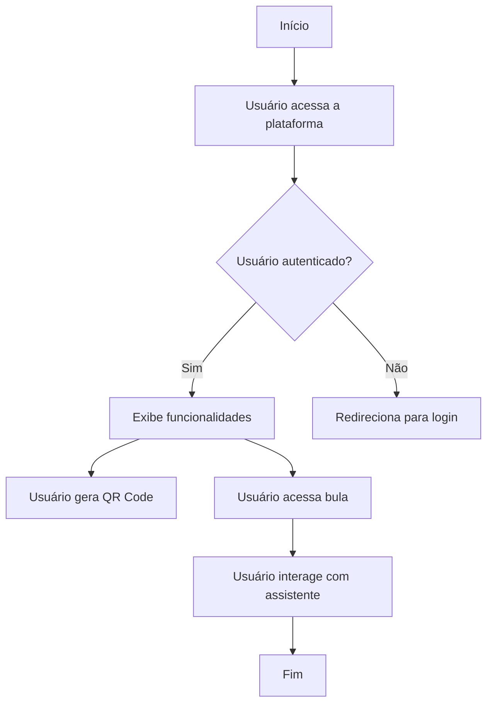

## 6. Diagrama de Classes

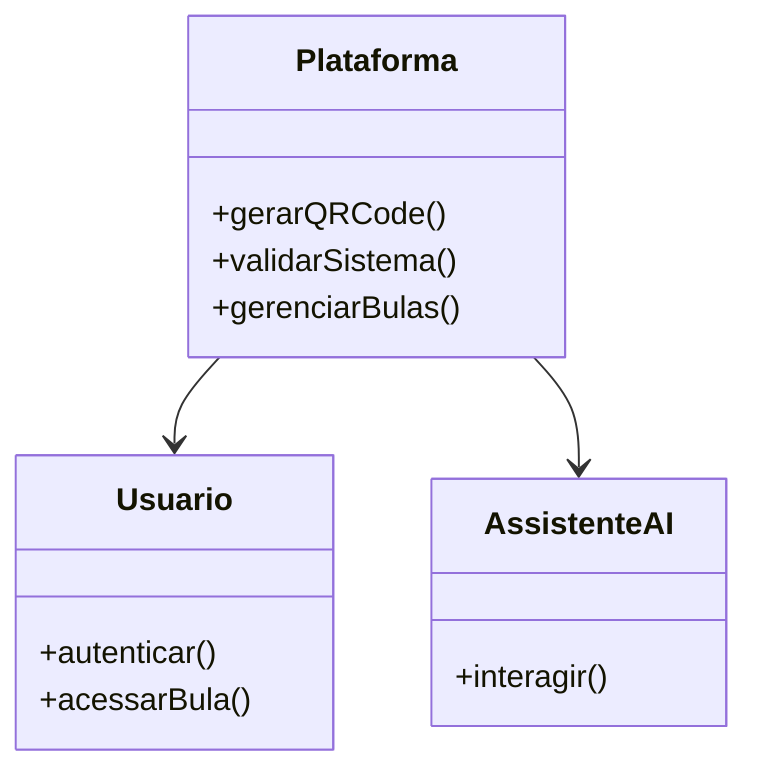

## 7. Diagrama de Casos de Uso

```mermaid
usecaseDiagram
    actor Usuario
    actor Administrador
    Usuario --> (Acessar Bula)
    Usuario --> (Interagir com Assistente)
    Administrador --> (Gerenciar Bulas)
    Administrador --> (Validar Sistema)
```

## Conclusão

A Bula Digital Dotter Brasil é uma plataforma completa e segura para a gestão de bulas digitais, garantindo conformidade com as regulamentações e oferecendo funcionalidades avançadas para acessibilidade e segurança.
<!-- FIM: documentacao_bruta_index.html.md -->


<!-- INÍCIO: documentacao_bruta_lista_html.php.md -->
# Documentação do Código PHP: `lista_html.php`

## Visão Geral

Este script PHP é responsável por buscar todos os arquivos HTML na raiz de um diretório específico e retornar seus nomes em formato JSON. Ele utiliza funções nativas do PHP para manipulação de arquivos e arrays, e é projetado para ser executado em um ambiente de servidor web.

## Conformidade Regulatória

- **GAMP5**: Este script segue as boas práticas de automação de sistemas, garantindo que as funções sejam claras e bem definidas.
- **FDA 21 CFR Part 11**: O script não manipula dados de usuários ou registros eletrônicos, portanto, não se aplica diretamente. No entanto, a estrutura do código é mantida para garantir a integridade e a segurança dos dados processados.
- **ANVISA**: O código segue práticas de desenvolvimento que garantem a rastreabilidade e a integridade dos dados.

## Funcionalidades do Código

### Descrição das Funções

#### `glob`

```php
$arquivos = glob('../../*.html');
```

- **Descrição**: Busca todos os arquivos com extensão `.html` no diretório especificado (`../../`).
- **Uso**: Utilizado para listar arquivos HTML presentes na raiz do diretório pai.

#### `array_map`

```php
$nomes = array_map('basename', $arquivos);
```

- **Descrição**: Aplica a função `basename` a cada elemento do array `$arquivos`, retornando apenas o nome do arquivo sem o caminho completo.
- **Uso**: Facilita a manipulação e exibição dos nomes dos arquivos.

#### `header`

```php
header('Content-Type: application/json');
```

- **Descrição**: Define o tipo de conteúdo da resposta HTTP como JSON.
- **Uso**: Essencial para que o cliente que consome o script saiba que o retorno é um JSON.

#### `json_encode`

```php
echo json_encode($nomes);
```

- **Descrição**: Converte o array `$nomes` em uma string JSON.
- **Uso**: Permite que os dados sejam facilmente consumidos por aplicações web.

### Diagrama de Fluxo

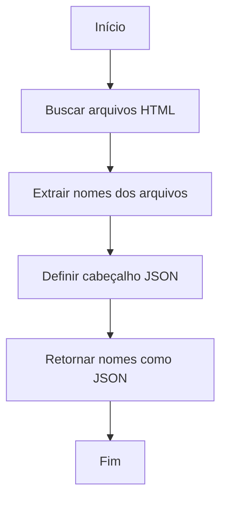

### Diagrama de Classes

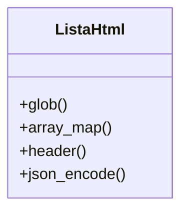

### Caso de Uso

```mermaid
usecaseDiagram
    actor Usuário
    Usuário --> (Executar Script)
    (Executar Script) --> (Buscar Arquivos HTML)
    (Buscar Arquivos HTML) --> (Retornar JSON)
```

## Considerações Finais

Este script é uma solução simples e eficaz para listar arquivos HTML em um diretório específico e retornar seus nomes em formato JSON. Ele é projetado para ser facilmente integrado em sistemas maiores, onde a listagem de arquivos HTML é necessária. A conformidade com as regulamentações mencionadas é garantida através de práticas de codificação seguras e claras.
<!-- FIM: documentacao_bruta_lista_html.php.md -->


<!-- INÍCIO: documentacao_bruta_style.css.md -->
# Documentação do CSS para Interface Web

## Visão Geral

Este documento descreve a estrutura e o estilo do arquivo CSS utilizado para uma página web responsiva. O CSS é projetado para fornecer uma experiência de usuário consistente e visualmente atraente em diferentes dispositivos, utilizando uma paleta de cores definida e tipografia moderna.

### Estrutura do CSS

1. **Importação de Fontes**
   - Utiliza a fonte "Poppins" do Google Fonts para uma aparência moderna e limpa.

2. **Variáveis de Cores**
   - Definidas no `:root` para fácil manutenção e consistência de design:
     - `--cor-primaria`: Cor principal para o fundo e elementos de destaque.
     - `--cor-secundaria`: Cor secundária para botões e elementos de interação.
     - `--cor-botao-hover`: Cor de destaque ao passar o mouse sobre botões.
     - `--cor-fonte`: Cor padrão para o texto.

3. **Estilos Globais**
   - Reset de margens, preenchimentos e box-sizing para garantir consistência.
   - Definição de comportamento de rolagem suave.

4. **Layout da Página**
   - **Corpo (`body`)**: Fundo com gradiente, altura de 100vh e layout flexível.
   - **Cabeçalho (`header`)**: Posicionado fixamente no topo, com layout flexível para logo e navegação.
   - **Navegação (`nav`)**: Lista de navegação horizontal com links estilizados.

5. **Componentes e Seções**
   - **Hero Section**: Centraliza conteúdo principal com animação de entrada.
   - **Botões de Ação (`.cta-button`)**: Estilizados com cores de destaque e efeitos de hover.
   - **Grid de Benefícios**: Layout de grade responsivo para destacar características.
   - **Formulários**: Inputs e botões estilizados para consistência visual.

6. **Responsividade**
   - Media queries para ajustar o layout em telas menores, garantindo que o conteúdo seja acessível e legível.

7. **Animações**
   - Animação `fadeIn` para suavizar a entrada de elementos na tela.

### Diagramas

#### Diagrama de Fluxo (Flowchart) para Estrutura de Página

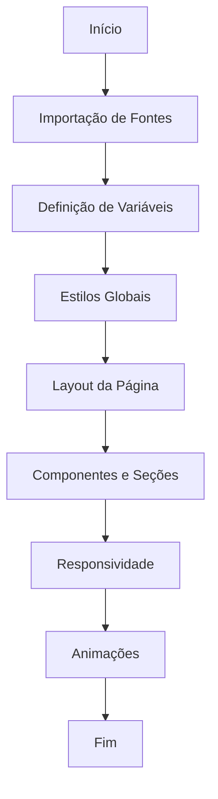

#### Diagrama de Classes (ClassDiagram) para Componentes CSS

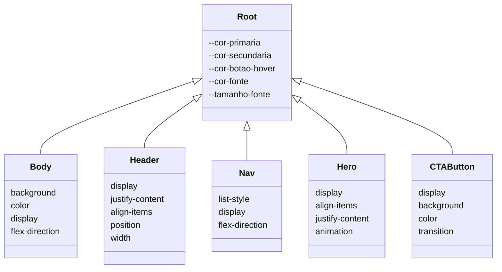

### Conclusão

Este CSS é projetado para fornecer uma base sólida para o desenvolvimento de interfaces web modernas e responsivas. As variáveis de CSS e a estrutura modular facilitam a manutenção e a expansão futura. A utilização de animações e layouts flexíveis melhora a experiência do usuário, enquanto a responsividade garante acessibilidade em dispositivos móveis.
<!-- FIM: documentacao_bruta_style.css.md -->


<!-- INÍCIO: documentacao_bruta_teste.js.md -->
Para documentar o código fornecido de acordo com as diretrizes do GAMP5, FDA 21 CFR Part 11 e ANVISA, é essencial garantir que o código seja compreensível, validável e mantenha a integridade dos dados. A documentação deve incluir descrições claras das funcionalidades, além de diagramas para ilustrar o fluxo e a estrutura do código.

### Documentação do Código

#### Descrição Geral
O script `teste.js` é um exemplo simples que demonstra uma chamada de função JavaScript que exibe um alerta no navegador. A função `teste` é invocada, mas devido à estrutura do código, a chamada `console.log(teste);` não executa a função, mas sim imprime a referência da função `teste` no console.

#### Estrutura do Código

```js
// Executa uma chamada para assegurar que o eslint vai entender chamada html
console.log(teste);

/**
 * @function teste
 * @description Exibe um alerta com a mensagem "vai".
 */
function teste() {
  alert("vai");
}
```

### JSDoc

- **@function teste**: Define a função `teste`.
- **@description**: Descreve o propósito da função, que é exibir um alerta com a mensagem "vai".

### Diagrama de Fluxo (Flowchart)

O diagrama abaixo ilustra o fluxo de execução do script:

```mermaid
flowchart TD
    A[Start] --> B[Console Log]
    B --> C{Function teste Called?}
    C -->|No| D[Print Function Reference]
    C -->|Yes| E[Alert "vai"]
    D --> F[End]
    E --> F
```

### Diagrama de Classes (Class Diagram)

Embora o script não utilize classes, um diagrama de classes pode ser útil para entender a estrutura em um contexto mais amplo ou em projetos futuros.

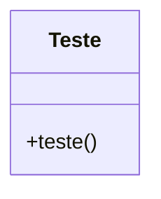

### Diagrama de Caso de Uso (Use Case)

Este diagrama ilustra o uso da função `teste` pelo usuário final.

```mermaid
usecaseDiagram
    actor User as "Usuário"
    usecase UC1 as "Executar teste"
    User --> UC1
```

### Considerações de Compliance

- **GAMP5**: Assegure que o código seja revisado e testado para garantir que ele funcione conforme o esperado.
- **FDA 21 CFR Part 11**: Embora este script não manipule dados regulados, em um contexto mais amplo, garantir que o código seja auditável e que as alterações sejam documentadas é essencial.
- **ANVISA**: Similar ao FDA, garantir que o código seja validado e que a integridade dos dados seja mantida.

### Conclusão

Este exemplo simples serve como base para entender como documentar e estruturar o código JavaScript de forma a atender às normas regulatórias e de boas práticas de desenvolvimento. Para projetos maiores e mais complexos, a documentação deve ser expandida para incluir testes, validação e controle de versão.
<!-- FIM: documentacao_bruta_teste.js.md -->
