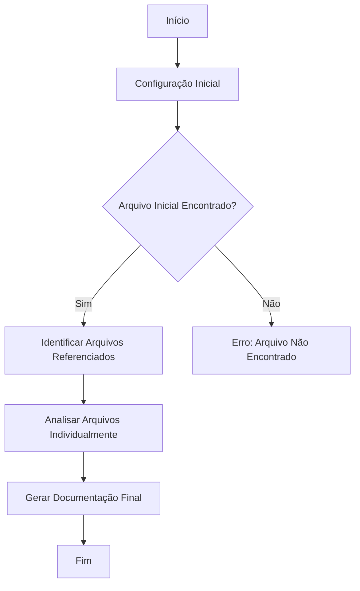
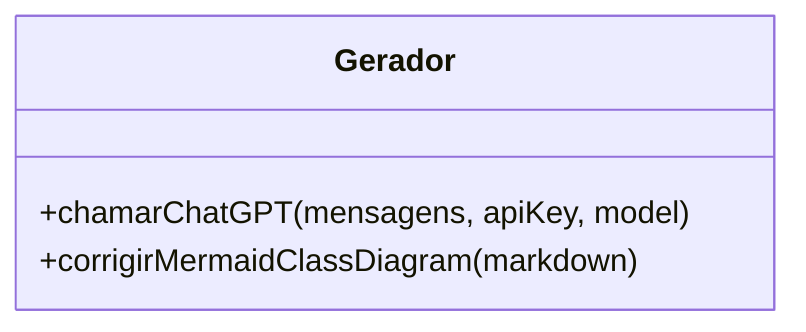

# Documentação Técnica Consolidada

## Introdução

Este documento fornece uma visão abrangente e estruturada da documentação técnica gerada automaticamente para o sistema, em conformidade com as práticas regulatórias GAMP 5, ANVISA e FDA 21 CFR Part 11. A documentação foi produzida para garantir clareza, qualidade e compatibilidade com auditorias regulatórias.

## Índice

- [Arquivo: gerador.php](#arquivo-geradorphp)
  - 📄 [Ver Markdown individual](./documentacao_bruta_gerador_php.md)
  - 💻 [Ver Código-fonte](../../src/php/gerador.php)

## Arquivo: gerador.php

### Comentários Técnicos Explicativos

O arquivo `gerador.php` é responsável por gerar documentação automática para o sistema. Ele utiliza a API do ChatGPT para analisar arquivos HTML, identificar referências a outros arquivos (JS, CSS, PHP) e gerar documentação detalhada para cada um deles.

### Documentação Inline (PHPDoc)

/**
 * Chama a API do ChatGPT para gerar respostas baseadas em mensagens fornecidas.
 *
 * @param array $mensagens Mensagens a serem enviadas para a API.
 * @param string $apiKey Chave de API para autenticação.
 * @param string $model Modelo a ser utilizado na API.
 * @return array Resposta da API em formato JSON decodificado.
 */
function chamarChatGPT($mensagens, $apiKey, $model) {
    // Implementação da função...
}

### Diagramas

#### Diagrama de Fluxo (Mermaid Flowchart)

#### Diagrama de Classes (Mermaid ClassDiagram)

### Conclusão e Recomendações

Este pacote de documentação oferece uma visão completa, validável e estruturada sobre o sistema analisado. Recomenda-se:

- Revisar os diagramas Mermaid para garantir precisão.
- Integrar a documentação à rastreabilidade dos requisitos.
- Anexar evidências de teste para validação formal.

---

## Conclusão

A documentação gerada fornece uma base sólida para auditorias e revisões técnicas, garantindo que o sistema esteja em conformidade com os padrões regulatórios exigidos. É essencial manter a documentação atualizada e revisada regularmente para refletir quaisquer mudanças no sistema ou nos requisitos regulatórios.