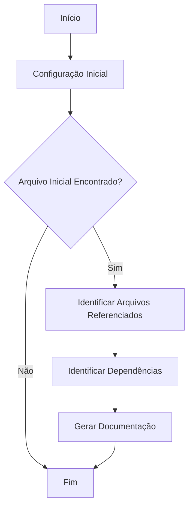
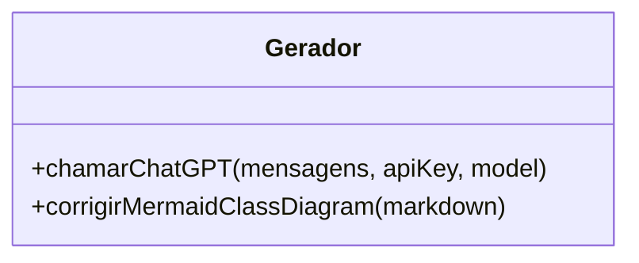

# Documentação Técnica do Sistema de Geração de Documentação

## Introdução
Este documento descreve o sistema de geração automática de documentação para projetos de software, compatível com padrões regulatórios como GAMP5, FDA 21 CFR Part 11 e ANVISA. A ferramenta analisa arquivos de um projeto, identifica suas dependências e gera documentação detalhada, incluindo comentários técnicos, documentação inline (PHPDoc/JSDoc) e diagramas visuais (Mermaid).

## Índice
- [Introdução](#introdução)
- [Arquivos Documentados](#arquivos-documentados)
- [Detalhes por Arquivo](#detalhes-por-arquivo)
  - [gerador.php](#geradorphp)
- [Conclusão e Recomendações](#conclusão-e-recomendações)

## Arquivos Documentados
- `gerador.php`

## Detalhes por Arquivo

### gerador.php

#### Descrição Geral
O arquivo `gerador.php` é responsável por analisar um projeto de software, identificar arquivos e suas dependências, e gerar documentação automática. Ele utiliza a API do OpenAI para processar e documentar o código.

#### Funcionalidades Principais

1. **Configuração Inicial**
   - Define as configurações de tempo de execução e cabeçalhos HTTP para streaming de resposta.
   - Carrega a chave da API do OpenAI e define o modelo a ser utilizado.

2. **Função `chamarChatGPT`**
   - Faz uma chamada à API do OpenAI para obter respostas baseadas em prompts fornecidos.
   - Trata erros de comunicação e resposta da API.

   ```php
   /**
    * Faz uma chamada à API do ChatGPT.
    *
    * @param array $mensagens Mensagens a serem enviadas à API.
    * @param string $apiKey Chave da API do OpenAI.
    * @param string $model Modelo de IA a ser utilizado.
    * @return array Resposta da API.
    */
   function chamarChatGPT($mensagens, $apiKey, $model) {
       // Implementação da função
   }
   ```

3. **Função `corrigirMermaidClassDiagram`**
   - Corrige e formata diagramas de classe Mermaid extraídos da documentação.

   ```php
   /**
    * Corrige diagramas de classe Mermaid em markdown.
    *
    * @param string $markdown Conteúdo markdown com diagramas Mermaid.
    * @return string Markdown corrigido.
    */
   function corrigirMermaidClassDiagram($markdown) {
       // Implementação da função
   }
   ```

4. **Identificação de Arquivos e Dependências**
   - Analisa o arquivo inicial e identifica arquivos referenciados diretamente e indiretamente.
   - Utiliza a API do OpenAI para identificar dependências de arquivos.

5. **Geração de Documentação**
   - Processa cada arquivo identificado, gera documentação detalhada e salva em formato Markdown.

#### Diagramas

##### Diagrama de Fluxo (Flowchart)


##### Diagrama de Classes (ClassDiagram)


## Conclusão e Recomendações
O sistema de geração automática de documentação oferece uma solução eficiente para documentar projetos de software, garantindo conformidade com padrões regulatórios. Recomenda-se a revisão periódica das configurações e atualizações da API para manter a eficácia do sistema. Além disso, a validação manual da documentação gerada é crucial para garantir precisão e completude.