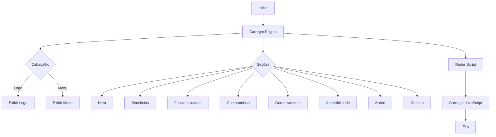

# Documentação do Projeto: Bula Digital Dotter Brasil

## Visão Geral

Este projeto é uma aplicação web para a gestão e publicação de bulas digitais, em conformidade com as regulamentações da ANVISA, FDA 21 CFR Part 11 e GAMP 5. A solução oferece funcionalidades como geração de QR Codes, segurança avançada, acessibilidade e gerenciamento simplificado, garantindo a conformidade com a RDC 885.

## Estrutura do Projeto

O projeto é composto por um arquivo HTML principal (`index.html`) que organiza a estrutura do site e inclui referências a arquivos CSS e JavaScript externos. A seguir, detalhamos as principais seções e funcionalidades do projeto.

### Diagrama de Fluxo



### Estrutura HTML

#### Cabeçalho

O cabeçalho contém o logo da empresa e um menu de navegação que permite acesso rápido às diferentes seções da página. A funcionalidade de menu é controlada por um ícone que, ao ser clicado, alterna a visibilidade da lista de navegação.

```html
<header>
  <div class="logo">
    
  </div>
  <div class="menu">
    <i class="fa fa-bars" onclick="toggleMenu()"></i>
  </div>
  <nav class="listaMenu" id="listaMenu">
    <ul>
      <li><a href="#sobre">Sobre</a></li>
      <li><a href="#beneficios">Benefícios</a></li>
      <li><a href="#funcionalidades">Funcionalidades</a></li>
      <li><a href="#contato">Contato</a></li>
      <li><a href="login.html">Login</a></li>
    </ul>
  </nav>
</header>
```

#### Seções Principais

Cada seção da página (`hero`, `beneficios`, `funcionalidades`, etc.) é projetada para destacar diferentes aspectos do produto, como benefícios, funcionalidades, compromisso com a conformidade regulatória, e informações de contato.

```html
<section class="hero">
  <div class="content-section2">
    <h1>Bula Digital ANVISA</h1>
    <h2>Simplifique a Gestão de suas Bulas Digitais</h2>
    <p>A solução completa para publicação, edição e controle de bulas digitais em total conformidade com a RDC 885.</p>
    <a href="#contato" class="cta-button">Saiba Mais</a>
  </div>
  <div class="hero-image">
    
  </div>
</section>
```

### Funcionalidades JavaScript

#### Carregamento Dinâmico de Scripts

O script JavaScript é carregado dinamicamente para garantir que a versão mais recente seja utilizada, evitando problemas de cache.

```html
<script>
  var script = document.createElement("script");
  script.src = "src/js/teste.js?no_cache=" + new Date().getTime();
  document.head.appendChild(script);
</script>
```

#### Função de Alternância do Menu

A função `toggleMenu` é responsável por alternar a visibilidade do menu de navegação.

```javascript
/**
 * Alterna a visibilidade do menu de navegação.
 */
function toggleMenu() {
  document.querySelector('.listaMenu ul').classList.toggle('active');
}
```

### Conformidade Regulatória

A plataforma está em conformidade com as diretrizes do FDA (21 CFR Part 11), ANVISA e GAMP 5, garantindo que os dados dos pacientes sejam protegidos e mantidos de forma confidencial.

### Diagrama de Caso de Uso

```mermaid
usecaseDiagram
    actor Usuário
    actor Administrador
    Usuário --> (Acessar Bula Digital)
    Usuário --> (Consultar Benefícios)
    Usuário --> (Enviar Contato)
    Administrador --> (Gerenciar Bulas)
    Administrador --> (Acessar Repositório RIEP)
```

## Conclusão

Este projeto oferece uma solução robusta e segura para a gestão de bulas digitais, atendendo às exigências regulatórias e proporcionando uma experiência de usuário acessível e eficiente. A documentação visa fornecer uma visão clara das funcionalidades e da estrutura do sistema, facilitando sua implementação e manutenção.