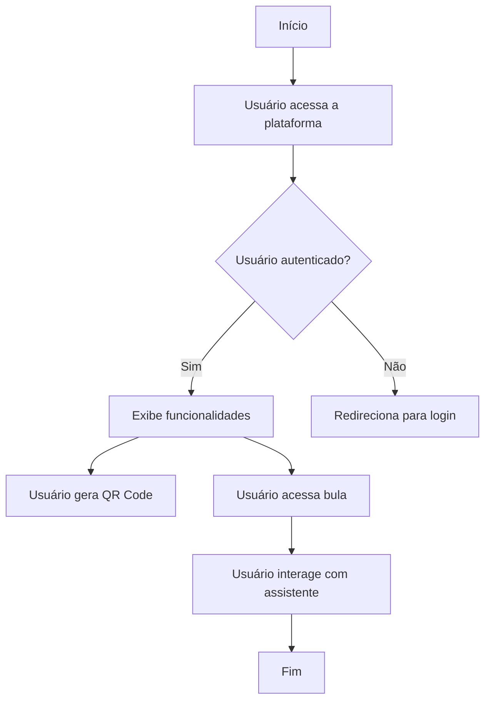
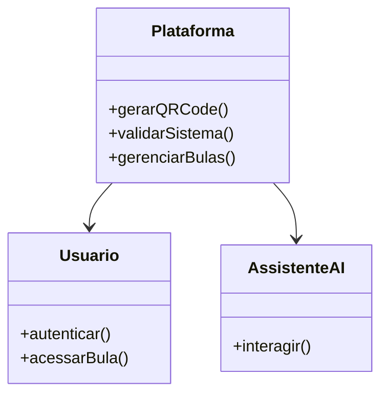

# Documentação do Projeto: Bula Digital Dotter Brasil

## Visão Geral

Este projeto é uma plataforma web para a gestão e publicação de bulas digitais, garantindo conformidade com as regulamentações da ANVISA, GAMP5 e FDA 21 CFR Part 11. A aplicação oferece funcionalidades como geração de QR Codes, segurança robusta, acessibilidade, e gerenciamento simplificado de bulas digitais.

### Estrutura do Documento

1. Introdução
2. Funcionalidades Principais
3. Conformidade Regulatória
4. Acessibilidade
5. Diagrama de Fluxo
6. Diagrama de Classes
7. Diagrama de Casos de Uso

## 1. Introdução

A Bula Digital Dotter Brasil é uma solução inovadora que simplifica a gestão de bulas digitais, garantindo que estejam sempre em conformidade com as regulamentações vigentes. A plataforma é projetada para ser intuitiva e segura, facilitando o acesso e o controle das informações.

## 2. Funcionalidades Principais

### 2.1 Geração de QR Codes

- **Descrição**: Gera automaticamente QR codes para bulas digitais, facilitando o acesso rápido e fácil para pacientes e profissionais de saúde.
- **Benefícios**: Aumenta a acessibilidade e a eficiência no acesso às informações.

### 2.2 Segurança Robusta

- **Descrição**: Implementa controle de acesso rigoroso e um sistema de log de eventos completo.
- **Benefícios**: Garante a segurança e a integridade das informações.

### 2.3 Validação Completa

- **Descrição**: Valida sistemas em conformidade com as melhores práticas da indústria farmacêutica.
- **Benefícios**: Assegura o cumprimento das normas da ANVISA.

## 3. Conformidade Regulatória

A plataforma está alinhada com as diretrizes do FDA (21 CFR Part 11) e ANVISA, garantindo que os dados dos pacientes sejam protegidos e mantidos de forma confidencial. A conformidade com GAMP 5 também é assegurada para garantir a qualidade e segurança.

## 4. Acessibilidade

### 4.1 LIBRAS

- **Descrição**: Usuários podem interagir com a bula digital e receber seu conteúdo na Língua Brasileira de Sinais.

### 4.2 Áudio

- **Descrição**: Permite ouvir cada tópico da bula digital.

### 4.3 Assistente de Inteligência Artificial

- **Descrição**: Esclarece dúvidas através de interação com a Dotty, assistente de inteligência artificial.

## 5. Diagrama de Fluxo



## 6. Diagrama de Classes



## 7. Diagrama de Casos de Uso

```mermaid
usecaseDiagram
    actor Usuario
    actor Administrador
    Usuario --> (Acessar Bula)
    Usuario --> (Interagir com Assistente)
    Administrador --> (Gerenciar Bulas)
    Administrador --> (Validar Sistema)
```

## Conclusão

A Bula Digital Dotter Brasil é uma plataforma completa e segura para a gestão de bulas digitais, garantindo conformidade com as regulamentações e oferecendo funcionalidades avançadas para acessibilidade e segurança.