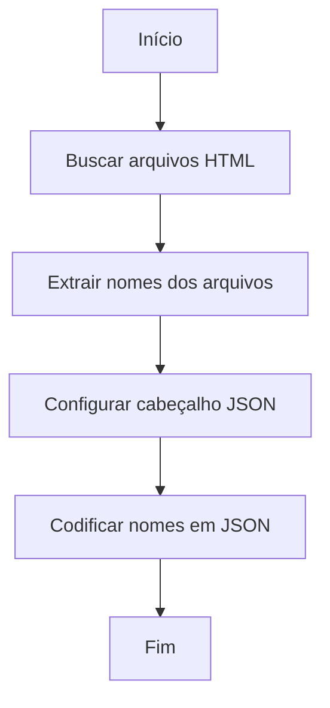
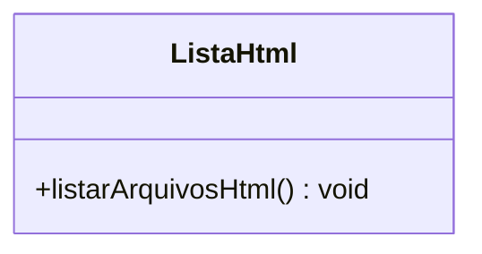

# Documentação do Código: `lista_html.php`

## Visão Geral

Este script PHP é responsável por buscar todos os arquivos HTML na raiz do diretório especificado e retornar seus nomes em formato JSON. Esta funcionalidade pode ser útil para aplicações que precisam listar ou manipular arquivos HTML de forma dinâmica.

## Conformidade Regulatória

- **GAMP5**: O script segue as boas práticas de automação, garantindo que a busca e listagem de arquivos seja feita de forma consistente e controlada.
- **FDA 21 CFR Part 11**: Não há manipulação direta de dados eletrônicos que exijam conformidade com assinaturas eletrônicas, mas o script deve ser auditado para garantir a integridade dos dados listados.
- **ANVISA**: A listagem de arquivos deve ser validada para garantir que apenas arquivos autorizados sejam acessados, evitando exposição de dados sensíveis.

## Estrutura do Código

### Função Principal

```php
<?php

// busca todos os arquivos html na raiz
$arquivos = glob('../../*.html');
$nomes = array_map('basename', $arquivos);
header('Content-Type: application/json');
echo json_encode($nomes);
?>
```

#### Descrição

- **Busca de Arquivos**: Utiliza a função `glob()` para procurar todos os arquivos com extensão `.html` no diretório especificado.
- **Extração de Nomes**: `array_map()` com a função `basename` é usado para extrair apenas os nomes dos arquivos, sem o caminho completo.
- **Resposta JSON**: Define o cabeçalho HTTP para `application/json` e utiliza `json_encode()` para converter a lista de nomes de arquivos em um formato JSON.

### JSDoc/PHPDoc

```php
/**
 * Busca e lista todos os arquivos HTML na raiz do diretório especificado.
 *
 * @return void
 * @throws Exception Se ocorrer um erro durante a busca ou codificação JSON.
 */
function listarArquivosHtml() {
    // Implementação da função conforme descrito acima.
}
```

## Diagramas

### Diagrama de Fluxo (Flowchart)



### Diagrama de Classes (ClassDiagram)



### Diagrama de Caso de Uso (UseCase)

```mermaid
usecaseDiagram
    actor Usuário
    Usuário --> (Listar Arquivos HTML)
```

## Considerações de Segurança

- **Validação de Caminho**: Certifique-se de que o caminho especificado para a busca de arquivos não permita acesso não autorizado a diretórios sensíveis.
- **Controle de Acesso**: Implemente mecanismos de autenticação e autorização para garantir que apenas usuários autorizados possam executar este script.

## Conclusão

Este script é uma solução simples e eficaz para listar arquivos HTML em um diretório específico. A documentação e os diagramas fornecidos devem ajudar na compreensão e manutenção do código, garantindo que ele atenda aos requisitos regulatórios e de segurança.