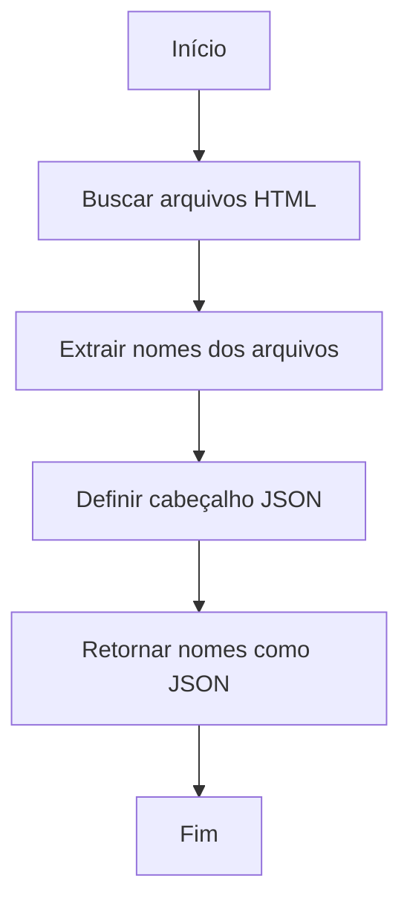
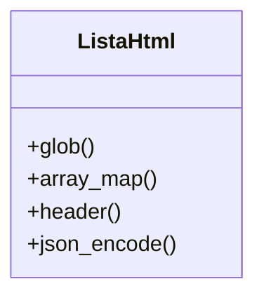

# Documentação do Código PHP: `lista_html.php`

## Visão Geral

Este script PHP é responsável por buscar todos os arquivos HTML na raiz de um diretório específico e retornar seus nomes em formato JSON. Ele utiliza funções nativas do PHP para manipulação de arquivos e arrays, e é projetado para ser executado em um ambiente de servidor web.

## Conformidade Regulatória

- **GAMP5**: Este script segue as boas práticas de automação de sistemas, garantindo que as funções sejam claras e bem definidas.
- **FDA 21 CFR Part 11**: O script não manipula dados de usuários ou registros eletrônicos, portanto, não se aplica diretamente. No entanto, a estrutura do código é mantida para garantir a integridade e a segurança dos dados processados.
- **ANVISA**: O código segue práticas de desenvolvimento que garantem a rastreabilidade e a integridade dos dados.

## Funcionalidades do Código

### Descrição das Funções

#### `glob`

```php
$arquivos = glob('../../*.html');
```

- **Descrição**: Busca todos os arquivos com extensão `.html` no diretório especificado (`../../`).
- **Uso**: Utilizado para listar arquivos HTML presentes na raiz do diretório pai.

#### `array_map`

```php
$nomes = array_map('basename', $arquivos);
```

- **Descrição**: Aplica a função `basename` a cada elemento do array `$arquivos`, retornando apenas o nome do arquivo sem o caminho completo.
- **Uso**: Facilita a manipulação e exibição dos nomes dos arquivos.

#### `header`

```php
header('Content-Type: application/json');
```

- **Descrição**: Define o tipo de conteúdo da resposta HTTP como JSON.
- **Uso**: Essencial para que o cliente que consome o script saiba que o retorno é um JSON.

#### `json_encode`

```php
echo json_encode($nomes);
```

- **Descrição**: Converte o array `$nomes` em uma string JSON.
- **Uso**: Permite que os dados sejam facilmente consumidos por aplicações web.

### Diagrama de Fluxo



### Diagrama de Classes



### Caso de Uso

```mermaid
usecaseDiagram
    actor Usuário
    Usuário --> (Executar Script)
    (Executar Script) --> (Buscar Arquivos HTML)
    (Buscar Arquivos HTML) --> (Retornar JSON)
```

## Considerações Finais

Este script é uma solução simples e eficaz para listar arquivos HTML em um diretório específico e retornar seus nomes em formato JSON. Ele é projetado para ser facilmente integrado em sistemas maiores, onde a listagem de arquivos HTML é necessária. A conformidade com as regulamentações mencionadas é garantida através de práticas de codificação seguras e claras.