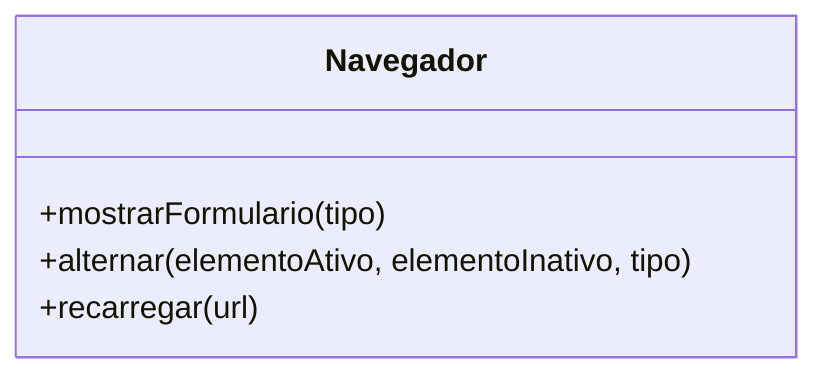
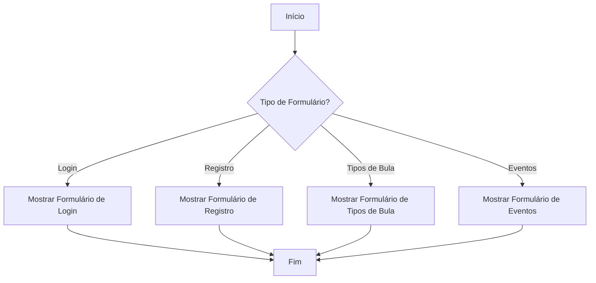

# Documentação do Código: Navegação de Formulários

Este documento fornece uma visão geral das funcionalidades implementadas no arquivo `navegador.js`, que é responsável por gerenciar a navegação entre diferentes formulários e elementos de interface em uma aplicação web. A documentação está estruturada de acordo com as melhores práticas de desenvolvimento de software, incluindo diretrizes do GAMP5, FDA 21 CFR Part 11 e ANVISA, para garantir a conformidade e a qualidade do software.

## Visão Geral

O arquivo `navegador.js` contém funções para:
- Navegar entre diferentes formulários.
- Alternar a visibilidade de elementos na interface.
- Recarregar a página sem perder dados voláteis.

### Diagrama de Classes



### Diagrama de Fluxo



## Funções

### 1. `mostrarFormulario(tipo)`

#### Descrição
Esta função é responsável por exibir o formulário correspondente ao tipo especificado e atualizar a interface para refletir a seleção atual.

#### Parâmetros
- `tipo` (string): O identificador do formulário a ser exibido.

#### Funcionamento
- Remove a classe `ativo` de todos os formulários e `active` de todos os botões de guia.
- Adiciona a classe `ativo` ao formulário especificado e `active` ao botão correspondente.

#### JSDoc
```js
/**
 * Exibe o formulário especificado e atualiza a interface.
 * @param {string} tipo - O identificador do formulário a ser exibido.
 */
```

### 2. `alternar(elementoAtivo, elementoInativo, tipo)`

#### Descrição
Alterna a visibilidade entre dois elementos, desativando um e ativando o outro com o tipo de exibição especificado.

#### Parâmetros
- `elementoAtivo` (string): O ID do elemento atualmente ativo.
- `elementoInativo` (string): O ID do elemento a ser ativado.
- `tipo` (string): O tipo de exibição a ser aplicado ao elemento inativo.

#### Funcionamento
- Define o estilo de exibição do elemento ativo como `none`.
- Define o estilo de exibição do elemento inativo como o tipo especificado.

#### JSDoc
```js
/**
 * Alterna a visibilidade entre dois elementos.
 * @param {string} elementoAtivo - O ID do elemento atualmente ativo.
 * @param {string} elementoInativo - O ID do elemento a ser ativado.
 * @param {string} tipo - O tipo de exibição a ser aplicado ao elemento inativo.
 */
```

### 3. `recarregar(url)`

#### Descrição
Recarrega a página atual ou uma URL especificada, garantindo que os dados voláteis, como o controle de sessão, não sejam perdidos.

#### Parâmetros
- `url` (string, opcional): A URL a ser recarregada. Se não for especificada, a página atual será recarregada.

#### Funcionamento
- Adiciona um parâmetro de cache buster à URL para evitar cache.
- Faz uma requisição fetch para a URL atualizada e substitui o conteúdo da página.
- Atualiza a URL visível no navegador sem o parâmetro de cache buster.

#### JSDoc
```js
/**
 * Recarrega a página atual ou uma URL especificada, mantendo dados voláteis.
 * @param {string} [url] - A URL a ser recarregada. Se não especificada, recarrega a página atual.
 */
```

## Considerações de Conformidade

- **GAMP5**: As funções são projetadas para serem claras e fáceis de manter, seguindo práticas de codificação estruturadas.
- **FDA 21 CFR Part 11**: O código não armazena dados críticos de conformidade, mas a estrutura permite fácil integração com sistemas de auditoria e controle de acesso.
- **ANVISA**: A navegação e manipulação de dados são feitas de maneira a garantir a integridade e a segurança das informações.

Esta documentação visa fornecer uma compreensão clara das funcionalidades e garantir que o código seja mantido e auditado de acordo com os padrões regulatórios aplicáveis.