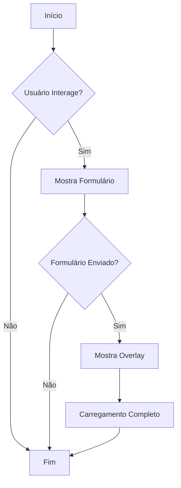
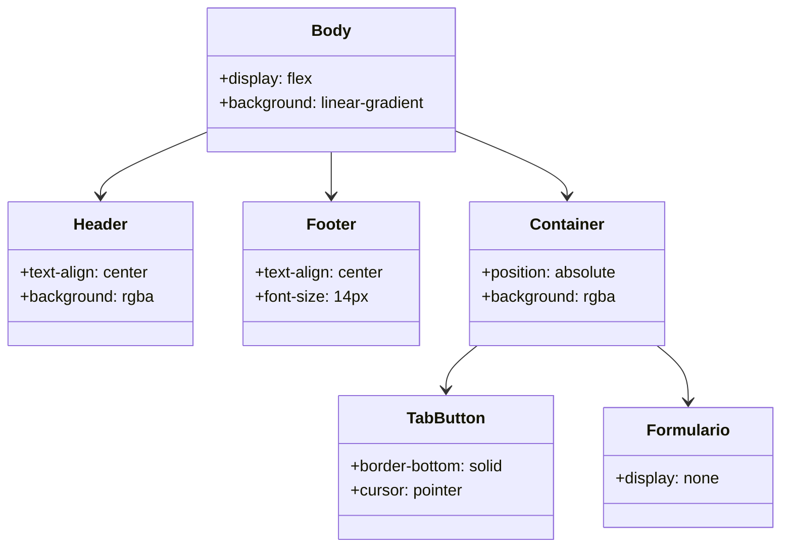

# Documentação de Estilo CSS

Este documento descreve a estrutura e o estilo do arquivo CSS `style-doc.css`, que é utilizado para estilizar uma página web com um layout responsivo e moderno. Abaixo estão as seções principais do CSS, juntamente com explicações sobre suas funcionalidades e efeitos visuais.

## Estrutura Geral

### Reset Básico
```css
* {
    margin: 0;
    padding: 0;
    box-sizing: border-box;
    font-family: Arial, sans-serif;
}
```
- **Objetivo**: Remove margens e preenchimentos padrão dos elementos e define a fonte padrão para `Arial, sans-serif`.
- **Efeito**: Garante consistência visual em diferentes navegadores.

### Corpo da Página
```css
body {
    display: flex;
    flex-direction: column;
    justify-content: space-between;
    height: 100vh;
    background: linear-gradient(135deg, #2c3e50, #4ca1af);
    background-attachment: fixed;
    color: #fff;
}
```
- **Objetivo**: Define um layout flexível para o corpo, com um gradiente de fundo e texto branco.
- **Efeito**: Cria um visual moderno e responsivo.

## Componentes Principais

### Cabeçalho
```css
header {
    text-align: center;
    padding: 15px;
    background: rgba(0, 0, 0, 0.2);
}
```
- **Objetivo**: Centraliza o texto do cabeçalho e aplica um fundo semitransparente.
- **Efeito**: Destaca o cabeçalho visualmente.

### Rodapé
```css
footer {
    text-align: center;
    padding: 10px;
    background: rgba(0, 0, 0, 0.2);
    font-size: 14px;
}
```
- **Objetivo**: Similar ao cabeçalho, mas com tamanho de fonte reduzido.
- **Efeito**: Proporciona um rodapé discreto.

### Container Central
```css
.container {
    width: 350px;
    position: absolute;
    top: 25%;
    left: 50%;
    translate: -50%;
    background: rgba(255, 255, 255, 0.1);
    padding: 20px;
    border-radius: 10px;
    backdrop-filter: blur(8px);
    box-shadow: 0 0 15px rgba(0, 0, 0, 0.3);
    text-align: center;
}
```
- **Objetivo**: Centraliza o conteúdo principal com um fundo semitransparente e efeito de desfoque.
- **Efeito**: Cria um destaque visual para o conteúdo principal.

### Botões de Aba
```css
.tabs {
    display: flex;
    justify-content: space-around;
    margin-bottom: 15px;
}
.tab-button {
    flex: 1;
    background: transparent;
    border: none;
    color: #fff;
    padding: 10px;
    font-size: 16px;
    cursor: pointer;
    border-bottom: 3px solid transparent;
}
.tab-button.active {
    border-bottom: 3px solid #4ca1af;
}
```
- **Objetivo**: Estiliza botões de aba para navegação.
- **Efeito**: Destaca a aba ativa com uma borda inferior colorida.

### Formulários
```css
.formulario {
    display: none;
}
.formulario.ativo {
    display: block;
}
```
- **Objetivo**: Controla a visibilidade dos formulários.
- **Efeito**: Apenas o formulário ativo é exibido.

### Botões e Inputs
```css
input, button, label {
    width: 100%;
    padding: 10px;
    border: none;
    border-radius: 5px;
    font-size: 16px;
    cursor: pointer;
}
button:hover, label:hover {
    background: #367a8d;
}
```
- **Objetivo**: Estiliza inputs, botões e labels com bordas arredondadas e efeitos de hover.
- **Efeito**: Melhora a usabilidade e a estética dos elementos interativos.

### Ícone Flutuante
```css
.icone {
    position: fixed;
    bottom: 35%;
    right: 2px;
    width: 40px;
    height: 40px;
    background-color: #367a8d;
    border-radius: 25%;
    display: flex;
    align-items: center;
    justify-content: center;
    color: white;
    font-size: 1.5em;
    cursor: pointer;
    transition: background 0.3s;
    z-index: 1003;
}
.icone:hover {
    background-color: #2c3e50;
}
```
- **Objetivo**: Cria um ícone flutuante com efeito de hover.
- **Efeito**: Permite fácil acesso a funcionalidades adicionais.

### Overlay de Carregamento
```css
.overlay {
    position: fixed;
    top: 0;
    left: 0;
    width: 100%;
    height: 100%;
    backdrop-filter: blur(8px);
    background-color: rgba(0, 0, 0, 0.4);
    display: none;
    justify-content: center;
    align-items: center;
    z-index: 1004;
}
.loader {
    width: 50px;
    height: 50px;
    border: 6px solid rgba(255, 255, 255, 0.3);
    border-top-color: #fff;
    border-radius: 50%;
    animation: spin 1s linear infinite;
}
@keyframes spin {
    from { transform: rotate(0deg); }
    to { transform: rotate(360deg); }
}
```
- **Objetivo**: Exibe um overlay com um loader giratório durante o carregamento de dados.
- **Efeito**: Indica visualmente que uma operação está em andamento.

## Diagrama de Fluxo (Flowchart)



## Diagrama de Classes (Class Diagram)



## Caso de Uso (Use Case)

```mermaid
usecaseDiagram
    actor Usuário
    Usuário --> (Interagir com o Formulário)
    Usuário --> (Navegar entre Abas)
    Usuário --> (Ver Overlay de Carregamento)
```

Esta documentação fornece uma visão abrangente do estilo e comportamento dos elementos na página, garantindo que os desenvolvedores possam entender e manter o código CSS de forma eficiente.