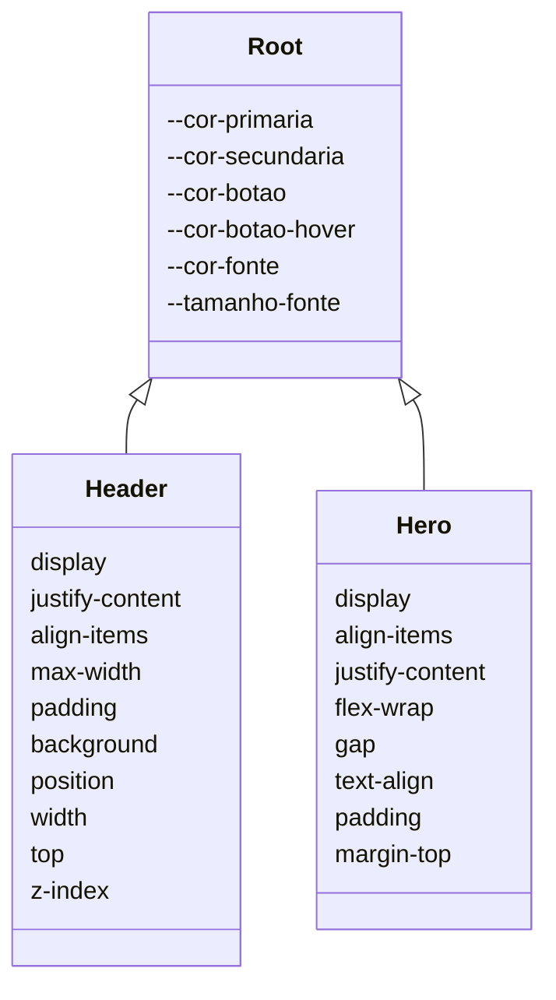
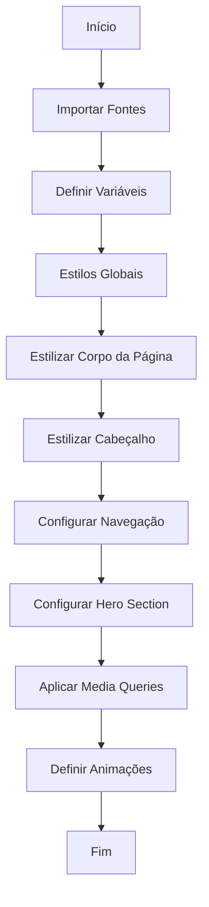

# Documentação de Estilo CSS

## Introdução

Este documento descreve a estrutura e as funcionalidades do arquivo CSS utilizado para estilizar uma página web. O arquivo faz uso de variáveis CSS para definir cores e tamanhos de fonte, garantindo consistência e facilidade de manutenção. Além disso, utiliza media queries para adaptar o layout a diferentes tamanhos de tela.

## Estrutura do Arquivo

### Importação de Fontes

```css
@import url("https://fonts.googleapis.com/css2?family=Poppins:wght@300;400;600&display=swap");
```

- **Descrição**: Importa a fonte "Poppins" do Google Fonts, com pesos variando de 300 a 600, para uso em toda a página.

### Variáveis CSS

```css
:root {
  --cor-primaria: #003759;
  --cor-secundaria: #44668eb8;
  --cor-botao: ;
  --cor-botao-hover: #0a1a41e2;
  --cor-fonte: #fff;
  --tamanho-fonte: 16px;
}
```

- **Descrição**: Define variáveis globais para cores principais, secundárias, de botões e fonte, além do tamanho padrão da fonte.

### Estilos Globais

```css
* {
  margin: 0;
  padding: 0;
  box-sizing: border-box;
  font-family: "Poppins", sans-serif;
  scroll-behavior: smooth;
}
```

- **Descrição**: Reseta margens e preenchimentos, define o box-sizing para border-box, aplica a fonte Poppins e define um comportamento de rolagem suave.

### Corpo da Página

```css
body {
  height: 100vh;
  background: linear-gradient(135deg, var(--cor-primaria), var(--cor-secundaria));
  background-attachment: fixed;
  color: var(--cor-fonte);
  display: flex;
  flex-direction: column;
  overflow-x: hidden;
}
```

- **Descrição**: Configura o corpo da página com um gradiente de fundo, cor de fonte, e define o layout como flexível e em coluna.

### Cabeçalho

```css
header {
  display: flex;
  justify-content: space-between;
  align-items: center;
  max-width: 100vw;
  padding: 20px calc(5vw);
  background: var(--cor-primaria);
  position: fixed;
  width: 100%;
  top: 0;
  z-index: 1000;
}
```

- **Descrição**: Estiliza o cabeçalho para ser fixo no topo, com espaçamento e alinhamento de itens.

### Navegação

```css
nav ul {
  list-style: none;
  display: flex;
  flex-direction: row;
  gap: 10px;
}
```

- **Descrição**: Remove o estilo de lista padrão e define a navegação como flexível em linha.

### Hero Section

```css
.hero {
  display: flex;
  align-items: center;
  justify-content: center;
  flex-wrap: wrap;
  gap: 20px;
  text-align: center;
  padding: 20px;
  margin-top: 190px;
}
```

- **Descrição**: Centraliza o conteúdo da seção hero, permitindo que os elementos se ajustem conforme necessário.

### Media Queries

#### Telas Largas

```css
@media screen and (min-width: 768px) {
  .hero {
    flex-direction: row;
    text-align: left;
  }
}
```

- **Descrição**: Ajusta a direção do flex e o alinhamento do texto para telas maiores.

#### Telas Estreitas

```css
@media screen and (max-width: 767px) {
  .hero {
    flex-direction: column;
    text-align: center;
  }
}
```

- **Descrição**: Ajusta a direção do flex e o alinhamento do texto para telas menores.

### Animações

```css
@keyframes fadeIn {
  from {
    opacity: 0;
    transform: translateY(-20px);
  }
  to {
    opacity: 1;
    transform: translateY(0);
  }
}
```

- **Descrição**: Define uma animação de fade-in para elementos, criando um efeito de entrada suave.

## Diagramas

### Diagrama de Classes (Mermaid)



### Diagrama de Fluxo (Mermaid)



## Conclusão

Este documento fornece uma visão geral das funcionalidades e estrutura do arquivo CSS, facilitando a compreensão e manutenção do estilo da página. As variáveis CSS e media queries são utilizadas para garantir flexibilidade e responsividade, enquanto as animações adicionam dinamismo à interface.