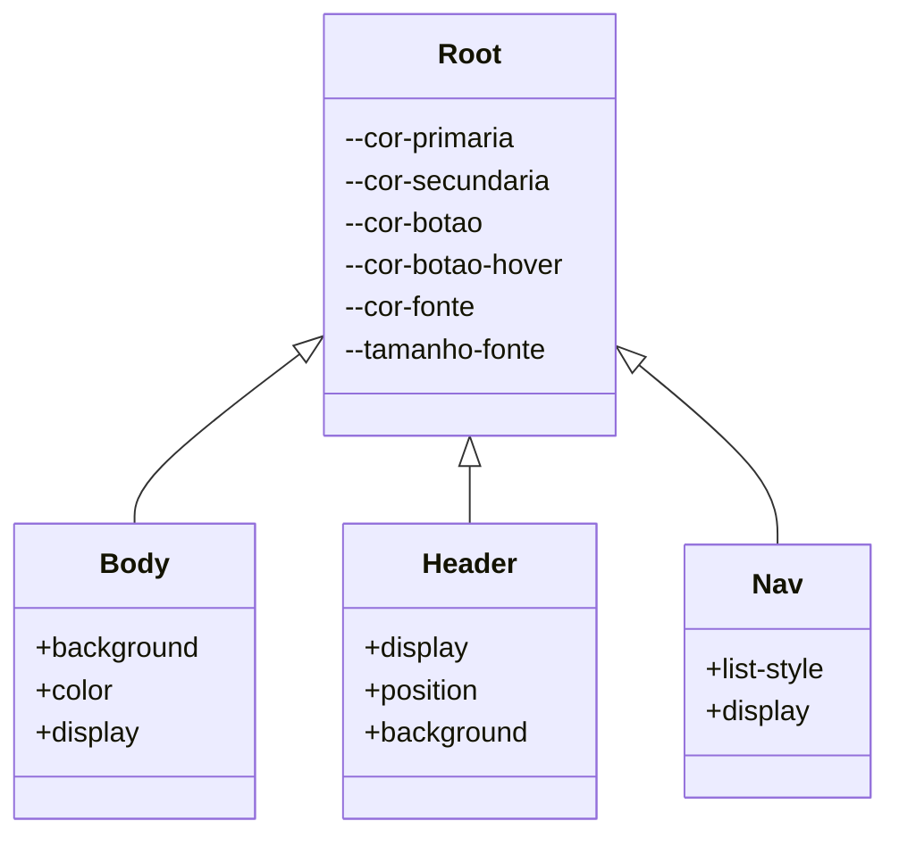
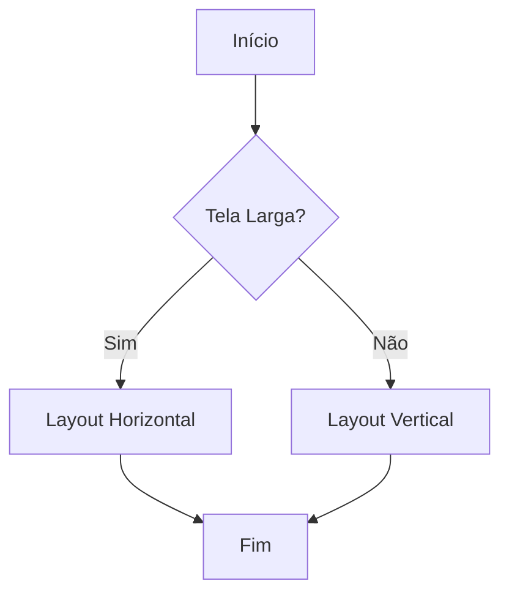

# Documentação de Estilo CSS

Este documento descreve a estrutura e o design do arquivo CSS que estiliza a interface de um site. O estilo é responsivo e utiliza variáveis CSS para facilitar a manutenção e a personalização.

## Estrutura Geral

### Importação de Fontes

```css
@import url("https://fonts.googleapis.com/css2?family=Poppins:wght@300;400;600&display=swap");
```

- **Descrição**: Importa a fonte "Poppins" do Google Fonts, que é usada em todo o site para garantir uma tipografia moderna e consistente.

### Variáveis CSS

```css
:root {
  --cor-primaria: #003759;
  --cor-secundaria: #44668eb8;
  --cor-botao: ;
  --cor-botao-hover: #0a1a41e2;
  --cor-fonte: #fff;
  --tamanho-fonte: 16px;
}
```

- **Descrição**: Define variáveis de cor e tamanho de fonte para facilitar a manutenção e a personalização do tema.

### Reset e Configuração Global

```css
* {
  margin: 0;
  padding: 0;
  box-sizing: border-box;
  font-family: "Poppins", sans-serif;
  scroll-behavior: smooth;
}
```

- **Descrição**: Reseta margens e paddings, define o box-sizing para border-box e aplica a fonte global. O comportamento de rolagem suave melhora a experiência do usuário.

## Layout do Corpo

### Corpo da Página

```css
body {
  height: 100vh;
  background: linear-gradient(135deg, var(--cor-primaria), var(--cor-secundaria));
  background-attachment: fixed;
  color: var(--cor-fonte);
  display: flex;
  flex-direction: column;
  overflow-x: hidden;
}
```

- **Descrição**: Configura o corpo da página com um gradiente de fundo, fixa o background ao rolar e define o layout flexível.

### Cabeçalho

```css
header {
  display: flex;
  justify-content: space-between;
  align-items: center;
  padding: 20px calc(5vw);
  background: var(--cor-primaria);
  position: fixed;
  width: 100%;
  top: 0;
  z-index: 1000;
}
```

- **Descrição**: Estiliza o cabeçalho com um layout flexível, fixa no topo da página e garante que permaneça visível ao rolar.

## Navegação

### Menu de Navegação

```css
nav ul {
  list-style: none;
  display: flex;
  flex-direction: row;
  gap: 10px;
}
```

- **Descrição**: Define o menu de navegação como uma lista horizontal sem marcadores, com espaçamento entre os itens.

### Responsividade

#### Telas Largas

```css
@media screen and (min-width: 768px) {
  .hero {
    flex-direction: row;
    text-align: left;
  }
}
```

- **Descrição**: Em telas largas, os elementos da seção hero são dispostos em linha e alinhados à esquerda.

#### Telas Estreitas

```css
@media screen and (max-width: 767px) {
  .hero {
    flex-direction: column;
    text-align: center;
  }
  .menu {
    display: flex;
  }
}
```

- **Descrição**: Em telas estreitas, os elementos da seção hero são empilhados verticalmente e centralizados. O menu é exibido como um botão.

## Animações

### Fade In

```css
@keyframes fadeIn {
  from {
    opacity: 0;
    transform: translateY(-20px);
  }
  to {
    opacity: 1;
    transform: translateY(0);
  }
}
```

- **Descrição**: Animação para elementos que aparecem gradualmente na tela, melhorando a experiência visual.

## Diagramas

### Diagrama de Classes (mermaid)



### Diagrama de Fluxo (mermaid)



Esta documentação fornece uma visão clara e concisa do estilo CSS aplicado ao site, com foco na responsividade e na experiência do usuário. As variáveis CSS e a estrutura modular facilitam a manutenção e a escalabilidade do design.