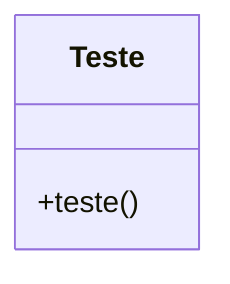

Para documentar o código fornecido de acordo com as diretrizes do GAMP5, FDA 21 CFR Part 11 e ANVISA, é essencial garantir que o código seja compreensível, validável e mantenha a integridade dos dados. A documentação deve incluir descrições claras das funcionalidades, além de diagramas para ilustrar o fluxo e a estrutura do código.

### Documentação do Código

#### Descrição Geral
O script `teste.js` é um exemplo simples que demonstra uma chamada de função JavaScript que exibe um alerta no navegador. A função `teste` é invocada, mas devido à estrutura do código, a chamada `console.log(teste);` não executa a função, mas sim imprime a referência da função `teste` no console.

#### Estrutura do Código

```js
// Executa uma chamada para assegurar que o eslint vai entender chamada html
console.log(teste);

/**
 * @function teste
 * @description Exibe um alerta com a mensagem "vai".
 */
function teste() {
  alert("vai");
}
```

### JSDoc

- **@function teste**: Define a função `teste`.
- **@description**: Descreve o propósito da função, que é exibir um alerta com a mensagem "vai".

### Diagrama de Fluxo (Flowchart)

O diagrama abaixo ilustra o fluxo de execução do script:

```mermaid
flowchart TD
    A[Start] --> B[Console Log]
    B --> C{Function teste Called?}
    C -->|No| D[Print Function Reference]
    C -->|Yes| E[Alert "vai"]
    D --> F[End]
    E --> F
```

### Diagrama de Classes (Class Diagram)

Embora o script não utilize classes, um diagrama de classes pode ser útil para entender a estrutura em um contexto mais amplo ou em projetos futuros.



### Diagrama de Caso de Uso (Use Case)

Este diagrama ilustra o uso da função `teste` pelo usuário final.

```mermaid
usecaseDiagram
    actor User as "Usuário"
    usecase UC1 as "Executar teste"
    User --> UC1
```

### Considerações de Compliance

- **GAMP5**: Assegure que o código seja revisado e testado para garantir que ele funcione conforme o esperado.
- **FDA 21 CFR Part 11**: Embora este script não manipule dados regulados, em um contexto mais amplo, garantir que o código seja auditável e que as alterações sejam documentadas é essencial.
- **ANVISA**: Similar ao FDA, garantir que o código seja validado e que a integridade dos dados seja mantida.

### Conclusão

Este exemplo simples serve como base para entender como documentar e estruturar o código JavaScript de forma a atender às normas regulatórias e de boas práticas de desenvolvimento. Para projetos maiores e mais complexos, a documentação deve ser expandida para incluir testes, validação e controle de versão.