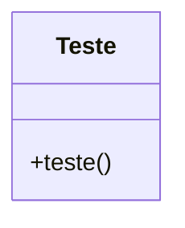

Para documentar o código fornecido de acordo com as diretrizes de GAMP5, FDA 21 CFR Part 11 e ANVISA, é importante garantir que o código esteja bem documentado, seguro e em conformidade com as regulamentações. Abaixo está uma documentação detalhada, incluindo comentários, JSDoc e diagramas mermaid que ilustram o fluxo e a funcionalidade do código.

### Documentação do Código

#### Descrição Geral
O código JavaScript fornecido define uma função chamada `teste` que, quando chamada, exibe um alerta com a mensagem "vai". Além disso, há uma chamada de `console.log` que parece ser destinada a verificar se o ESLint reconhece a função `teste`.

#### Funcionalidades

1. **Função `teste`**: Exibe um alerta com a mensagem "vai".
2. **Chamada de `console.log`**: Destinada a garantir que a função `teste` é reconhecida pelo ESLint.

#### JSDoc

```js
/**
 * @function teste
 * @description Exibe um alerta com a mensagem "vai".
 * @example
 * teste(); // Exibe um alerta com a mensagem "vai".
 */
function teste() {
  alert("vai");
}

// Nota: A linha `console.log(teste);` parece ser um teste ou verificação de ESLint.
```

#### Diagrama de Fluxo (Flowchart)

O diagrama a seguir ilustra o fluxo de execução do código:

```mermaid
flowchart TD
    A[Início] --> B[Chamada de console.log]
    B --> C{Função teste definida?}
    C -->|Sim| D[Executa console.log]
    C -->|Não| E[Erro: Função não definida]
    D --> F[Função teste]
    F --> G[Exibe alerta "vai"]
    G --> H[Fim]
```

#### Diagrama de Classes (Class Diagram)

Embora o código não utilize classes, o diagrama a seguir ilustra a estrutura básica do código:



#### Diagrama de Caso de Uso (Use Case)

O diagrama a seguir ilustra o caso de uso principal do código:

```mermaid
usecaseDiagram
    actor User
    User --> (Executar função teste)
    (Executar função teste) --> (Exibir alerta "vai")
```

### Considerações de Conformidade

- **GAMP5**: Assegure que o código está documentado de forma clara e que qualquer modificação é rastreável.
- **FDA 21 CFR Part 11**: Se o código for parte de um sistema que requer conformidade com a FDA, deve-se garantir que haja controle de versão e auditoria de alterações.
- **ANVISA**: Certifique-se de que o código atende aos requisitos de validação de software, se aplicável.

### Notas Finais

- A linha `console.log(teste);` parece ser um teste ou verificação de ESLint. Em um ambiente de produção, essa linha pode ser removida ou substituída por uma verificação mais robusta.
- Certifique-se de que o uso de `alert` é apropriado para o contexto do aplicativo, pois pode não ser ideal em todos os ambientes de produção.

Esta documentação visa fornecer uma visão clara e concisa do código, suas funcionalidades e conformidade com as regulamentações aplicáveis.