# Documentação Técnica do Projeto

## Introdução Geral

Este documento fornece uma visão abrangente de vários componentes de um sistema web, incluindo arquivos CSS, JavaScript, PHP e HTML. A documentação é estruturada para atender aos requisitos de conformidade regulatória, como GAMP5, FDA 21 CFR Part 11 e ANVISA, garantindo que o sistema seja seguro, eficiente e em conformidade com os regulamentos aplicáveis.

## Índice

1. [Lista de Arquivos Documentados](#lista-de-arquivos-documentados)
2. [Documentação por Arquivo](#documentação-por-arquivo)
   - [CSS: bd.css](#css-bdcss)
   - [CSS: chat.css](#css-chatcss)
   - [JavaScript: chat.js](#javascript-chatjs)
   - [PHP: chat.php](#php-chatphp)
   - [HTML: documentacao.html](#html-documentacaohtml)
   - [HTML: documentador.html](#html-documentadorhtml)
   - [JavaScript: documentador.js](#javascript-documentadorjs)
   - [PHP: gerador.php](#php-geradorphp)
   - [HTML: index.html](#html-indexhtml)
   - [PHP: lista_html.php](#php-lista_htmlphp)
   - [JavaScript: navegador.js](#javascript-navegadorjs)
   - [CSS: style.css](#css-stylecss)
   - [JavaScript: teste.js](#javascript-testejs)
3. [Conclusão e Recomendações](#conclusão-e-recomendações)

## Lista de Arquivos Documentados

- `bd.css`
- `chat.css`
- `chat.js`
- `chat.php`
- `documentacao.html`
- `documentador.html`
- `documentador.js`
- `gerador.php`
- `index.html`
- `lista_html.php`
- `navegador.js`
- `style.css`
- `teste.js`

## Documentação por Arquivo

### CSS: bd.css

#### Comentários Técnicos Explicativos

O arquivo `bd.css` define estilos para elementos HTML comuns, componentes de layout e interações do usuário. Ele garante uma experiência de usuário coesa e acessível.

#### Documentação Inline

```css
html, body {
  height: 100%;
  font-family: Arial, sans-serif;
  text-decoration: none;
  background-attachment: fixed;
}
```

#### Diagramas de Fluxo

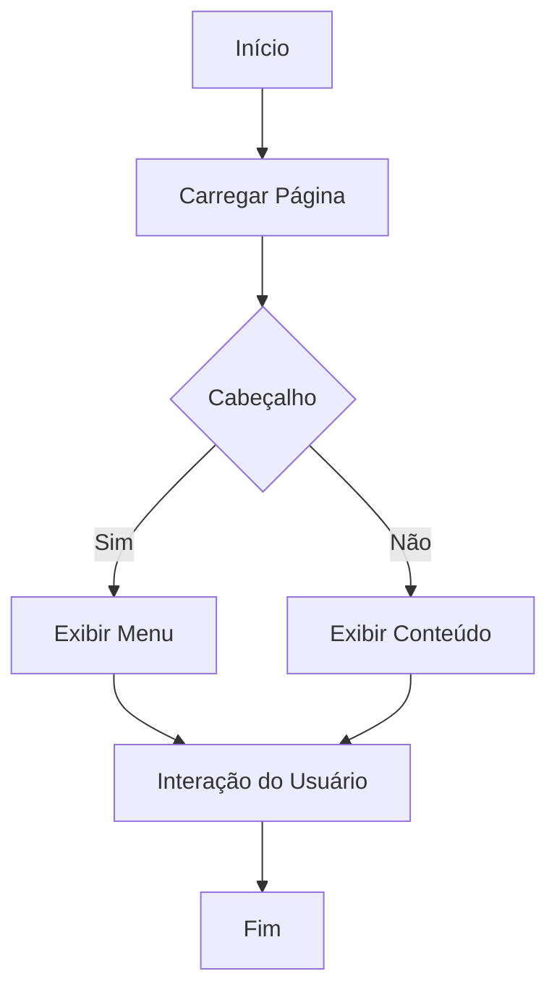

### CSS: chat.css

#### Comentários Técnicos Explicativos

Estiliza um componente de chat fixado na parte inferior da tela, com um cabeçalho clicável que permite expandir ou recolher a janela de mensagens.

#### Documentação Inline

```css
#chat-container {
    position: fixed;
    display: none;
    bottom: 20px;
    right: 50%;
    translate: 50%;
    width: 300px;
    background: white;
    border: 1px solid #ccc;
    border-radius: 10px;
    box-shadow: 0px 4px 6px rgba(0, 0, 0, 0.1);
    font-family: Arial, sans-serif;
}
```

#### Diagramas de Classes

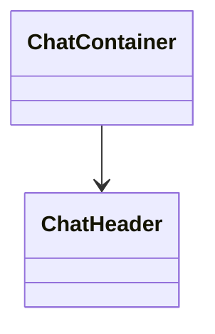


### JavaScript: chat.js

#### Comentários Técnicos Explicativos

Implementa um sistema de chat com suporte para entrada de texto e voz, utilizando reconhecimento de fala e síntese de voz.

#### Documentação Inline

```js
/**
 * Envia a mensagem do usuário para o servidor e exibe a resposta.
 * @param {string} url - URL opcional para o arquivo de bula.
 */
function sendMessage(url) {
  // Implementação...
}
```

#### Diagramas de Fluxo

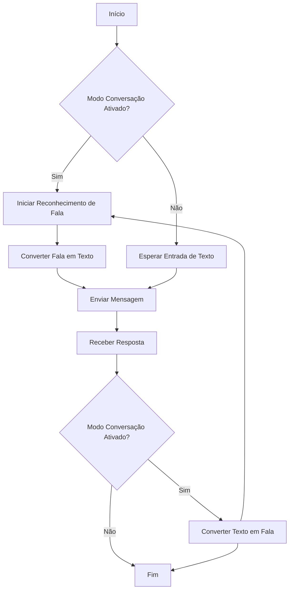

### PHP: chat.php

#### Comentários Técnicos Explicativos

Integra um sistema de chat com a API da OpenAI, processando mensagens do usuário e retornando respostas geradas pela IA.

#### Documentação Inline

```php
/**
 * Processa a mensagem do usuário e retorna uma resposta da API OpenAI.
 *
 * @return void
 */
function processUserMessage() {
    // Código da função conforme descrito acima
}
```

#### Diagramas de Fluxo

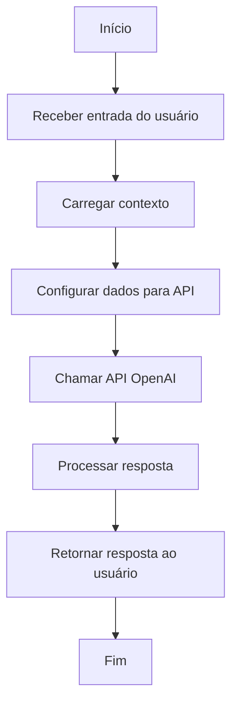

### HTML: documentacao.html

#### Comentários Técnicos Explicativos

Descreve a estrutura e funcionalidades de um sistema web que utiliza tecnologias modernas para renderização de conteúdo Markdown e integração com assistentes de inteligência artificial.

#### Documentação Inline

```html
<meta charset="UTF-8" />
<meta name="viewport" content="width=device-width, height=device-height, initial-scale=1.0" />
<meta http-equiv="Cache-Control" content="no-cache, no-store, must-revalidate" />
<meta http-equiv="Pragma" content="no-cache" />
<meta http-equiv="Expires" content="0" />
<meta name="theme-color" content="#023e7d" />
```

#### Diagramas de Caso de Uso

```mermaid
usecase
actor Usuario
actor AssistenteIA
Usuario --> (Visualizar Documentacao)
Usuario --> (Interagir com Assistente de IA)
AssistenteIA --> (Responder Perguntas)
```

### HTML: documentador.html

#### Comentários Técnicos Explicativos

Descreve a estrutura e funcionalidades do sistema de Gerador Automático de Documentação, projetado para simplificar a geração de documentação de sistemas.

#### Documentação Inline

```html
<!-- Header -->
<header>
    
</header>
```

#### Diagramas de Fluxo

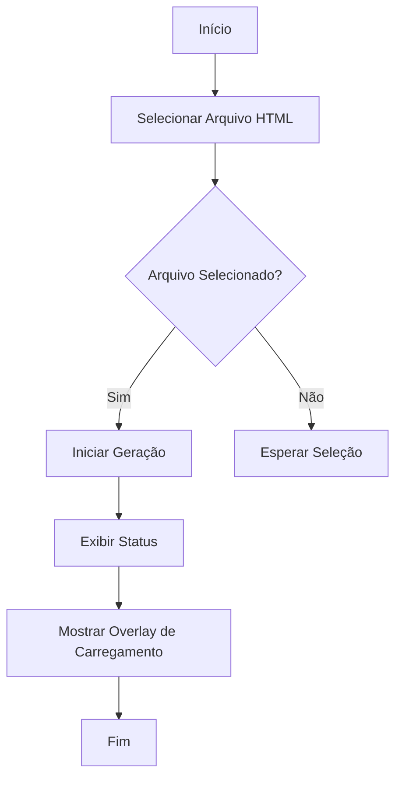

### JavaScript: documentador.js

#### Comentários Técnicos Explicativos

Carrega arquivos HTML e inicia a geração de documentação baseada nesses arquivos.

#### Documentação Inline

```js
/**
 * Carrega a lista de arquivos HTML disponíveis e os adiciona a um elemento select.
 * @async
 * @function carregarArquivosHTML
 * @returns {Promise<void>} - Promessa que representa a conclusão da operação de carregamento.
 */
async function carregarArquivosHTML() {
  // Implementação...
}
```

#### Diagramas de Fluxo

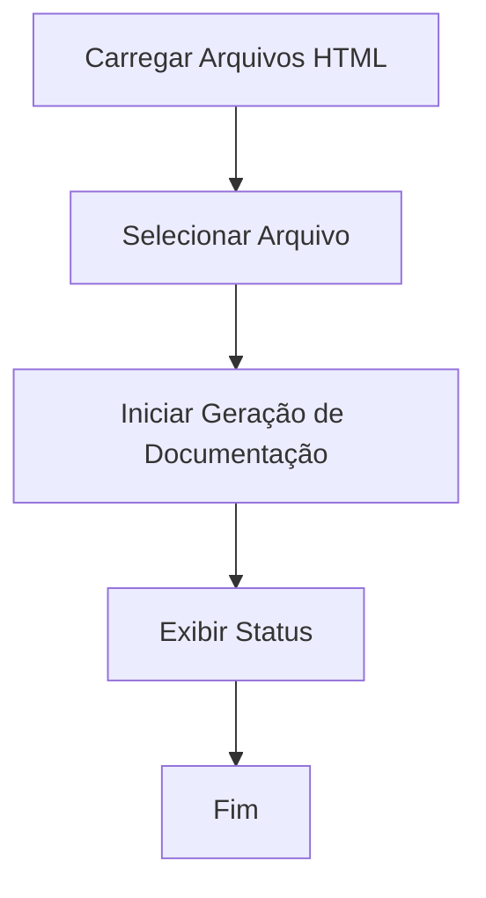

### PHP: gerador.php

#### Comentários Técnicos Explicativos

Análise de um projeto de software, identifica arquivos e suas dependências, e gera documentação automática.

#### Documentação Inline

```php
/**
 * Faz uma chamada à API do ChatGPT.
 *
 * @param array $mensagens Mensagens a serem enviadas à API.
 * @param string $apiKey Chave da API do OpenAI.
 * @param string $model Modelo de IA a ser utilizado.
 * @return array Resposta da API.
 */
function chamarChatGPT($mensagens, $apiKey, $model) {
    // Implementação da função
}
```

#### Diagramas de Fluxo

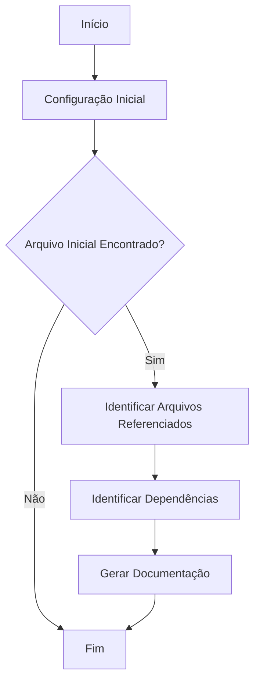

### HTML: index.html

#### Comentários Técnicos Explicativos

Plataforma web para a gestão e publicação de bulas digitais, garantindo conformidade com as regulamentações da ANVISA, GAMP5 e FDA 21 CFR Part 11.

#### Documentação Inline

```html
<!-- Meta Tags -->
<meta charset="UTF-8">
<meta name="viewport" content="width=device-width, initial-scale=1.0">
```

#### Diagramas de Fluxo

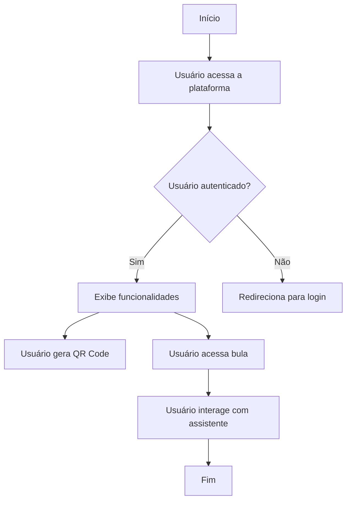

### PHP: lista_html.php

#### Comentários Técnicos Explicativos

Busca todos os arquivos HTML na raiz de um diretório específico e retorna seus nomes em formato JSON.

#### Documentação Inline

```php
$arquivos = glob('../../*.html');
```

#### Diagramas de Fluxo

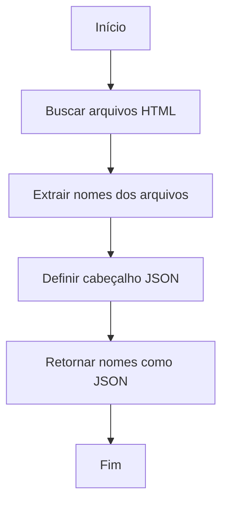

### JavaScript: navegador.js

#### Comentários Técnicos Explicativos

Gerencia a navegação entre diferentes formulários e elementos de interface em uma aplicação web.

#### Documentação Inline

```js
/**
 * Exibe o formulário especificado e atualiza a interface.
 * @param {string} tipo - O identificador do formulário a ser exibido.
 */
function mostrarFormulario(tipo) {
  // Implementação...
}
```

#### Diagramas de Fluxo

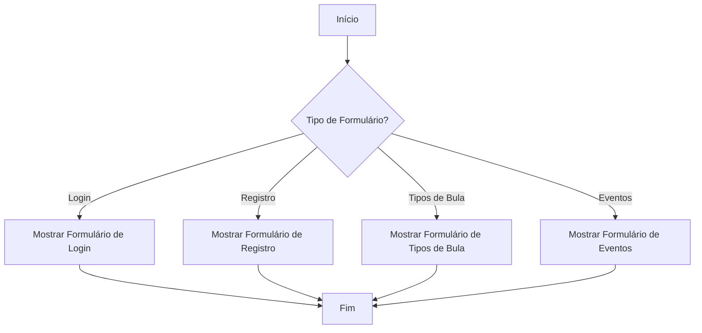

### CSS: style.css

#### Comentários Técnicos Explicativos

Estiliza a interface de um site, utilizando variáveis CSS para facilitar a manutenção e a personalização.

#### Documentação Inline

```css
:root {
  --cor-primaria: #003759;
  --cor-secundaria: #44668eb8;
  --cor-botao: ;
  --cor-botao-hover: #0a1a41e2;
  --cor-fonte: #fff;
  --tamanho-fonte: 16px;
}
```

#### Diagramas de Fluxo

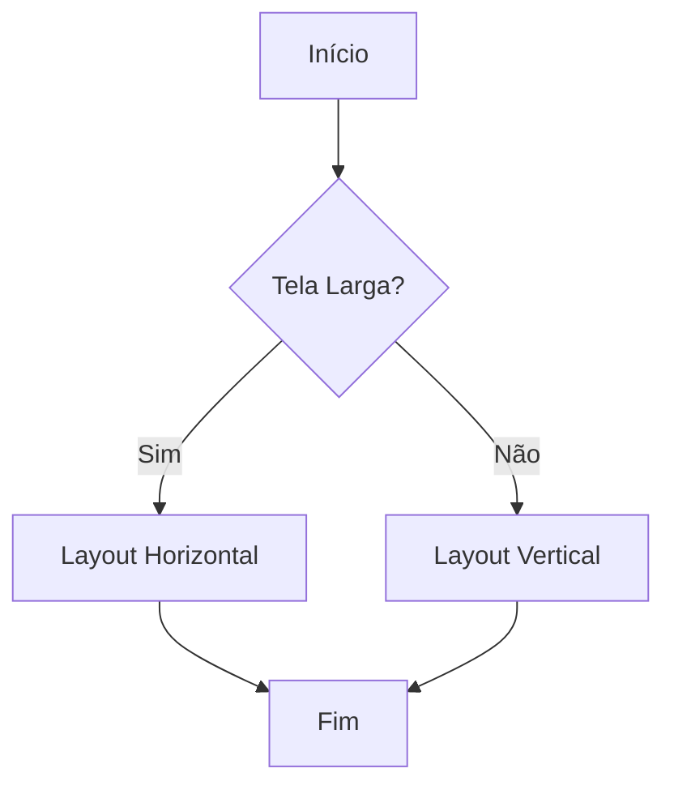

### JavaScript: teste.js

#### Comentários Técnicos Explicativos

Demonstra uma chamada de função JavaScript que exibe um alerta no navegador.

#### Documentação Inline

```js
/**
 * @function teste
 * @description Exibe um alerta com a mensagem "vai".
 */
function teste() {
  alert("vai");
}
```

#### Diagramas de Fluxo

```mermaid
flowchart TD
    A[Start] --> B[Console Log]
    B --> C{Function teste Called?}
    C -->|No| D[Print Function Reference]
    C -->|Yes| E[Alert "vai"]
    D --> F[End]
    E --> F
```

## Conclusão e Recomendações

Este documento fornece uma visão abrangente dos componentes do sistema, garantindo que os desenvolvedores possam entender e manter o código de forma eficaz. Recomenda-se a revisão periódica das configurações e atualizações da API para manter a eficácia do sistema. Além disso, a validação manual da documentação gerada é crucial para garantir precisão e completude.