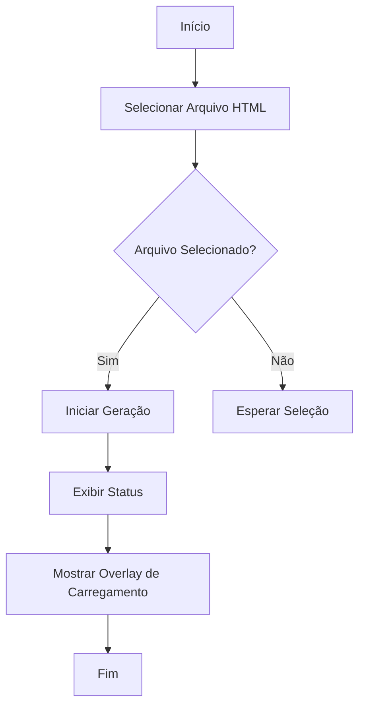
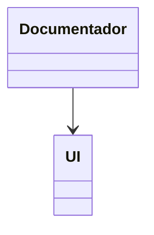
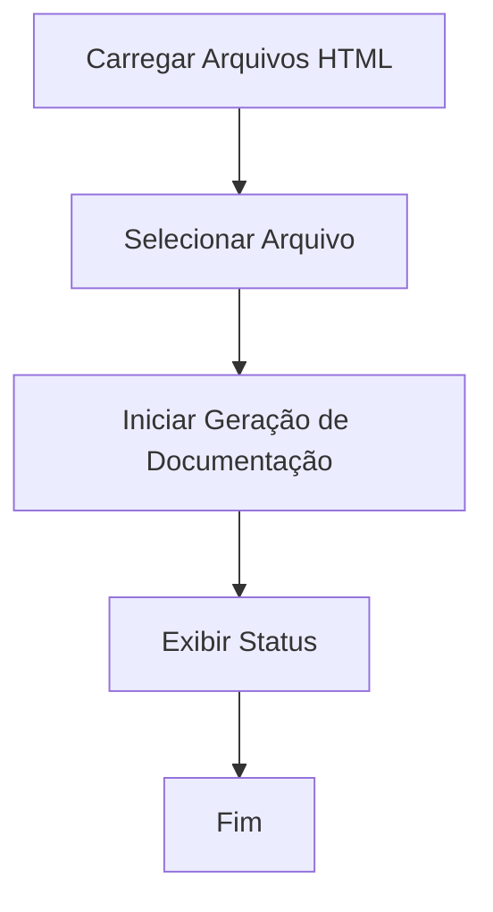
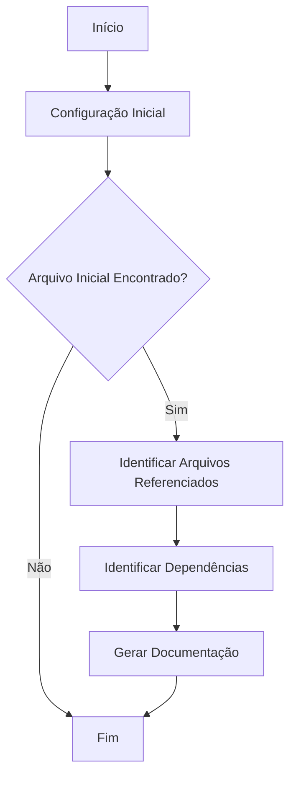
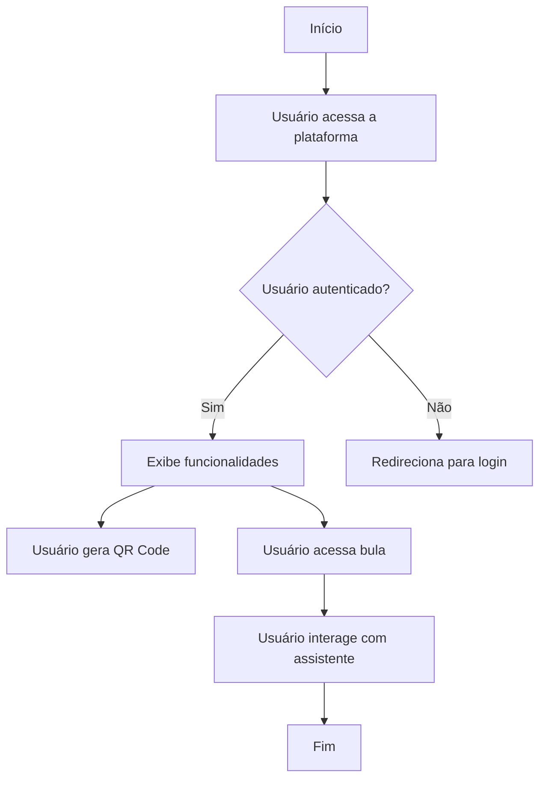
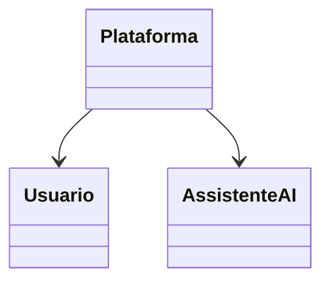
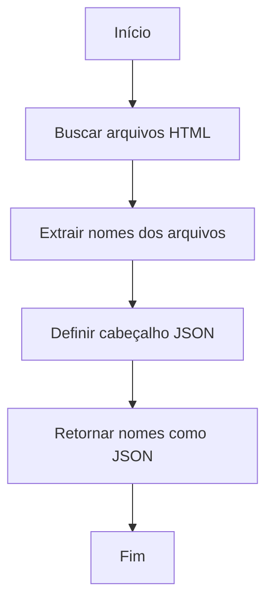
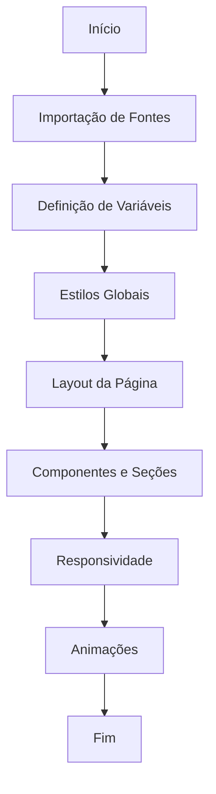

# Documentação Técnica do Sistema de Gerador Automático de Documentação

## Introdução Geral

Este documento fornece uma visão abrangente do sistema de Gerador Automático de Documentação desenvolvido pela Dotter Brasil. O sistema é projetado para facilitar a geração de documentação de sistemas, assegurando conformidade com padrões regulatórios como GAMP5, FDA 21 CFR Part 11 e ANVISA. A documentação inclui detalhes técnicos, diagramas de fluxo, diagramas de classes e casos de uso, garantindo que o sistema seja compreensível e auditável.

## Índice

1. [Lista de Arquivos Documentados](#lista-de-arquivos-documentados)
2. [Detalhes por Arquivo](#detalhes-por-arquivo)
   - [documentador.html](#documentadorhtml)
   - [documentador.js](#documentadorjs)
   - [gerador.php](#geradorphp)
   - [index.html](#indexhtml)
   - [lista_html.php](#lista_htmlphp)
   - [style.css](#stylecss)
   - [teste.js](#testejs)
3. [Conclusão e Recomendações](#conclusão-e-recomendações)

## Lista de Arquivos Documentados

- `documentador.html`
- `documentador.js`
- `gerador.php`
- `index.html`
- `lista_html.php`
- `style.css`
- `teste.js`

## Detalhes por Arquivo

### documentador.html

#### Comentários Técnicos Explicativos

O arquivo `documentador.html` é responsável pela estrutura básica do sistema de documentação. Ele inclui metadados essenciais, configurações de cache, e a inclusão de scripts JavaScript necessários para a funcionalidade do sistema.

#### Diagrama de Fluxo



#### Diagrama de Classes




### documentador.js

#### Comentários Técnicos Explicativos

Este arquivo JavaScript gerencia a lógica de carregamento de arquivos HTML e inicia a geração de documentação. Ele garante que as operações sejam seguras e eficientes.

#### Diagrama de Fluxo



#### Diagrama de Classes

```mermaid
classDiagram
```


#### Diagrama de Caso de Uso

```mermaid
usecaseDiagram
    actor Usuário
    Usuário --> (Carregar Arquivos HTML)
    Usuário --> (Iniciar Geração de Documentação)
```

### gerador.php

#### Comentários Técnicos Explicativos

O `gerador.php` analisa um projeto de software, identifica arquivos e suas dependências, e gera documentação automática utilizando a API do OpenAI.

#### Diagrama de Fluxo



#### Diagrama de Classes

```mermaid
classDiagram
```


### index.html

#### Comentários Técnicos Explicativos

Este arquivo HTML é a base para a plataforma de gestão de bulas digitais, garantindo conformidade com regulamentações e oferecendo funcionalidades como geração de QR Codes e acessibilidade.

#### Diagrama de Fluxo



#### Diagrama de Classes




### lista_html.php

#### Comentários Técnicos Explicativos

Este script PHP lista todos os arquivos HTML em um diretório específico e retorna seus nomes em formato JSON.

#### Diagrama de Fluxo



#### Diagrama de Classes

```mermaid
classDiagram
```


### style.css

#### Comentários Técnicos Explicativos

O CSS define o estilo da interface web, garantindo uma experiência de usuário consistente e visualmente atraente em diferentes dispositivos.

#### Diagrama de Fluxo



#### Diagrama de Classes

```mermaid
classDiagram
    flex --> direction
    justify --> content
    align --> items
    list --> style
    flex --> direction
    align --> items
    justify --> content
```


### teste.js

#### Comentários Técnicos Explicativos

O `teste.js` é um exemplo simples que demonstra uma chamada de função JavaScript que exibe um alerta no navegador.

#### Diagrama de Fluxo

```mermaid
flowchart TD
    A[Start] --> B[Console Log]
    B --> C{Function teste Called?}
    C -->|No| D[Print Function Reference]
    C -->|Yes| E[Alert "vai"]
    D --> F[End]
    E --> F
```

#### Diagrama de Classes

```mermaid
classDiagram
```


#### Diagrama de Caso de Uso

```mermaid
usecaseDiagram
    actor User as "Usuário"
    usecase UC1 as "Executar teste"
    User --> UC1
```

## Conclusão e Recomendações

O sistema de Gerador Automático de Documentação é uma solução robusta para documentar projetos de software, assegurando conformidade com padrões regulatórios. Recomenda-se a revisão periódica das configurações e atualizações da API para manter a eficácia do sistema. Além disso, a validação manual da documentação gerada é crucial para garantir precisão e completude. A documentação fornecida aqui deve ser utilizada como base para futuras expansões e melhorias do sistema.